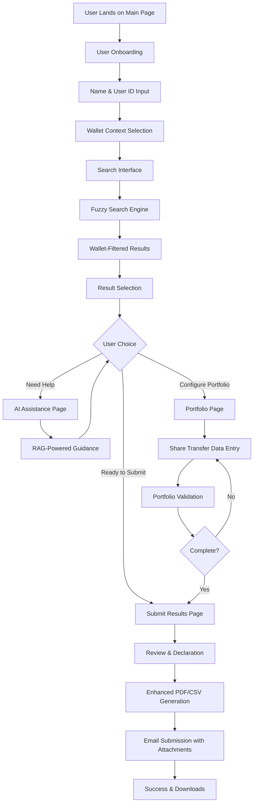
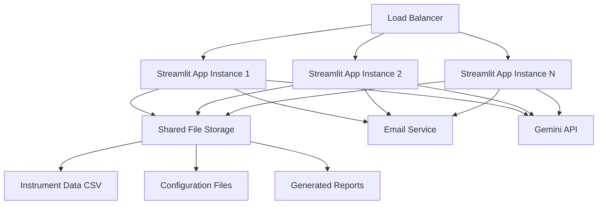
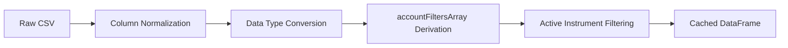
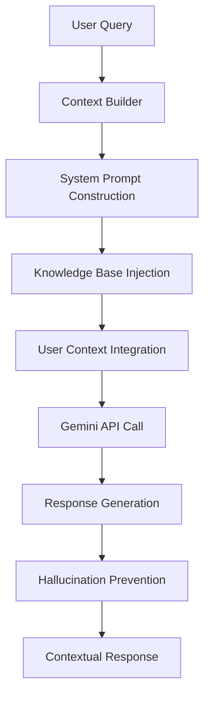
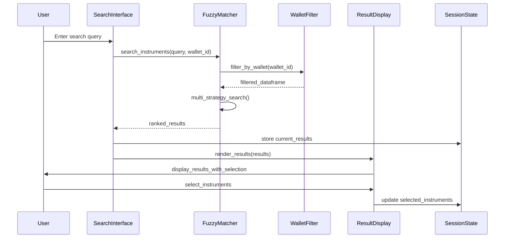
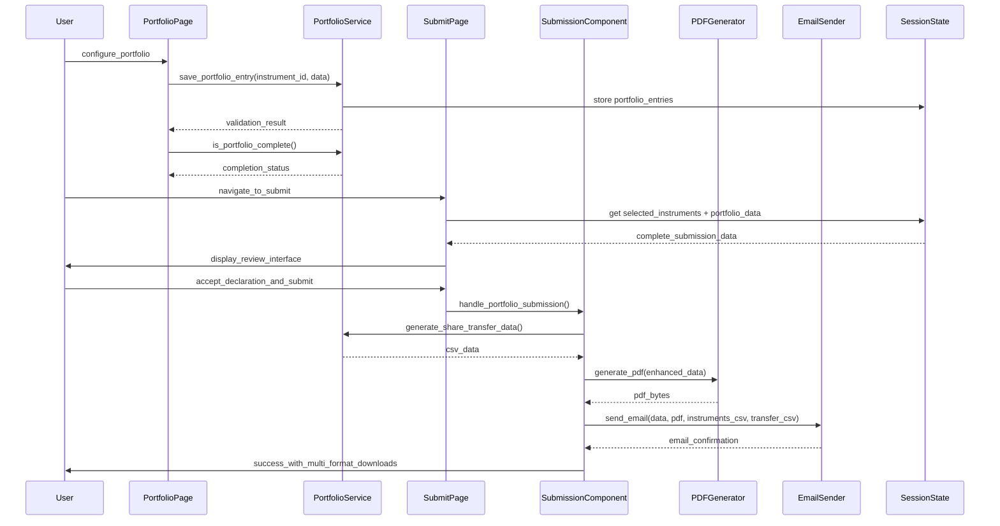

# Smart Instrument Finder App

A sophisticated financial instrument search and discovery platform built with Streamlit, featuring advanced fuzzy matching, wallet-aware filtering, and AI-powered assistance.

## Overview

The Smart Instrument Finder App is a modern web application designed to help users discover and select financial instruments across multiple investment platforms and wallets. It provides intelligent search capabilities, personalized recommendations, and seamless result submission workflows.

### Key Features

- **Advanced Fuzzy Search**: Multi-field search across instrument names, ticker symbols, ISIN codes, and contract codes
- **Wallet-Aware Filtering**: Filter instruments based on availability in specific investment wallets/platforms
- **AI-Powered Assistance**: Contextual help and guidance using Google Gemini with RAG architecture
- **Portfolio Configuration**: Complete share transfer data capture with AI-integration readiness
- **Smart Deduplication**: Business-key based deduplication using (Exchange, Ticker, ContractCode)
- **Real-time Results**: Fast, cached search with relevance scoring and ranking
- **Export Capabilities**: Generate PDF reports and CSV exports of selected instruments including share transfer format
- **Session Persistence**: Robust state management across multiple pages
- **Responsive Design**: Modern, gradient-based UI with smooth animations
- **Multi-Format Export**: Standard instrument CSV and specialized share transfer CSV generation

## Architecture & Core Structure

### Application Structure

```
Instrument Finder App V2/
├── .streamlit/
│   ├── config.toml          # Streamlit configuration
│   └── pages.toml           # Multi-page navigation setup
├── app/                     # Core application directory
│   ├── components/          # Modular UI components
│   │   ├── __init__.py
│   │   ├── feedback.py      # User feedback collection
│   │   ├── result_display.py # Search results presentation
│   │   ├── search_interface.py # Search input & options
│   │   ├── selection_panel.py # Selection management UI
│   │   ├── share_transfer_form.py # Portfolio data entry form
│   │   ├── sidebar.py       # Navigation sidebar
│   │   ├── submission.py    # Result submission handling
│   │   └── wallet_selector.py # Wallet context selection
│   ├── data/                # Configuration & specifications
│   │   ├── __init__.py
│   │   ├── broker_specifications.json # Broker ID mappings
│   │   ├── portfolio_configurations.json # Portfolio defaults
│   │   ├── portfolio_schema.json # AI integration schema
│   │   ├── search_configurations.json # Search algorithm settings
│   │   └── wallet_specifications.json # Wallet mappings & metadata
│   ├── pages/               # Multi-page application structure
│   │   ├── 1_AI_Assistance.py # RAG-powered AI assistant
│   │   ├── 2_Portfolio.py   # Share transfer portfolio configuration
│   │   └── 3_Submit.py      # Results review & submission
│   ├── search/              # Core search engine
│   │   ├── __init__.py
│   │   ├── fuzzy_matcher.py # Advanced fuzzy matching algorithm
│   │   └── wallet_filter.py # Wallet-aware filtering engine
│   ├── services/            # Business logic layer
│   │   ├── __init__.py
│   │   ├── portfolio_service.py # Portfolio data management
│   │   └── selection_manager.py # Selection state management
│   ├── __init__.py
│   ├── email_sender.py      # SMTP email functionality
│   ├── json_validators.py   # JSON schema validation utilities
│   ├── main.py              # Primary search interface (landing page)
│   ├── pdf_generator.py     # PDF report generation
│   ├── styling.py           # CSS styling & animations
│   └── utils.py             # Session management & utilities
├── assets/
│   └── logos/               # Visual assets & branding
├── data/
│   └── Instrument_Data_Format_Example.csv # Financial instrument dataset
├── documentation/
│   └── persisted_selection_solution_design.md # Technical solution designs
├── agent_summarizer_mandate.md    # AI agent persona & constraints
├── instrument_finder_knowledge_base.md # RAG knowledge base
├── README.md                # Project documentation
└── requirements.txt         # Python dependencies
```

### Core Application Flow



### Technical Stack

- **Frontend**: Streamlit (Python web framework)
- **Search Engine**: FuzzyWuzzy with Python-Levenshtein for fast string matching
- **Data Processing**: Pandas for CSV handling and data manipulation
- **AI Integration**: Google Gemini 1.5 Flash via API
- **PDF Generation**: ReportLab for document creation
- **Email**: SMTP with attachment support
- **Session Management**: Streamlit session state with namespace isolation

### Data Model

The application works with a comprehensive instrument dataset containing:

- **Core Identifiers**: InstrumentID, Ticker, ContractCode, ISINCode
- **Classification**: AssetGroup, AssetSubGroup, Exchange
- **Metadata**: Name, Description, Currency, ActiveData status
- **Wallet Eligibility**: 22 accountFilters columns mapped to wallet codes
- **UI Assets**: Logos, flag codes for visual presentation

#### Wallet Mapping System

The app uses a sophisticated wallet filtering system with 22 wrapper types:

| Wallet | Code | Description |
|--------|------|-------------|
| ZAR | 2 | South African Rand accounts |
| TFSA | 3 | Tax-Free Savings Account |
| USD | 10 | US Dollar accounts |
| GBP | 74 | British Pound accounts |
| EUR | 75 | Euro accounts |
| AUD | 16 | Australian Dollar accounts |
| RA | 9 | Retirement Annuity |
| RISE | 11 | RISE Investment platform |
| EasyCrypto | 99 | Cryptocurrency platform |
| EasyProperties | 66 | Property investment platform |
| ... | ... | (Additional wallets as configured) |

## Installation

### Prerequisites

- Python 3.9+
- pip package manager
- Internet connection for AI features

### Setup Steps

1. **Clone the repository**:
   ```bash
   git clone <repository-url>
   cd "Instrument Finder App V2"
   ```

2. **Install dependencies**:
   ```bash
   pip install -r requirements.txt
   ```

3. **Configure secrets** (create `.streamlit/secrets.toml`):
   ```toml
   [app]
   max_upload_mb = 4
   
   [email]
   smtp_server = "smtp.gmail.com"
   smtp_port = 587
   sender_email = "your-email@example.com"
   sender_password = "your-app-password"
   
   [ai]
   gemini_api_key = "your-gemini-api-key"
   ```

4. **Prepare data**:
   - Place your instrument CSV file in the `data/` directory
   - Update the file path in `app/main.py` if needed

5. **Run the application**:
   ```bash
   streamlit run app/main.py
   ```

## Usage

### 1. Smart Search Page

The main landing page where users can:
- Enter their name and user ID for session tracking
- Select their preferred investment wallet
- Search for instruments using natural language queries
- Review and select instruments from ranked results
- Apply advanced search filters (fuzzy threshold, result limits)

### 2. AI Assistance Page

An intelligent assistant that provides:
- Context-aware help based on user's search history
- Explanations of search results and instrument details
- Investment guidance within defined knowledge boundaries
- Wallet-specific recommendations

### 3. Portfolio Configuration Page

Comprehensive share transfer data capture featuring:
- Individual portfolio entry configuration for each selected instrument
- Trust Account ID, quantity, and pricing data entry
- Settlement dates and broker ID specification
- Data validation and completeness tracking
- Progress indicators and batch configuration options
- AI-integration readiness for future PDF processing

### 4. Submit Results Page

Final submission workflow featuring:
- Review of selected instruments and portfolio configurations
- Additional notes and feedback collection
- Declaration acceptance
- Automated PDF and multi-format CSV generation (instruments + share transfer)
- Email delivery with comprehensive attachments

## Key Business Logic & Algorithms

### Instrument Deduplication Strategy

The application uses a **business key approach** for deduplication as recommended in the CSV analysis:

```python
def get_instrument_key(instrument: Dict) -> str:
    # Primary: Business Key (Exchange, Ticker, ContractCode)
    business_key = (
        (instrument.get('exchange') or '').upper(),
        (instrument.get('ticker') or '').upper(), 
        (instrument.get('contract_code') or '').upper()
    )
    
    if any(business_key):
        return f"BUSINESS_KEY|{business_key[0]}|{business_key[1]}|{business_key[2]}"
    
    # Fallback: Legacy Key (InstrumentID, Name)
    return f"LEGACY_KEY|{instrument.get('instrument_id', '')}|{instrument.get('name', '').upper()}"
```

### Wallet Eligibility Algorithm

```python
def derive_filters_array(row) -> str:
    """Derives accountFiltersArray from 22 wrapper columns"""
    codes = []
    wrapper_cols = [c for c in columns if c.startswith('accountFilters/')]
    
    for column in wrapper_cols:
        try:
            value = int(row.get(column, 0))
            if value != 0:
                codes.append(str(value))
        except (ValueError, TypeError):
            continue
    
    # Deduplicate while preserving order
    return ','.join(dict.fromkeys(codes))
```

### Search Relevance Scoring

```python
# Match Type Priority & Scoring
MATCH_PRIORITIES = {
    'exact_name': (0, 100),      # Highest priority, 100% relevance
    'exact_ticker': (1, 95),     # High priority, 95% relevance  
    'fuzzy_name': (2, 'dynamic'), # Medium priority, fuzzy score
    'ticker': (3, 'dynamic'),    # Lower priority, fuzzy score
    'isin': (4, 'dynamic')       # Lowest priority, fuzzy score
}

def calculate_final_score(match_type: str, fuzzy_score: int) -> int:
    priority, base_score = MATCH_PRIORITIES[match_type]
    return base_score if base_score != 'dynamic' else fuzzy_score
```

### Portfolio Data Management

The application includes a sophisticated portfolio configuration system for share transfer data capture:

```python
# Portfolio Entry Structure
portfolio_entry = {
    # Core Fields (Required)
    'platform': 'EE',              # EE or SX
    'trust_account_id': '8275727', # 6-10 digits
    'quantity': -4,                # Can be negative
    'base_cost': 5574.403385,      # Per unit cost
    'settlement_date': '2025-09-10', # YYYY-MM-DD
    'last_price': 10863.00,        # Current price
    'broker_from': '9',            # Source broker ID
    'broker_to': '26',             # Destination broker ID
    
    # AI Integration Fields (Future PDF Processing)
    'data_source': 'manual_entry', # Source type
    'ai_confidence': None,         # Overall confidence
    'source_document': None,       # Source PDF if applicable
}
```

### Share Transfer CSV Generation

```python
# Target CSV Format Output
def generate_share_transfer_csv() -> str:
    """Generates CSV in exact broker-required format."""
    # Headers: SX/EE,User ID ,TrustAccountID,ShareCode,InstrumentID,Qty,Base Cost ©,Excel Date,SettlementDate,Last Price,BrokerID_From,BrokerID_To,Reference,,
    # Example: EE,1809263,8275727,STXWDM,2827,-4,5574.403385,2025/09/10,2025-09-10,10863.00,9 ,26 ,NT -2025-09-10,NT -,2025/09/10
```

### Portfolio Service Architecture

```python
# Core Portfolio Management Service
class PortfolioService:
    @staticmethod
    def save_portfolio_entry(instrument_id: str, portfolio_data: Dict) -> bool
    
    @staticmethod
    def get_portfolio_entry(instrument_id: str) -> Optional[Dict]
    
    @staticmethod
    def is_portfolio_complete() -> bool
    
    @staticmethod
    def generate_share_transfer_data() -> List[Dict]
    
    @staticmethod
    def import_ai_portfolio_data(json_data: Dict) -> Dict[str, Any]  # Future PDF processing
```

## Production Deployment Considerations

### Scalability Architecture



### Environment Configuration

#### Production Secrets (`secrets.toml`)
```toml
[app]
max_upload_mb = 10
environment = "production"

[email]
smtp_server = "smtp.company.com"
smtp_port = 587
sender_email = "noreply@company.com"
sender_password = "secure_app_password"

[llm_api]  
gemini_key = "production_api_key"

[monitoring]
error_reporting_endpoint = "https://monitoring.company.com/errors"
analytics_endpoint = "https://analytics.company.com/events"
```

#### Docker Deployment
```dockerfile
FROM python:3.11-slim

WORKDIR /app
COPY requirements.txt .
RUN pip install -r requirements.txt

COPY . .
EXPOSE 8501

HEALTHCHECK CMD curl --fail http://localhost:8501/_stcore/health
CMD ["streamlit", "run", "app/main.py", "--server.port=8501", "--server.address=0.0.0.0"]
```

### Security Considerations

#### Data Protection
- **Input Sanitization**: All user inputs validated and sanitized
- **File Upload Limits**: Configurable file size limits (default 4MB)
- **Session Security**: Secure session state management with UUIDs
- **API Key Protection**: Secrets stored securely, never in code

#### Access Control
- **Rate Limiting**: Implement request rate limiting for API calls
- **User Tracking**: Session-based user identification and audit trails
- **Data Retention**: Configurable data retention policies for user sessions

### Monitoring & Analytics

#### Key Metrics to Track
```python
# User Engagement Metrics
- Session duration and page visits
- Search query patterns and success rates
- Instrument selection patterns
- AI assistant usage frequency

# Performance Metrics  
- Search response times
- CSV loading performance
- Memory usage patterns
- Error rates by component

# Business Metrics
- Most searched instruments
- Wallet preference distributions  
- Submission completion rates
- User feedback sentiment
```

#### Error Monitoring
```python
# Critical Error Categories
1. Data Loading Failures (CSV parsing, missing files)
2. Search Engine Errors (fuzzy matching failures)
3. AI Service Outages (Gemini API failures)
4. Email Delivery Issues (SMTP failures)
5. Session State Corruption
```

## Development

### Key Components

#### Fuzzy Matcher (`app/search/fuzzy_matcher.py`)

The core search engine implements:
- Multi-field fuzzy matching with configurable thresholds
- Relevance scoring and ranking algorithms
- Business-key based deduplication
- Wallet-aware result filtering

#### Wallet Filter (`app/search/wallet_filter.py`)

Handles:
- Wallet eligibility validation
- Account filter parsing from CSV data
- Dynamic wallet list generation

#### Portfolio Service (`app/services/portfolio_service.py`)

Manages:
- Portfolio data persistence and validation
- Share transfer CSV generation in exact broker format
- AI integration readiness for future PDF processing
- Business logic for portfolio completeness tracking

#### Session Management (`app/utils.py`)

Provides:
- Namespace isolation for component state
- Persistent widget helpers
- Session tracking and analytics
- Robust data loading with caching

#### Selection Manager (`app/services/selection_manager.py`)

Handles:
- Cross-page instrument selection persistence
- Selection metadata and source tracking
- Duplicate prevention and selection validation
- Selection summary and statistics

## Technical Implementation Deep Dive

### Search Engine Architecture

#### Multi-Strategy Fuzzy Matching (`app/search/fuzzy_matcher.py`)

The core search engine implements a sophisticated multi-strategy approach:

```python
# Search Strategy Priority (highest to lowest)
1. Exact Name Matches (100% relevance)
2. Exact Ticker Matches (95% relevance) 
3. Fuzzy Name Matching (configurable threshold)
4. Ticker Fuzzy Matching (lower threshold)
5. ISIN Code Matching (high precision)
```

**Key Features:**
- **Business Key Deduplication**: Uses `(Exchange, Ticker, ContractCode)` as primary key
- **Configurable Thresholds**: Separate thresholds for different field types
- **Relevance Scoring**: Weighted scoring based on match type and quality
- **Performance Optimization**: Pre-built indices for fast lookups

#### Wallet-Aware Filtering (`app/search/wallet_filter.py`)

```python
# Wallet Filter Process
CSV Data → Parse accountFilters/* columns → Build accountFiltersArray → Filter by wallet_id
```

**Implementation Details:**
- Parses 22 `accountFilters/*` columns into unified `accountFiltersArray`
- Supports both existing and derived filter arrays
- Validates wallet eligibility using regex pattern matching
- Provides wallet metadata and display information

### Data Processing Pipeline

#### CSV Data Ingestion (`app/utils.py`)



**Processing Steps:**
1. **Column Validation**: Ensures required columns exist with fallbacks
2. **Type Normalization**: Converts data types and handles missing values
3. **Filter Array Generation**: Derives `accountFiltersArray` from wrapper columns
4. **Active Filtering**: Removes inactive instruments (`ActiveData != 0`)
5. **Caching**: Uses `@st.cache_data` for performance optimization

### Session State Management

#### Namespace Isolation Pattern

```python
# Session State Structure
st.session_state = {
    # User Context
    "user_name": str,
    "user_id": str,
    "selected_wallet": str,
    "selected_wallet_id": str,
    
    # Search State (Temporary)
    "current_results": List[Dict],
    "search_history": List[Dict],
    "search_preferences": Dict,
    
    # Selection State (Persistent)
    "selected_instruments": List[Dict],  # Persists across searches
    "submission_notes": str,
    
    # Portfolio State (New)
    "portfolio_entries": Dict[str, Dict],  # Keyed by instrument_id
    "portfolio_metadata": {
        "default_platform": "EE",
        "default_broker_from": "9", 
        "default_broker_to": "26",
        "last_updated": str
    },
    
    # AI Assistant State
    "messages": List[Dict],  # Chat history
    
    # Session Metadata
    "session_id": str,
    "page_visits": Dict[str, int]
}
```

### AI Architecture (RAG System)

The AI assistance uses a sophisticated Retrieval-Augmented Generation approach:

#### Knowledge Base Architecture


**Components:**
1. **Knowledge Base**: `instrument_finder_knowledge_base.md` - Curated information about the application, search strategies, and wallet details
2. **Agent Mandate**: `agent_summarizer_mandate.md` - Defines AI persona, constraints, and operational guidelines
3. **Dynamic Context**: Real-time user state integration (search history, selections, wallet context)
4. **Hallucination Prevention**: Strict constraints to only use provided knowledge

#### Context-Aware System Prompt

```python
def create_system_prompt():
    return f"""
    AGENT MANDATE: {agent_mandate}
    
    USER CONTEXT:
    - Name: {user_name}
    - Wallet: {selected_wallet}
    - Search History: {recent_searches}
    - Selected Instruments: {selected_count}
    
    KNOWLEDGE BASE: {knowledge_base}
    """
```

### Component Architecture

#### Modular UI Components (`app/components/`)

Each component follows a consistent pattern:

```python
class ComponentName:
    def __init__(self, dependencies):
        self.dependencies = dependencies
    
    def render(self, **kwargs) -> ReturnType:
        # Component-specific rendering logic
        # Returns processed data or user selections
```

**Component Responsibilities:**
- **`search_interface.py`**: Search input, options, and triggers
- **`result_display.py`**: Results presentation and selection management
- **`selection_panel.py`**: Cross-page selection persistence and management UI
- **`share_transfer_form.py`**: Portfolio data entry form with validation
- **`wallet_selector.py`**: Wallet context selection and user onboarding
- **`submission.py`**: Result processing, PDF/CSV generation, email sending
- **`sidebar.py`**: Navigation and branding
- **`feedback.py`**: User feedback collection and rating system

### Data Flow Architecture

#### Search Flow


#### Enhanced Submission Flow (with Portfolio)


### Configuration Management

#### Wallet Specifications (`app/data/wallet_specifications.json`)

```json
{
  "wallet_mappings": {
    "wallet_id": {
      "name": "short_name",
      "display_name": "user_friendly_name", 
      "currency": "currency_code",
      "active": boolean,
      "description": "detailed_description"
    }
  },
  "default_wallets": ["priority_wallet_list"],
  "search_settings": {
    "fuzzy_threshold": 80,
    "max_results": 50
  }
}
```

#### Search Configurations (`app/data/search_configurations.json`)

```json
{
  "fuzzy_search": {
    "default_threshold": 80,
    "ticker_threshold": 60,
    "isin_threshold": 85,
    "search_modes": {
      "smart": {"exact_weight": 1.0, "fuzzy_weight": 0.8},
      "exact_only": {"exact_weight": 1.0, "fuzzy_weight": 0.0},
      "fuzzy_only": {"exact_weight": 0.0, "fuzzy_weight": 1.0}
    }
  },
  "display_settings": {
    "results_per_page": 25,
    "show_relevance_scores": true,
    "highlight_exact_matches": true
  }
}
```

#### Portfolio Schema (`app/data/portfolio_schema.json`)

```json
{
  "metadata": {
    "source": "manual_entry",
    "confidence_score": 1.0,
    "extraction_timestamp": "2024-01-15T10:30:00Z"
  },
  "portfolio_entries": [
    {
      "instrument_identifier": {
        "ticker": "AAPL"
      },
      "portfolio_data": {
        "trust_account_id": "1234567",
        "quantity": 100,
        "base_cost": 150.50,
        "settlement_date": "2024-01-10",
        "last_price": 160.75,
        "broker_from": "9",
        "broker_to": "26"
      }
    }
  ]
}
```

#### Broker Specifications (`app/data/broker_specifications.json`)

```json
{
  "brokers": {
    "9": {
      "name": "EasyEquities",
      "type": "source",
      "active": true
    },
    "26": {
      "name": "Satrix",
      "type": "destination", 
      "active": true
    }
  },
  "default_mappings": {
    "default_from": "9",
    "default_to": "26"
  }
}
```

### Performance Optimization

#### Caching Strategy

```python
@st.cache_data
def load_instruments_data(csv_path: str) -> pd.DataFrame:
    # Heavy data processing cached at application level
    
@st.cache_data  
def load_application_data():
    # Configuration and data loading cached
```

#### Memory Management

- **Session State Cleanup**: Automatic cleanup of old search history (50 item limit)
- **Result Pagination**: Configurable result limits to prevent memory bloat
- **Lazy Loading**: Components loaded only when needed
- **Data Streaming**: Large datasets processed in chunks

### Error Handling & Resilience

#### Graceful Degradation

```python
try:
    # Primary functionality
    result = primary_operation()
except SpecificException as e:
    # Fallback with user notification
    st.warning(f"Feature unavailable: {e}")
    result = fallback_operation()
except Exception as e:
    # Graceful failure with logging
    st.error("An unexpected error occurred")
    log_error(e)
    result = safe_default()
```

#### Data Validation

- **CSV Schema Validation**: Ensures required columns exist
- **Type Safety**: Robust type conversion with error handling  
- **Input Sanitization**: User input validation and cleaning
- **State Consistency**: Session state validation and recovery

### Adding New Features

To extend the application:

1. **New Search Fields**: Add field handling in `fuzzy_matcher.py`
2. **Additional Wallets**: Update `wallet_specifications.json`
3. **UI Components**: Create new components in `app/components/`
4. **Data Sources**: Extend `load_instruments_data()` in `utils.py`
5. **Portfolio Fields**: Add validation rules in `portfolio_service.py`
6. **Broker Integration**: Update `broker_specifications.json`
7. **AI Processing**: Extend `portfolio_schema.json` for new data types
8. **Export Formats**: Modify CSV generation methods in `submission.py`

## Data Requirements

### CSV Format

The instrument data CSV should contain:

**Required Columns**:
- `Name`: Instrument display name
- `Ticker`: Trading symbol
- `Exchange`: Trading venue
- `ContractCode`: Internal contract identifier
- `ActiveData`: Status (1=active, 0=inactive)

**Optional Columns**:
- `InstrumentID`: Internal numeric ID
- `ISINCode`: International Securities ID
- `AssetGroup`: Instrument category
- `accountFilters/*`: 22 wallet eligibility columns
- `accountFiltersArray`: Comma-separated wallet codes

### Data Quality

The application handles:
- Missing or empty fields gracefully
- Automatic derivation of `accountFiltersArray` from wrapper columns
- Deduplication using business keys
- Data type normalization and cleaning

## Troubleshooting

### Common Issues

1. **Import Errors**: Ensure all dependencies are installed and Python path is correct
2. **CSV Loading**: Check file path and column names in your data file
3. **AI Features**: Verify Gemini API key is configured in secrets.toml
4. **Email Sending**: Confirm SMTP settings and app passwords

### Performance Optimization

- Large datasets: Increase caching limits in Streamlit configuration
- Slow searches: Adjust fuzzy thresholds and result limits
- Memory usage: Regular session state cleanup for long-running sessions

## Portfolio Feature

### Current Capabilities

The Portfolio feature provides comprehensive share transfer data management:

- **Manual Data Entry**: Complete form-based portfolio configuration for each selected instrument
- **Data Validation**: Multi-layer validation ensuring data integrity and compliance
- **Progress Tracking**: Visual indicators showing portfolio configuration completeness
- **Flexible Export**: Multiple CSV formats including broker-specific share transfer format
- **Session Persistence**: Portfolio data persists across browser sessions

### Data Fields Captured

| Field | Type | Validation | Description |
|-------|------|------------|-------------|
| Platform | Select | EE/SX | Trading platform identifier |
| Trust Account ID | Text | 6-10 digits | Account identifier |
| Quantity | Number | Non-zero | Share quantity (can be negative) |
| Base Cost | Decimal | Positive | Cost per share |
| Settlement Date | Date | Valid date | Transaction settlement date |
| Last Price | Decimal | Positive | Current market price |
| Broker From | Select | Valid broker | Source broker ID |
| Broker To | Select | Valid broker | Destination broker ID |

### Export Formats

1. **Standard Instruments CSV**: Complete instrument details with search metadata
2. **Share Transfer CSV**: Broker-specific format with exact column specifications
3. **Combined PDF Report**: Human-readable summary of all data

### Future AI Integration

The Portfolio feature is architected for future PDF processing capabilities:

- **JSON Schema Ready**: Standardized data contracts for AI agents
- **Confidence Scoring**: Framework for AI extraction confidence tracking
- **Manual Review Interface**: UI patterns for reviewing AI-extracted data
- **Batch Processing**: Architecture supports bulk data import from documents

### Workflow Integration

Portfolio configuration integrates seamlessly with the main application workflow:

1. **Search & Select**: Users find and select instruments
2. **Configure Portfolio**: Complete share transfer data for each instrument  
3. **Validate & Review**: System validates all entries and shows completion status
4. **Submit**: Enhanced submission generates multiple export formats
5. **Email Delivery**: Attachments include all formats for downstream processing

## Contributing

1. Fork the repository
2. Create a feature branch
3. Make your changes with appropriate tests
4. Submit a pull request with detailed description

## License

This project is proprietary software. All rights reserved.

## Support

For technical support or feature requests, please contact the development team.

---

*Smart Instrument Finder App - Making investment discovery intelligent and accessible.*
