# Entity Onboarding System - Architecture Diagram

## Data Flow and Dependencies

## Component Architecture

## Validation Flow

```mermaid
graph TD
    INPUT[User Input] --> FIELD[Field-level Validation]
    
    FIELD --> TYPE[Data Type Check]
    FIELD --> FORMAT[Format/Regex Check]
    FIELD --> LENGTH[Length Validation]
    FIELD --> RANGE[Value Range Check]
    
    TYPE --> SPECIAL[Special Validation]
    FORMAT --> SPECIAL
    LENGTH --> SPECIAL
    RANGE --> SPECIAL
    
    SPECIAL --> LUHN[Luhn Check<br/>SA ID Numbers]
    SPECIAL --> PHONE_VAL[Phone Format<br/>Country-specific]
    SPECIAL --> EMAIL[Email Format]
    SPECIAL --> POSTAL[Postal Code<br/>Country-specific]
    
    LUHN --> DEP[Dependency Validation]
    PHONE_VAL --> DEP
    EMAIL --> DEP
    POSTAL --> DEP
    
    DEP --> REQ[Required Field Check]
    DEP --> CROSS[Cross-field Logic]
    
    REQ --> ENTITY_TYPE{Entity Type}
    CROSS --> ENTITY_TYPE
    
    ENTITY_TYPE --> TRUST_MASTERS[Trust: Masters Office Required]
    ENTITY_TYPE --> REG_COUNTRY[Registration: Country Required if Number Provided]
    ENTITY_TYPE --> ID_DEPS[ID Type Dependencies]
    
    TRUST_MASTERS --> DOC_VAL[Document Validation]
    REG_COUNTRY --> DOC_VAL
    ID_DEPS --> DOC_VAL
    
    DOC_VAL --> ROLE_DOCS[Role-specific Documents]
    DOC_VAL --> ENTITY_DOCS[Entity Documents]
    DOC_VAL --> FORMAT_CHECK[File Format Check]
    DOC_VAL --> SIZE_CHECK[File Size Check]
    
    ROLE_DOCS --> FINAL[Final Validation]
    ENTITY_DOCS --> FINAL
    FORMAT_CHECK --> FINAL
    SIZE_CHECK --> FINAL
    
    FINAL --> PASS[✅ Validation Passed]
    FINAL --> FAIL[❌ Validation Failed<br/>Error Messages]
    
    classDef validation fill:#e8f5e8
    classDef check fill:#fff3e0
    classDef result fill:#ffebee
    
    class FIELD,TYPE,FORMAT,LENGTH,RANGE,SPECIAL,DEP,REQ,CROSS,DOC_VAL validation
    class LUHN,PHONE_VAL,EMAIL,POSTAL,TRUST_MASTERS,REG_COUNTRY,ID_DEPS,ROLE_DOCS,ENTITY_DOCS,FORMAT_CHECK,SIZE_CHECK check
    class PASS,FAIL result
```

## Key Benefits of New Architecture

### 🎯 **Structured Data Management**
- **Code/Label Separation**: UI displays labels, system stores codes
- **Versioned Controlled Lists**: Easy updates and rollback capability
- **Consistent Validation**: Single source of truth for all rules

### 🔧 **Enhanced Maintainability**
- **Declarative Specifications**: JSON-driven configuration
- **Role-based Architecture**: Reusable role definitions
- **Modular Validation**: Independent validation modules

### 🚀 **Scalability Features**
- **Dynamic Form Generation**: Forms built from specifications
- **Extensible Document Requirements**: Easy addition of new requirements
- **Cross-field Dependencies**: Complex business rule support

### 📊 **Data Integrity**
- **Structured Validation**: Multi-layer validation pipeline
- **Business Rule Enforcement**: Entity-specific logic
- **Document Compliance**: Upload validation and requirements checking

This architecture follows the semantic specification requirements and provides a robust foundation for entity onboarding with proper separation of concerns, maintainable code, and scalable design patterns.
