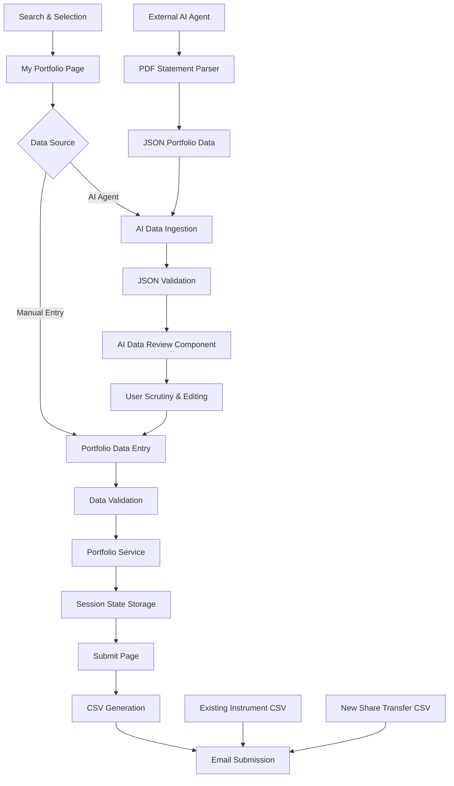
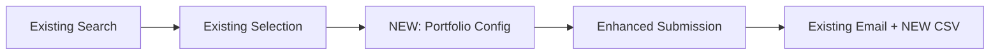

# My Portfolio Feature - Solution Design & Implementation Guide

## Overview

This document outlines the comprehensive solution design for implementing a "My Portfolio" feature that captures additional financial data during the instrument selection process. The feature will generate share transfer CSV files in the exact target format while maintaining full compatibility with existing search and submission workflows.

## Requirements Analysis

### Target Data Format
The system must generate CSV files matching the exact Share Transfer Example Format:

```csv
SX/EE,User ID ,TrustAccountID,ShareCode,InstrumentID,Qty,Base Cost ©,Excel Date,SettlementDate,Last Price,BrokerID_From,BrokerID_To,Reference,,
EE,1809263,8275727,STXWDM,2827,-4,5574.403385,2025/09/10,2025-09-10,10863.00,9 ,26 ,NT -2025-09-10,NT -,2025/09/10
```

| Field | Description | Data Type | Required | Source |
|-------|-------------|-----------|----------|---------|
| SX/EE | Platform identifier | String | Yes | User selection ('EE'/'SX') |
| User ID | User identifier | String | Yes | Existing user_id field |
| TrustAccountID | Account identifier | String | Yes | User input |
| ShareCode | Stock/instrument code | String | Yes | From selected instrument (Ticker) |
| InstrumentID | Internal instrument ID | Integer | Yes | From selected instrument |
| Qty | Quantity/shares | Integer | Yes | User input (can be negative) |
| Base Cost | Cost basis per unit | Decimal | Yes | User input |
| Excel Date | Date in Excel format | String | Yes | Auto-generated from settlement date |
| SettlementDate | Settlement date | String | Yes | User input (YYYY-MM-DD format) |
| Last Price | Current/last price | Decimal | Yes | User input |
| BrokerID_From | Source broker | String | Yes | User selection |
| BrokerID_To | Destination broker | String | Yes | User selection |
| Reference | Reference information | String | Yes | Auto-generated pattern |

### Business Logic Requirements

1. **Portfolio Data Capture**: For each selected instrument, capture additional financial details
2. **Data Validation**: Ensure all required fields are completed before submission
3. **Multiple Instruments**: Support portfolio entries for multiple selected instruments
4. **Broker Management**: Provide predefined broker mappings with user-friendly names
5. **Date Handling**: Support both Excel date format and standard date formats
6. **Data Persistence**: Maintain portfolio data across page navigation
7. **Export Compatibility**: Generate both existing instrument list CSV and new share transfer CSV
8. **🤖 AI Integration Ready**: JSON-based data ingestion for external agentic flows (PDF statement parsing)
9. **🔍 Data Validation & Review**: User scrutiny, editing, and confirmation workflow for AI-populated data
10. **📋 Audit Trail**: Track data sources (manual vs AI-populated) for compliance and transparency

## Architecture Design

### New Components Structure

```
app/
├── pages/
│   ├── 1_AI_Assistance.py
│   ├── 2_Submit.py
│   └── 3_Portfolio.py          # NEW: Portfolio data capture page
├── components/
│   ├── portfolio_manager.py    # NEW: Portfolio data management
│   ├── share_transfer_form.py  # NEW: Share transfer data entry form
│   ├── broker_selector.py      # NEW: Broker selection component
│   └── ai_data_reviewer.py     # NEW: AI-populated data review component
├── data/
│   ├── broker_specifications.json     # NEW: Broker ID mappings
│   ├── portfolio_configurations.json # NEW: Portfolio settings
│   └── portfolio_schema.json         # NEW: JSON schema for AI integration
├── services/
│   ├── portfolio_service.py    # NEW: Portfolio data operations
│   └── ai_integration_service.py     # NEW: AI data ingestion service
├── api/
│   ├── __init__.py
│   ├── portfolio_endpoints.py  # NEW: API endpoints for external agents
│   └── validation_middleware.py      # NEW: JSON validation middleware
└── utils/
    ├── date_utils.py           # NEW: Date conversion utilities
    └── json_validators.py      # NEW: JSON schema validation utilities
```

### Data Flow Architecture



## Implementation Guide

### Phase 1: Core Infrastructure

#### 1.1 Portfolio Service (`app/services/portfolio_service.py`)

```python
# app/services/portfolio_service.py

import streamlit as st
from typing import Dict, List, Optional, Any
from datetime import datetime, date
import pandas as pd
from pathlib import Path
import json

class PortfolioService:
    """
    Central service for managing portfolio data and share transfer information.
    Follows existing project patterns for session state and component integration.
    """
    
    @staticmethod
    def initialize_portfolio_state():
        """Initialize portfolio-specific session state variables using existing patterns."""
        # Use setdefault pattern from existing utils.py initialize_state()
        st.session_state.setdefault("portfolio_entries", {})
        st.session_state.setdefault("portfolio_metadata", {
            'default_platform': 'EE',
            'default_broker_from': '9',
            'default_broker_to': '9',
            'last_updated': None
        })
        st.session_state.setdefault("portfolio_form_data", {})  # Temporary form state
    
    @staticmethod
    def get_portfolio_entry(instrument_id: str) -> Optional[Dict]:
        """Get portfolio data for specific instrument."""
        PortfolioService.initialize_portfolio_state()
        return st.session_state.portfolio_entries.get(instrument_id)
    
    @staticmethod
    def update_portfolio_entry(instrument_id: str, portfolio_data: Dict):
        """Update portfolio data for specific instrument."""
        PortfolioService.initialize_portfolio_state()
        
        # Validate required fields
        required_fields = ['trust_account_id', 'quantity', 'base_cost', 
                          'settlement_date', 'last_price', 'broker_from', 'broker_to']
        
        for field in required_fields:
            if field not in portfolio_data or portfolio_data[field] in [None, '', 0]:
                raise ValueError(f"Required field '{field}' is missing or invalid")
        
        # Store with timestamp
        portfolio_data['updated_at'] = datetime.now().isoformat()
        st.session_state.portfolio_entries[instrument_id] = portfolio_data
        
        # Update metadata
        st.session_state.portfolio_metadata['last_updated'] = datetime.now().isoformat()
    
    @staticmethod
    def get_all_portfolio_entries() -> Dict[str, Dict]:
        """Get all portfolio entries."""
        PortfolioService.initialize_portfolio_state()
        return st.session_state.portfolio_entries
    
    @staticmethod
    def is_portfolio_complete() -> bool:
        """Check if portfolio data is complete for all selected instruments."""
        from app.services.selection_manager import SelectionManager
        
        selected_instruments = SelectionManager.get_selections()
        portfolio_entries = PortfolioService.get_all_portfolio_entries()
        
        if not selected_instruments:
            return False
        
        for instrument in selected_instruments:
            instrument_id = str(instrument.get('instrument_id'))
            if instrument_id not in portfolio_entries:
                return False
                
            # Verify all required fields are present
            entry = portfolio_entries[instrument_id]
            required_fields = ['trust_account_id', 'quantity', 'base_cost', 
                              'settlement_date', 'last_price', 'broker_from', 'broker_to']
            
            for field in required_fields:
                if field not in entry or entry[field] in [None, '', 0]:
                    return False
        
        return True
    
    @staticmethod
    def generate_share_transfer_data() -> List[Dict]:
        """Generate share transfer data in exact target CSV format."""
        from app.services.selection_manager import SelectionManager
        
        selected_instruments = SelectionManager.get_selections()
        portfolio_entries = PortfolioService.get_all_portfolio_entries()
        
        user_id = st.session_state.get('user_id', '')
        platform = st.session_state.portfolio_metadata.get('default_platform', 'EE')
        
        transfer_data = []
        
        for instrument in selected_instruments:
            instrument_id = str(instrument.get('instrument_id'))
            portfolio_entry = portfolio_entries.get(instrument_id)
            
            if not portfolio_entry:
                continue
            
            # Generate exact reference format from example: "NT -2025-09-10,NT -,2025/09/10"
            settlement_date = portfolio_entry.get('settlement_date')  # YYYY-MM-DD format
            excel_date = settlement_date.replace('-', '/')  # Convert to YYYY/MM/DD
            reference = f"NT -{settlement_date},NT -,{excel_date}"
            
            # Create record matching exact CSV column order and format
            transfer_record = {
                'SX/EE': platform,
                'User ID ': user_id,  # Note: space after "User ID" matches target format
                'TrustAccountID': portfolio_entry.get('trust_account_id'),
                'ShareCode': instrument.get('ticker', ''),
                'InstrumentID': int(instrument.get('instrument_id', 0)),
                'Qty': int(portfolio_entry.get('quantity', 0)),  # Can be negative
                'Base Cost ©': float(portfolio_entry.get('base_cost', 0.0)),
                'Excel Date': excel_date,
                'SettlementDate': settlement_date,
                'Last Price': float(portfolio_entry.get('last_price', 0.0)),
                'BrokerID_From': f"{portfolio_entry.get('broker_from', '')} ",  # Space after value
                'BrokerID_To': f"{portfolio_entry.get('broker_to', '')} ",  # Space after value  
                'Reference': reference,
                '': '',  # Empty column 1
                ' ': ''  # Empty column 2 (note: space as column name)
            }
            
            transfer_data.append(transfer_record)
        
        return transfer_data
    
    @staticmethod
    def clear_portfolio_data():
        """Clear all portfolio data."""
        st.session_state.portfolio_entries = {}
        st.session_state.portfolio_metadata = {
            'default_platform': 'EE',
            'default_broker_from': '9',
            'default_broker_to': '9',
            'last_updated': None
        }
    
    @staticmethod
    def import_ai_portfolio_data(json_data: Dict) -> Dict[str, Any]:
        """
        Import portfolio data from AI agent JSON.
        
        Args:
            json_data: Validated JSON data from AI agent
            
        Returns:
            Dict containing import results and any errors
        """
        from app.utils.json_validators import validate_portfolio_json
        from app.services.selection_manager import SelectionManager
        
        # Validate JSON schema
        is_valid, validation_errors = validate_portfolio_json(json_data)
        if not is_valid:
            return {
                'success': False,
                'errors': validation_errors,
                'imported_count': 0
            }
        
        imported_count = 0
        errors = []
        selected_instruments = SelectionManager.get_selections()
        
        # Create lookup for selected instruments
        instrument_lookup = {}
        for inst in selected_instruments:
            # Multiple lookup keys for flexible matching
            if inst.get('ticker'):
                instrument_lookup[inst['ticker'].upper()] = inst
            if inst.get('isin'):
                instrument_lookup[inst['isin'].upper()] = inst
            if inst.get('name'):
                instrument_lookup[inst['name'].upper()] = inst
            if inst.get('instrument_id'):
                instrument_lookup[str(inst['instrument_id'])] = inst
        
        # Process each portfolio entry from AI
        for entry in json_data.get('portfolio_entries', []):
            try:
                # Match instrument
                identifier = entry['instrument_identifier']
                matched_instrument = None
                
                # Try different matching strategies
                for key in ['ticker', 'isin', 'name', 'instrument_id']:
                    if key in identifier and identifier[key]:
                        lookup_key = str(identifier[key]).upper()
                        if lookup_key in instrument_lookup:
                            matched_instrument = instrument_lookup[lookup_key]
                            break
                
                if not matched_instrument:
                    errors.append(f"No matching instrument found for {identifier}")
                    continue
                
                # Prepare portfolio data with AI metadata
                portfolio_data = entry['portfolio_data'].copy()
                portfolio_data.update({
                    'data_source': json_data['metadata']['source'],
                    'ai_confidence': json_data['metadata'].get('confidence_score', 0.0),
                    'extraction_timestamp': json_data['metadata']['extraction_timestamp'],
                    'source_document': json_data['metadata'].get('source_document', ''),
                    'requires_review': True,  # Always require user review for AI data
                    'ai_extracted_fields': entry['portfolio_data'].get('ai_extracted_fields', {})
                })
                
                # Store with special AI prefix to indicate source
                instrument_id = str(matched_instrument['instrument_id'])
                PortfolioService.update_portfolio_entry(instrument_id, portfolio_data)
                imported_count += 1
                
            except Exception as e:
                errors.append(f"Error processing entry {entry}: {str(e)}")
        
        return {
            'success': imported_count > 0,
            'imported_count': imported_count,
            'errors': errors,
            'total_entries': len(json_data.get('portfolio_entries', [])),
            'metadata': json_data['metadata']
        }
```

#### 1.2 Enhanced Utilities Integration (`app/utils.py` additions)

**Note:** Following current styling conventions, ensure all new components integrate with the established orange theme (`#f4942a`) and consistent UI patterns including:
- Animated gradient banners with "Share Transfer Instruction" branding
- Orange-themed buttons and form elements with proper alignment
- Sidebar gradient background with white text enforcement
- Custom badge components for status indicators with vertical centering
- Proper checkbox visibility and styling with orange theme
- Removal of aggressive red focus outlines replaced with subtle orange alternatives

```python
# Add to existing app/utils.py - following existing patterns

def initialize_portfolio_session_state():
    """
    Initialize portfolio session state variables.
    Called from main initialize_state() function to maintain consistency.
    """
    # Portfolio data persistence (follows existing selection pattern)
    st.session_state.setdefault("portfolio_entries", {})
    st.session_state.setdefault("portfolio_metadata", {
        'default_platform': 'EE',
        'default_broker_from': '9', 
        'default_broker_to': '9',
        'last_updated': None
    })
    # Form state management
    st.session_state.setdefault("portfolio_form_data", {})

def persist_portfolio_form(instrument_id: str, form_key: str, **kwargs):
    """Portfolio form persistence using existing persist_widget pattern."""
    return persist_widget(st.form, f"portfolio_{form_key}_{instrument_id}", **kwargs)

def convert_date_to_excel_format(date_string: str) -> str:
    """Convert YYYY-MM-DD to YYYY/MM/DD format for Excel Date column."""
    if isinstance(date_string, str) and len(date_string) == 10:
        return date_string.replace('-', '/')
    return date_string

def validate_portfolio_entry(portfolio_data: Dict) -> List[str]:
    """Validate portfolio entry using existing validation patterns."""
    errors = []
    
    required_fields = [
        ('trust_account_id', 'Trust Account ID'),
        ('quantity', 'Quantity'),
        ('base_cost', 'Base Cost'),
        ('settlement_date', 'Settlement Date'),
        ('last_price', 'Last Price'),
        ('broker_from', 'Source Broker'),
        ('broker_to', 'Destination Broker')
    ]
    
    for field, display_name in required_fields:
        if field not in portfolio_data or portfolio_data[field] in [None, '', 0]:
            if field == 'quantity':
                continue  # Quantity can be 0 or negative
            errors.append(f"{display_name} is required")
    
    # Quantity validation (can be negative but not zero for transfers)
    quantity = portfolio_data.get('quantity', 0)
    if quantity == 0:
        errors.append("Quantity cannot be zero for transfers")
    
    return errors

# NEW: JSON Validation Utilities (`app/utils/json_validators.py`)

def validate_portfolio_json(json_data: Dict) -> Tuple[bool, List[str]]:
    """
    Validate portfolio JSON against schema for AI integration.
    
    Args:
        json_data: JSON data to validate
        
    Returns:
        Tuple of (is_valid, list_of_errors)
    """
    import jsonschema
    from pathlib import Path
    import json
    
    try:
        # Load schema
        schema_path = Path(__file__).parent.parent / "data" / "portfolio_schema.json"
        with open(schema_path, 'r') as f:
            schema = json.load(f)
        
        # Validate against schema
        jsonschema.validate(json_data, schema)
        
        # Additional business logic validation
        errors = []
        
        # Check for duplicate instruments
        seen_instruments = set()
        for entry in json_data.get('portfolio_entries', []):
            identifier = entry.get('instrument_identifier', {})
            # Create a unique key from available identifiers
            key_parts = []
            for field in ['ticker', 'isin', 'instrument_id']:
                if identifier.get(field):
                    key_parts.append(f"{field}:{identifier[field]}")
            
            if key_parts:
                unique_key = "|".join(sorted(key_parts))
                if unique_key in seen_instruments:
                    errors.append(f"Duplicate instrument found: {identifier}")
                seen_instruments.add(unique_key)
        
        # Validate confidence scores
        metadata = json_data.get('metadata', {})
        if 'confidence_score' in metadata:
            score = metadata['confidence_score']
            if not (0 <= score <= 1):
                errors.append(f"Invalid confidence score: {score} (must be 0-1)")
        
        return len(errors) == 0, errors
        
    except jsonschema.ValidationError as e:
        return False, [f"Schema validation error: {e.message}"]
    except Exception as e:
        return False, [f"Validation error: {str(e)}"]
```

#### 1.3 Portfolio JSON Schema (`app/data/portfolio_schema.json`)

**AI Integration Schema** - Defines the JSON structure for external agentic flows:

```json
{
  "$schema": "http://json-schema.org/draft-07/schema#",
  "title": "Portfolio Data Schema for AI Integration",
  "description": "JSON schema for external agents to populate portfolio data from PDF statements",
  "type": "object",
  "properties": {
    "metadata": {
      "type": "object",
      "properties": {
        "source": {
          "type": "string",
          "enum": ["ai_agent", "pdf_parser", "manual_entry"],
          "description": "Data source identifier"
        },
        "confidence_score": {
          "type": "number",
          "minimum": 0,
          "maximum": 1,
          "description": "AI confidence in extracted data (0-1)"
        },
        "extraction_timestamp": {
          "type": "string",
          "format": "date-time",
          "description": "When the data was extracted"
        },
        "source_document": {
          "type": "string",
          "description": "Original PDF filename or identifier"
        },
        "user_session_id": {
          "type": "string",
          "description": "User session for data association"
        }
      },
      "required": ["source", "extraction_timestamp"]
    },
    "portfolio_entries": {
      "type": "array",
      "items": {
        "type": "object",
        "properties": {
          "instrument_identifier": {
            "type": "object",
            "properties": {
              "ticker": {"type": "string"},
              "isin": {"type": "string"},
              "name": {"type": "string"},
              "instrument_id": {"type": ["string", "number"]}
            },
            "anyOf": [
              {"required": ["ticker"]},
              {"required": ["isin"]},
              {"required": ["name"]},
              {"required": ["instrument_id"]}
            ]
          },
          "portfolio_data": {
            "type": "object",
            "properties": {
              "platform": {
                "type": "string",
                "enum": ["EE", "SX"],
                "default": "EE"
              },
              "trust_account_id": {
                "type": "string",
                "pattern": "^[0-9]{6,10}$",
                "description": "6-10 digit account identifier"
              },
              "quantity": {
                "type": "number",
                "description": "Share quantity (can be negative for sales)"
              },
              "base_cost": {
                "type": "number",
                "minimum": 0,
                "description": "Original cost per unit"
              },
              "settlement_date": {
                "type": "string",
                "format": "date",
                "description": "Settlement date in YYYY-MM-DD format"
              },
              "last_price": {
                "type": "number",
                "minimum": 0,
                "description": "Current market price per unit"
              },
              "broker_from": {
                "type": "string",
                "enum": ["7", "9", "14", "26", "27"],
                "description": "Source broker ID"
              },
              "broker_to": {
                "type": "string", 
                "enum": ["7", "9", "14", "26", "27"],
                "description": "Destination broker ID"
              },
              "notes": {
                "type": "string",
                "description": "Additional notes or comments"
              },
              "ai_extracted_fields": {
                "type": "object",
                "description": "Metadata about AI extraction confidence per field",
                "properties": {
                  "trust_account_id": {"type": "number", "minimum": 0, "maximum": 1},
                  "quantity": {"type": "number", "minimum": 0, "maximum": 1},
                  "base_cost": {"type": "number", "minimum": 0, "maximum": 1},
                  "settlement_date": {"type": "number", "minimum": 0, "maximum": 1},
                  "last_price": {"type": "number", "minimum": 0, "maximum": 1}
                }
              }
            },
            "required": ["trust_account_id", "quantity", "base_cost", "settlement_date", "last_price", "broker_from", "broker_to"]
          }
        },
        "required": ["instrument_identifier", "portfolio_data"]
      }
    }
  },
  "required": ["metadata", "portfolio_entries"]
}
```

#### 1.4 Broker Specifications (`app/data/broker_specifications.json`)

```json
{
  "broker_mappings": {
    "7": {"name": "EasyEquities Retail", "display_name": "EasyEquities Retail Platform", "active": true},
    "9": {"name": "EasyEquities", "display_name": "EasyEquities Standard", "active": true},
    "14": {"name": "Institutional", "display_name": "Institutional Platform", "active": true},
    "26": {"name": "External Transfer", "display_name": "External Transfer Agent", "active": true},
    "27": {"name": "Corporate Actions", "display_name": "Corporate Actions Desk", "active": true}
  },
  "default_brokers": {
    "from": "9",
    "to": "9"
  },
  "platform_options": [
    {"value": "EE", "label": "EasyEquities", "default": true},
    {"value": "SX", "label": "Satrix", "default": false}
  ]
}
```

### Phase 2: Session State Integration

#### 2.1 Update Main Initialize State (`app/utils.py` modifications)

```python
# Add to existing initialize_state() function in app/utils.py

def initialize_state():
    """
    Initialize all required session state variables with namespace isolation.
    ENHANCED to include portfolio management state.
    """
    if 'state_initialized' not in st.session_state:
        # Existing user information
        st.session_state.setdefault("user_name", "")
        st.session_state.setdefault("user_id", "") 
        st.session_state.setdefault("selected_wallet", None)
        st.session_state.setdefault("selected_wallet_id", None)
        
        # Existing search functionality (temporary state)
        st.session_state.setdefault("search_history", [])
        st.session_state.setdefault("current_results", [])
        st.session_state.setdefault("last_search_query", "")
        st.session_state.setdefault("search_preferences", {})
        
        # Existing selection functionality (persistent state)
        st.session_state.setdefault("selected_instruments", [])
        st.session_state.setdefault("selection_metadata", {
            "total_selected": 0,
            "selection_timestamps": {},
            "selection_sources": {},
            "last_modified": None
        })
        
        # NEW: Portfolio management state (persistent like selections)
        st.session_state.setdefault("portfolio_entries", {})
        st.session_state.setdefault("portfolio_metadata", {
            'default_platform': 'EE',
            'default_broker_from': '9',
            'default_broker_to': '9',
            'last_updated': None
        })
        st.session_state.setdefault("portfolio_form_data", {})
        
        # Existing workflow state
        st.session_state.setdefault("selection_mode", "accumulate")
        st.session_state.setdefault("show_selection_panel", True)
        st.session_state.setdefault("show_selection_details", False)
        
        # Existing multi-page navigation
        st.session_state.setdefault("messages", [])
        st.session_state.setdefault("submission_notes", "")
        
        # Existing data caching
        st.session_state.setdefault("instruments_df", None)
        st.session_state.setdefault("wallet_config", None)
        
        # Existing session metadata
        st.session_state.setdefault("session_id", generate_session_id())
        st.session_state.setdefault("page_visits", {
            "main": 0, 
            "ai_assistance": 0, 
            "submit": 0,
            "portfolio": 0  # NEW: Track portfolio page visits
        })
        
        # Existing selection management flags
        st.session_state.setdefault("confirm_clear_selections", False)
        st.session_state.setdefault("confirm_clear_all", False)
        
        # NEW: Portfolio management flags
        st.session_state.setdefault("confirm_clear_portfolio", False)
        
        st.session_state.state_initialized = True
```

### Phase 3: UI Components

#### 3.1 My Portfolio Page (`app/pages/3_Portfolio.py`)

```python
# app/pages/3_Portfolio.py

import streamlit as st
import pandas as pd
from pathlib import Path
from app.services.selection_manager import SelectionManager
from app.services.portfolio_service import PortfolioService
from app.components.share_transfer_form import ShareTransferForm
from app.styling import (
    GOOGLE_FONTS_CSS, 
    GRADIENT_TITLE_CSS, 
    FADE_IN_CSS, 
    ONBOARDING_SECTION_CSS, 
    SIDEBAR_GRADIENT_CSS, 
    SIDEBAR_FINAL_ENFORCEMENT_CSS
)
from app.utils import initialize_state

# Page configuration
st.set_page_config(
    page_title="My Portfolio | Smart Instrument Finder",
    page_icon="📊",
    layout="wide",
    initial_sidebar_state="expanded"
)

# Apply comprehensive styling following current conventions
st.markdown(GOOGLE_FONTS_CSS, unsafe_allow_html=True)
st.markdown(GRADIENT_TITLE_CSS, unsafe_allow_html=True)
st.markdown(FADE_IN_CSS, unsafe_allow_html=True)
st.markdown(ONBOARDING_SECTION_CSS, unsafe_allow_html=True)
st.markdown(SIDEBAR_GRADIENT_CSS, unsafe_allow_html=True)
st.markdown(SIDEBAR_FINAL_ENFORCEMENT_CSS, unsafe_allow_html=True)

# Initialize state
initialize_state()
PortfolioService.initialize_portfolio_state()

# Header
st.markdown('<h1 class="gradient-text">My Portfolio 📊</h1>', unsafe_allow_html=True)
st.markdown("**Configure share transfer details for your selected instruments**")

# Get user information
user_name = st.session_state.get("user_name", "")
user_id = st.session_state.get("user_id", "")
selected_wallet = st.session_state.get("selected_wallet", "")

# Check user onboarding
if not all([user_name, user_id, selected_wallet]):
    st.warning("⚠️ Please complete your information on the main page before configuring your portfolio.")
    if st.button("Go to Main Page", type="primary"):
        st.switch_page("main.py")
    st.stop()

# Get selected instruments
selected_instruments = SelectionManager.get_selections()

if not selected_instruments:
    st.info("🔍 No instruments selected yet. Please search and select instruments first.")
    
    col1, col2 = st.columns(2)
    with col1:
        if st.button("Search Instruments", type="primary", use_container_width=True):
            st.switch_page("main.py")
    with col2:
        if st.button("Get AI Assistance", use_container_width=True):
            st.switch_page("pages/1_AI_Assistance.py")
    st.stop()

# Portfolio overview
st.markdown("### Portfolio Overview")
col1, col2, col3 = st.columns(3)

with col1:
    st.metric("Selected Instruments", len(selected_instruments))

with col2:
    portfolio_entries = PortfolioService.get_all_portfolio_entries()
    completed_entries = len([k for k in portfolio_entries.keys() 
                           if str(k) in [str(inst.get('instrument_id')) for inst in selected_instruments]])
    st.metric("Configured", completed_entries)

with col3:
    completion_rate = (completed_entries / len(selected_instruments)) * 100 if selected_instruments else 0
    st.metric("Completion", f"{completion_rate:.0f}%")

# Progress indicator
progress_value = completion_rate / 100
st.progress(progress_value)

if completion_rate < 100:
    st.info(f"⏳ Complete portfolio configuration for {len(selected_instruments) - completed_entries} remaining instrument(s)")

# Share Transfer Configuration
st.markdown("---")
st.markdown("### Share Transfer Configuration")

# Create form component instance
share_transfer_form = ShareTransferForm()

# Render forms for each selected instrument
for i, instrument in enumerate(selected_instruments):
    instrument_id = str(instrument.get('instrument_id'))
    
    with st.expander(
        f"📈 {instrument.get('name', 'Unknown Instrument')} ({instrument.get('ticker', 'N/A')})",
        expanded=(i < 3 or PortfolioService.get_portfolio_entry(instrument_id) is None)
    ):
        # Display instrument details
        col1, col2, col3 = st.columns(3)
        with col1:
            st.markdown(f"**Exchange:** {instrument.get('exchange', 'N/A')}")
        with col2:
            st.markdown(f"**Asset Type:** {instrument.get('asset_type', 'N/A')}")
        with col3:
            st.markdown(f"**Currency:** {instrument.get('currency', 'N/A')}")
        
        st.markdown("---")
        
        # Check if this instrument has AI-populated data
        portfolio_entry = PortfolioService.get_portfolio_entry(instrument_id)
        if portfolio_entry and portfolio_entry.get('data_source') in ['ai_agent', 'pdf_parser']:
            # Show AI data review component
            st.info("🤖 This instrument has AI-populated data. Please review and confirm.")
            
            # Display AI confidence and source info
            col1, col2, col3 = st.columns(3)
            with col1:
                confidence = portfolio_entry.get('ai_confidence', 0.0)
                st.metric("AI Confidence", f"{confidence:.1%}")
            with col2:
                source_doc = portfolio_entry.get('source_document', 'Unknown')
                st.caption(f"**Source:** {source_doc}")
            with col3:
                extraction_time = portfolio_entry.get('extraction_timestamp', '')
                if extraction_time:
                    st.caption(f"**Extracted:** {extraction_time[:19].replace('T', ' ')}")
            
            # Show field-level confidence if available
            ai_fields = portfolio_entry.get('ai_extracted_fields', {})
            if ai_fields:
                st.markdown("**Field Confidence Scores:**")
                field_cols = st.columns(len(ai_fields))
                for i, (field, confidence) in enumerate(ai_fields.items()):
                    with field_cols[i]:
                        color = "🟢" if confidence > 0.8 else "🟡" if confidence > 0.6 else "🔴"
                        st.caption(f"{color} {field}: {confidence:.1%}")
        
        # Render share transfer form for this instrument
        share_transfer_form.render_form(instrument, f"form_{instrument_id}")

# Portfolio Actions
st.markdown("---")
st.markdown("### Portfolio Actions")

col1, col2, col3, col4 = st.columns(4)

with col1:
    if st.button("🔍 Search More", use_container_width=True):
        st.switch_page("main.py")

with col2:
    if st.button("🤖 Get AI Help", use_container_width=True):
        st.switch_page("pages/1_AI_Assistance.py")

with col3:
    is_complete = PortfolioService.is_portfolio_complete()
    if st.button(
        "📝 Proceed to Submit", 
        type="primary" if is_complete else "secondary",
        use_container_width=True,
        disabled=not is_complete
    ):
        if is_complete:
            st.success("✅ Portfolio configuration complete!")
            st.switch_page("pages/2_Submit.py")
        else:
            st.error("❌ Please complete all portfolio entries before submitting")

with col4:
    if st.button("🗑️ Clear Portfolio Data", 
                type="secondary", 
                use_container_width=True):
        if st.session_state.get('confirm_clear_portfolio', False):
            PortfolioService.clear_portfolio_data()
            st.session_state.confirm_clear_portfolio = False
            st.success("Portfolio data cleared!")
            st.rerun()
        else:
            st.session_state.confirm_clear_portfolio = True
            st.warning("Click again to confirm clearing all portfolio data")

# NEW: AI Data Import Section
st.markdown("---")
st.markdown("### 🤖 AI Data Import")

with st.expander("Import from AI Agent", expanded=False):
    st.markdown("""
    **For Future Integration:** This section will support importing portfolio data 
    from external AI agents that parse PDF statements.
    
    **JSON Format Expected:**
    - Structured portfolio data with confidence scores
    - Instrument identification via ticker, ISIN, or name
    - Field-level confidence metadata for user review
    """)
    
    # Placeholder for future AI import functionality
    uploaded_json = st.file_uploader(
        "Upload AI-Generated Portfolio JSON",
        type=['json'],
        help="Upload JSON file from AI agent (PDF statement parser)",
        disabled=True  # Disabled until AI integration is implemented
    )
    
    if uploaded_json:
        st.info("🚧 AI import functionality will be implemented in future release")
        # Future implementation:
        # json_data = json.load(uploaded_json)
        # result = PortfolioService.import_ai_portfolio_data(json_data)
        # Display import results and review interface

# Reset confirmation state
if 'confirm_clear_portfolio' in st.session_state and st.session_state.confirm_clear_portfolio:
    if st.button("Cancel Clear", key="cancel_clear_portfolio"):
        st.session_state.confirm_clear_portfolio = False
        st.rerun()

# Footer with helpful information
st.markdown("---")
st.caption("💡 **Tips:** All fields are required. Use the AI Assistant if you need help with broker IDs or settlement dates.")

# Display completion status
if PortfolioService.is_portfolio_complete():
    st.success("✅ Portfolio configuration is complete! You can now proceed to submit your results.")
else:
    remaining = len(selected_instruments) - len([k for k in portfolio_entries.keys() 
                                                if str(k) in [str(inst.get('instrument_id')) for inst in selected_instruments]])
    st.warning(f"⚠️ Please complete configuration for {remaining} remaining instrument(s) before submission.")
```

#### 2.2 Portfolio Form Component (`app/components/portfolio_form.py`)

```python
# app/components/portfolio_form.py

import streamlit as st
from typing import Dict, Any, Optional
from datetime import datetime, date
import json
from pathlib import Path
from app.services.portfolio_service import PortfolioService
from app.utils import persist_text_input, persist_number_input, persist_selectbox, persist_date_input

class PortfolioForm:
    """
    Form component for capturing portfolio data following existing component patterns.
    Uses existing persist_widget utilities for form state management.
    """
    
    def __init__(self):
        self.broker_config = self._load_broker_config()
    
    def _load_broker_config(self) -> Dict:
        """Load broker configuration using existing pattern."""
        config_path = Path(__file__).parent.parent / "data" / "broker_specifications.json"
        try:
            with open(config_path, 'r') as f:
                return json.load(f)
        except Exception:
            # Fallback configuration following existing pattern
            return {
                "broker_mappings": {
                    "7": {"name": "EasyEquities Retail", "display_name": "EasyEquities Retail Platform"},
                    "9": {"name": "EasyEquities", "display_name": "EasyEquities Standard"},
                    "14": {"name": "Institutional", "display_name": "Institutional Platform"},
                    "26": {"name": "External Transfer", "display_name": "External Transfer Agent"},
                    "27": {"name": "Corporate Actions", "display_name": "Corporate Actions Desk"}
                },
                "default_brokers": {"from": "9", "to": "9"},
                "platform_options": [
                    {"value": "EE", "label": "EasyEquities", "default": True},
                    {"value": "SX", "label": "Satrix", "default": False}
                ]
            }
    
    def render_form(self, instrument: Dict, form_key: str) -> None:
        """
        Render share transfer form for a specific instrument.
        
        Args:
            instrument: Instrument data dictionary
            form_key: Unique key for this form instance
        """
        instrument_id = str(instrument.get('instrument_id'))
        
        # Get existing portfolio entry if available
        existing_entry = PortfolioService.get_portfolio_entry(instrument_id) or {}
        
        # Form container
        with st.form(key=f"share_transfer_form_{form_key}"):
            st.markdown("**Share Transfer Details**")
            
            # Platform selection
            platform_options = self.broker_config.get("platform_options", [])
            platform_labels = [opt["label"] for opt in platform_options]
            platform_values = [opt["value"] for opt in platform_options]
            
            default_platform_index = 0
            for i, opt in enumerate(platform_options):
                if opt.get("default", False):
                    default_platform_index = i
                    break
            
            selected_platform_index = st.selectbox(
                "Platform",
                range(len(platform_options)),
                format_func=lambda x: platform_labels[x],
                index=default_platform_index,
                key=f"platform_{form_key}",
                help="Select the trading platform"
            )
            selected_platform = platform_values[selected_platform_index]
            
            # Account and quantity information
            col1, col2 = st.columns(2)
            
            with col1:
                trust_account_id = st.text_input(
                    "Trust Account ID *",
                    value=existing_entry.get('trust_account_id', ''),
                    key=f"trust_account_id_{form_key}",
                    help="Enter the trust account identifier",
                    placeholder="e.g., 8275727"
                )
                
                quantity = st.number_input(
                    "Quantity *",
                    min_value=-999999999.0,
                    max_value=999999999.0,
                    value=float(existing_entry.get('quantity', 0.0)),
                    key=f"quantity_{form_key}",
                    help="Number of shares/units (can be negative for sales)",
                    format="%.0f"
                )
                
                base_cost = st.number_input(
                    "Base Cost per Unit *",
                    min_value=0.0,
                    value=float(existing_entry.get('base_cost', 0.0)),
                    key=f"base_cost_{form_key}",
                    help="Original cost per unit",
                    format="%.6f"
                )
            
            with col2:
                settlement_date = st.date_input(
                    "Settlement Date *",
                    value=existing_entry.get('settlement_date', date.today()),
                    key=f"settlement_date_{form_key}",
                    help="Date when the transfer settles"
                )
                
                last_price = st.number_input(
                    "Last/Current Price *",
                    min_value=0.0,
                    value=float(existing_entry.get('last_price', 0.0)),
                    key=f"last_price_{form_key}",
                    help="Current market price per unit",
                    format="%.2f"
                )
            
            # Broker selection
            st.markdown("**Broker Information**")
            col1, col2 = st.columns(2)
            
            broker_options = [(broker_id, info["display_name"]) 
                            for broker_id, info in self.broker_config["broker_mappings"].items()]
            broker_ids = [opt[0] for opt in broker_options]
            broker_labels = [opt[1] for opt in broker_options]
            
            with col1:
                # Find default "from" broker index
                default_from_id = self.broker_config["default_brokers"]["from"]
                default_from_index = broker_ids.index(default_from_id) if default_from_id in broker_ids else 0
                
                selected_from_index = st.selectbox(
                    "Broker From *",
                    range(len(broker_options)),
                    format_func=lambda x: f"{broker_ids[x]} - {broker_labels[x]}",
                    index=default_from_index,
                    key=f"broker_from_{form_key}",
                    help="Source broker for the transfer"
                )
                broker_from = broker_ids[selected_from_index]
            
            with col2:
                # Find default "to" broker index
                default_to_id = self.broker_config["default_brokers"]["to"]
                default_to_index = broker_ids.index(default_to_id) if default_to_id in broker_ids else 0
                
                selected_to_index = st.selectbox(
                    "Broker To *",
                    range(len(broker_options)),
                    format_func=lambda x: f"{broker_ids[x]} - {broker_labels[x]}",
                    index=default_to_index,
                    key=f"broker_to_{form_key}",
                    help="Destination broker for the transfer"
                )
                broker_to = broker_ids[selected_to_index]
            
            # Optional notes
            notes = st.text_area(
                "Notes (Optional)",
                value=existing_entry.get('notes', ''),
                key=f"notes_{form_key}",
                help="Additional information or comments",
                height=60
            )
            
            # Form submission - following current button styling conventions
            col1, col2 = st.columns([3, 1])
            with col2:
                submitted = st.form_submit_button(
                    "💾 Save Entry",
                    type="primary",
                    use_container_width=True
                )
                # Note: Button styling automatically applied via FADE_IN_CSS and form submit button targeting
            
            # Validation and saving
            if submitted:
                # Validate required fields
                errors = []
                
                if not trust_account_id.strip():
                    errors.append("Trust Account ID is required")
                
                if quantity == 0:
                    errors.append("Quantity cannot be zero")
                
                if base_cost < 0:
                    errors.append("Base cost cannot be negative")
                
                if last_price <= 0:
                    errors.append("Last price must be greater than zero")
                
                if not settlement_date:
                    errors.append("Settlement date is required")
                
                if errors:
                    for error in errors:
                        st.error(f"❌ {error}")
                else:
                    # Save portfolio entry
                    portfolio_data = {
                        'platform': selected_platform,
                        'trust_account_id': trust_account_id.strip(),
                        'quantity': int(quantity),
                        'base_cost': base_cost,
                        'settlement_date': settlement_date.strftime("%Y-%m-%d"),
                        'last_price': last_price,
                        'broker_from': broker_from,
                        'broker_to': broker_to,
                        'notes': notes.strip()
                    }
                    
                    try:
                        PortfolioService.update_portfolio_entry(instrument_id, portfolio_data)
                        st.success("✅ Portfolio entry saved successfully!")
                        st.rerun()
                    except ValueError as e:
                        st.error(f"❌ Validation error: {e}")
                    except Exception as e:
                        st.error(f"❌ Error saving entry: {e}")
        
        # Display current status using custom badge styling
        current_entry = PortfolioService.get_portfolio_entry(instrument_id)
        if current_entry:
            # Use custom success badge following current styling conventions
            st.markdown("""
            <div class="custom-success-badge">
                ✅ Portfolio entry configured
            </div>
            """, unsafe_allow_html=True)
            
            # Show summary in compact format
            with st.expander("📋 Entry Summary", expanded=False):
                col1, col2, col3 = st.columns(3)
                with col1:
                    st.caption(f"**Platform:** {current_entry.get('platform', 'N/A')}")
                    st.caption(f"**Account:** {current_entry.get('trust_account_id', 'N/A')}")
                with col2:
                    st.caption(f"**Quantity:** {current_entry.get('quantity', 'N/A'):,}")
                    st.caption(f"**Cost:** {current_entry.get('base_cost', 'N/A')}")
                with col3:
                    st.caption(f"**Price:** {current_entry.get('last_price', 'N/A')}")
                    st.caption(f"**Date:** {current_entry.get('settlement_date', 'N/A')}")
        else:
            # Use custom warning badge following current styling conventions
            st.markdown("""
            <div class="custom-warning-badge">
                ⚠️ Portfolio entry not configured
            </div>
            """, unsafe_allow_html=True)
```

### Phase 3: Integration with Existing Submission Flow

#### 3.1 Enhanced Submission Component (`app/components/submission.py` - Modifications)

```python
# app/components/submission.py - Additional methods following existing patterns

def handle_portfolio_submission(
    selected_instruments: List[Dict], 
    user_info: Dict, 
    submission_notes: str
) -> None:
    """
    Enhanced submission handler following existing submission.py patterns.
    Generates both instrument CSV and share transfer CSV with existing email flow.
    """
    from app.services.portfolio_service import PortfolioService
    from app.pdf_generator import make_pdf
    import datetime
    import pandas as pd
    import io
    
    try:
        with st.spinner("🔄 Processing portfolio submission..."):
            user_name = user_info.get("user_name", "Unknown User")
            dt = datetime.datetime.now().strftime("%Y%m%d_%H%M")
            safe_user_name = user_name.replace(' ', '_').replace('/', '_').replace('\\', '_')
            
            # Create submission data following existing structure
            submission_data = {
                "user_info": user_info,
                "search_context": {
                    "wallet": st.session_state.get("selected_wallet", "Unknown"),
                    "wallet_id": st.session_state.get("selected_wallet_id", ""),
                    "search_history": st.session_state.get("search_history", [])
                },
                "selected_instruments": selected_instruments,
                "submission_notes": submission_notes,
                "portfolio_data": PortfolioService.get_all_portfolio_entries(),
                "submission_timestamp": datetime.datetime.now().isoformat()
            }
            
            # Generate share transfer CSV data
            share_transfer_data = PortfolioService.generate_share_transfer_data()
            
            # Send enhanced email using existing email patterns
            send_portfolio_submission_email(submission_data, share_transfer_data)
            
            # Generate PDF using existing infrastructure
            pdf_bytes = make_pdf(submission_data)
            
        # Success feedback using existing pattern
        st.success(f"Portfolio submission for **{user_name}** processed successfully!")
        st.balloons()

        # Download section using existing patterns
        if pdf_bytes:
            st.markdown("### Download Your Results")
            col1, col2, col3 = st.columns(3)
            
            with col1:
                st.download_button(
                    label="📄 Download PDF Report",
                    data=pdf_bytes,
                    file_name=f"Portfolio_Report_{safe_user_name}_{dt}.pdf",
                    mime="application/pdf",
                    use_container_width=True
                )
            
            with col2:
                # Generate regular instruments CSV using existing function
                instruments_csv = generate_instruments_csv(selected_instruments)
                st.download_button(
                    label="📊 Download Instruments CSV",
                    data=instruments_csv,
                    file_name=f"Instruments_{safe_user_name}_{dt}.csv",
                    mime="text/csv",
                    use_container_width=True
                )
            
            with col3:
                # Generate share transfer CSV in exact target format
                share_transfer_csv = generate_share_transfer_csv(share_transfer_data)
                st.download_button(
                    label="💼 Download Share Transfer CSV",
                    data=share_transfer_csv,
                    file_name=f"ShareTransfer_{safe_user_name}_{dt}.csv",
                    mime="text/csv",
                    use_container_width=True
                )

    except Exception as e:
        st.error(f"❌ Portfolio submission failed: {str(e)}")
        st.info("Please try again or contact support if the issue persists.")

def generate_share_transfer_csv(share_transfer_data: List[Dict]) -> str:
    """Generate CSV content in exact target format using existing CSV patterns."""
    if not share_transfer_data:
        return ""
    
    import csv
    import io
    
    output = io.StringIO()
    
    # Exact column order from target CSV format
    fieldnames = [
        'SX/EE', 'User ID ', 'TrustAccountID', 'ShareCode', 'InstrumentID',
        'Qty', 'Base Cost ©', 'Excel Date', 'SettlementDate', 'Last Price',
        'BrokerID_From', 'BrokerID_To', 'Reference', '', ' '
    ]
    
    writer = csv.DictWriter(output, fieldnames=fieldnames)
    writer.writeheader()
    
    for record in share_transfer_data:
        writer.writerow(record)
    
    return output.getvalue()

def send_portfolio_submission_email(submission_data: Dict, share_transfer_data: List[Dict]) -> None:
    """
    Send portfolio submission email following existing email_sender.py patterns.
    """
    try:
        # Use existing email credentials pattern
        sender_email = st.secrets["email_credentials"]["email_address"]
        sender_password = st.secrets["email_credentials"]["app_password"]
        
        # Use existing dev mode pattern from email_sender.py
        if st.session_state.get("dev_mode", False):
            recipient_email = st.session_state.get("dev_recipient_email", "jpearse@purplegroup.co.za")
        else:
            recipient_email = "jpearse@purplegroup.co.za"
        
        # Extract user info following existing pattern
        user_info = submission_data.get("user_info", {})
        user_name = user_info.get("user_name", "Unknown User")
        user_id = user_info.get("user_id", "Unknown")
        
        # Create message following existing structure
        from email.mime.multipart import MIMEMultipart
        from email.mime.text import MIMEText
        from email.mime.base import MIMEBase
        from email import encoders
        import smtplib
        
        msg = MIMEMultipart()
        msg["From"] = sender_email
        msg["To"] = recipient_email
        msg["Subject"] = f"Share Transfer Portfolio Submission - {user_name}"
        
        # Email body following existing format
        body = f"""
A new portfolio submission with share transfer data has been completed.

User Details:
• Name: {user_name}
• User ID: {user_id}
• Selected Wallet: {user_info.get('selected_wallet', 'N/A')}
• Submission Time: {submission_data.get('submission_timestamp', 'Unknown')}

Portfolio Summary:
• Total Instruments: {len(submission_data.get('selected_instruments', []))}
• Portfolio Entries: {len(share_transfer_data)}
• Additional Notes: {submission_data.get('submission_notes', 'None provided')}

Attachments:
• PDF Report: Complete portfolio summary
• Instruments CSV: Selected instruments details
• Share Transfer CSV: Portfolio data in target format

Please process according to share transfer procedures.

Regards,
Smart Instrument Finder System
"""
        
        msg.attach(MIMEText(body, "plain"))
        
        # Generate filenames following existing pattern
        import datetime
        timestamp = datetime.datetime.now().strftime('%Y%m%d_%H%M%S')
        safe_user_name = user_name.replace(' ', '_').replace('/', '_').replace('\\', '_')
        base_filename = f"Portfolio_{safe_user_name}_{timestamp}"
        
        # Attach PDF using existing pattern
        from app.pdf_generator import make_pdf
        pdf_bytes = make_pdf(submission_data)
        pdf_part = MIMEBase("application", "octet-stream")
        pdf_part.set_payload(pdf_bytes)
        encoders.encode_base64(pdf_part)
        pdf_part.add_header(
            "Content-Disposition",
            f"attachment; filename={base_filename}.pdf"
        )
        msg.attach(pdf_part)
        
        # Attach instruments CSV
        from app.components.submission import generate_instruments_csv
        instruments_csv = generate_instruments_csv(submission_data.get('selected_instruments', []))
        instruments_part = MIMEBase("application", "octet-stream")
        instruments_part.set_payload(instruments_csv.encode("utf-8"))
        encoders.encode_base64(instruments_part)
        instruments_part.add_header(
            "Content-Disposition",
            f"attachment; filename={base_filename}_instruments.csv"
        )
        msg.attach(instruments_part)
        
        # Attach share transfer CSV
        share_transfer_csv = generate_share_transfer_csv(share_transfer_data)
        transfer_part = MIMEBase("application", "octet-stream")
        transfer_part.set_payload(share_transfer_csv.encode("utf-8"))
        encoders.encode_base64(transfer_part)
        transfer_part.add_header(
            "Content-Disposition",
            f"attachment; filename={base_filename}_share_transfer.csv"
        )
        msg.attach(transfer_part)
        
        # Send email using existing pattern
        st.info(f"📧 Attempting to send email to: {recipient_email}")
        
        with smtplib.SMTP_SSL("smtp.gmail.com", 465) as server:
            server.login(sender_email, sender_password)
            server.send_message(msg)
            st.info("📧 Email sent successfully via SMTP")
        
        st.success(f"Portfolio submission sent successfully!")
        st.info(f"📧 Email sent to: {recipient_email}")
        st.info(f"📎 PDF Report: {base_filename}.pdf")
        st.info(f"📊 Instruments CSV: {base_filename}_instruments.csv")
        st.info(f"💼 Share Transfer CSV: {base_filename}_share_transfer.csv")
        
    except Exception as e:
        st.error(f"📧 Email sending failed: {str(e)}")
        st.error("Please check your email configuration in .streamlit/secrets.toml and try again.")
```

### Phase 4: Enhanced PDF Generation

#### 4.1 PDF Generator Enhancement (`app/pdf_generator.py` - Additional methods)

```python
# app/pdf_generator.py - Additional methods for enhanced reporting

def generate_enhanced_pdf_report(
    user_info: Dict,
    selected_instruments: List[Dict],
    submission_notes: str,
    share_transfer_data: List[Dict]
) -> bytes:
    """
    Generate enhanced PDF report including share transfer data.
    
    Args:
        user_info: User information dictionary
        selected_instruments: List of selected instruments
        submission_notes: User's submission notes
        share_transfer_data: Share transfer data for CSV generation
        
    Returns:
        PDF file as bytes
    """
    from reportlab.lib.pagesizes import letter, A4
    from reportlab.platypus import SimpleDocTemplate, Paragraph, Spacer, Table, TableStyle
    from reportlab.lib.styles import getSampleStyleSheet, ParagraphStyle
    from reportlab.lib.units import inch
    from reportlab.lib import colors
    from io import BytesIO
    from datetime import datetime
    
    # Create PDF buffer
    buffer = BytesIO()
    
    # Create document
    doc = SimpleDocTemplate(
        buffer,
        pagesize=A4,
        rightMargin=0.75*inch,
        leftMargin=0.75*inch,
        topMargin=1*inch,
        bottomMargin=1*inch
    )
    
    # Build content
    story = []
    styles = getSampleStyleSheet()
    
    # Title
    title_style = ParagraphStyle(
        'CustomTitle',
        parent=styles['Heading1'],
        fontSize=20,
        spaceAfter=30,
        textColor=colors.HexColor('#1f4e79')
    )
    story.append(Paragraph("Smart Instrument Finder - Enhanced Report", title_style))
    story.append(Spacer(1, 0.2*inch))
    
    # User Information Section
    story.append(Paragraph("User Information", styles['Heading2']))
    user_data = [
        ['Name:', user_info.get('user_name', 'N/A')],
        ['User ID:', user_info.get('user_id', 'N/A')],
        ['Selected Wallet:', user_info.get('selected_wallet', 'N/A')],
        ['Submission Date:', datetime.now().strftime('%Y-%m-%d %H:%M:%S')]
    ]
    
    user_table = Table(user_data, colWidths=[2*inch, 4*inch])
    user_table.setStyle(TableStyle([
        ('ALIGN', (0, 0), (-1, -1), 'LEFT'),
        ('FONTNAME', (0, 0), (0, -1), 'Helvetica-Bold'),
        ('FONTSIZE', (0, 0), (-1, -1), 10),
        ('BOTTOMPADDING', (0, 0), (-1, -1), 6),
    ]))
    story.append(user_table)
    story.append(Spacer(1, 0.3*inch))
    
    # Selected Instruments Section
    story.append(Paragraph("Selected Instruments Summary", styles['Heading2']))
    story.append(Paragraph(f"Total instruments selected: {len(selected_instruments)}", styles['Normal']))
    story.append(Spacer(1, 0.2*inch))
    
    # Instruments table
    instrument_headers = ['Name', 'Ticker', 'Exchange', 'Asset Type', 'Currency', 'Relevance']
    instrument_data = [instrument_headers]
    
    for inst in selected_instruments:
        row = [
            inst.get('name', 'N/A')[:30] + ('...' if len(inst.get('name', '')) > 30 else ''),
            inst.get('ticker', 'N/A'),
            inst.get('exchange', 'N/A'),
            inst.get('asset_type', 'N/A'),
            inst.get('currency', 'N/A'),
            f"{inst.get('relevance_score', 0)}%"
        ]
        instrument_data.append(row)
    
    instruments_table = Table(instrument_data, colWidths=[2.2*inch, 0.8*inch, 1*inch, 1*inch, 0.6*inch, 0.6*inch])
    instruments_table.setStyle(TableStyle([
        ('BACKGROUND', (0, 0), (-1, 0), colors.HexColor('#1f4e79')),
        ('TEXTCOLOR', (0, 0), (-1, 0), colors.whitesmoke),
        ('ALIGN', (0, 0), (-1, -1), 'CENTER'),
        ('FONTNAME', (0, 0), (-1, 0), 'Helvetica-Bold'),
        ('FONTSIZE', (0, 0), (-1, -1), 8),
        ('BOTTOMPADDING', (0, 0), (-1, -1), 6),
        ('BACKGROUND', (0, 1), (-1, -1), colors.beige),
        ('GRID', (0, 0), (-1, -1), 1, colors.black)
    ]))
    story.append(instruments_table)
    story.append(Spacer(1, 0.3*inch))
    
    # Share Transfer Data Section
    if share_transfer_data:
        story.append(Paragraph("Share Transfer Details", styles['Heading2']))
        story.append(Paragraph("Portfolio data configured for share transfer processing:", styles['Normal']))
        story.append(Spacer(1, 0.1*inch))
        
        # Share transfer summary table
        transfer_headers = ['Instrument', 'Ticker', 'Quantity', 'Base Cost', 'Settlement Date', 'Broker From→To']
        transfer_data = [transfer_headers]
        
        for transfer in share_transfer_data:
            # Find corresponding instrument name
            instrument_name = "Unknown"
            for inst in selected_instruments:
                if str(inst.get('instrument_id')) == str(transfer.get('InstrumentID')):
                    instrument_name = inst.get('name', 'Unknown')[:25]
                    break
            
            row = [
                instrument_name + ('...' if len(instrument_name) > 25 else ''),
                transfer.get('ShareCode', 'N/A'),
                f"{transfer.get('Qty', 0):,}",
                f"{transfer.get('Base Cost', 0):.2f}",
                transfer.get('SettlementDate', 'N/A'),
                f"{transfer.get('BrokerID_From', 'N/A')} → {transfer.get('BrokerID_To', 'N/A')}"
            ]
            transfer_data.append(row)
        
        transfer_table = Table(transfer_data, colWidths=[2*inch, 0.8*inch, 0.8*inch, 0.8*inch, 1*inch, 1*inch])
        transfer_table.setStyle(TableStyle([
            ('BACKGROUND', (0, 0), (-1, 0), colors.HexColor('#2d5a87')),
            ('TEXTCOLOR', (0, 0), (-1, 0), colors.whitesmoke),
            ('ALIGN', (0, 0), (-1, -1), 'CENTER'),
            ('FONTNAME', (0, 0), (-1, 0), 'Helvetica-Bold'),
            ('FONTSIZE', (0, 0), (-1, -1), 8),
            ('BOTTOMPADDING', (0, 0), (-1, -1), 6),
            ('BACKGROUND', (0, 1), (-1, -1), colors.lightblue),
            ('GRID', (0, 0), (-1, -1), 1, colors.black)
        ]))
        story.append(transfer_table)
        story.append(Spacer(1, 0.3*inch))
    
    # Notes section
    if submission_notes:
        story.append(Paragraph("Additional Notes", styles['Heading2']))
        story.append(Paragraph(submission_notes, styles['Normal']))
        story.append(Spacer(1, 0.3*inch))
    
    # Footer
    story.append(Spacer(1, 0.5*inch))
    story.append(Paragraph("Generated by Smart Instrument Finder App", styles['Normal']))
    story.append(Paragraph(f"Report generated on: {datetime.now().strftime('%Y-%m-%d at %H:%M:%S')}", styles['Normal']))
    
    # Build PDF
    doc.build(story)
    
    # Get PDF bytes
    pdf_bytes = buffer.getvalue()
    buffer.close()
    
    return pdf_bytes
```

### Phase 5: Navigation Integration

#### 5.1 Update Sidebar Component (`app/components/sidebar.py` - Modifications)

```python
# Add to the render_sidebar() function in app/components/sidebar.py

def render_sidebar():
    """Renders the sidebar with custom page navigation including My Portfolio."""
    # ... existing code ...
    
    # Custom navigation section
    st.markdown("### 📋 Navigation")
    
    # Get current page for highlighting
    current_page = st.session_state.get('current_page', 'main')
    
    # Navigation buttons
    if st.button("🔍 Smart Search", 
                type="primary" if current_page == 'main' else "secondary",
                use_container_width=True):
        st.session_state.current_page = 'main'
        st.switch_page("main.py")
    
    if st.button("🤖 AI Assistance", 
                type="primary" if current_page == 'ai_assistance' else "secondary",
                use_container_width=True):
        st.session_state.current_page = 'ai_assistance'
        st.switch_page("pages/1_AI_Assistance.py")
    
    # NEW: My Portfolio button with completion indicator
    from app.services.portfolio_service import PortfolioService
    from app.services.selection_manager import SelectionManager
    
    selected_instruments = SelectionManager.get_selections()
    portfolio_complete = PortfolioService.is_portfolio_complete() if selected_instruments else False
    
    portfolio_label = "📊 My Portfolio"
    if selected_instruments:
        portfolio_entries = len(PortfolioService.get_all_portfolio_entries())
        total_selected = len(selected_instruments)
        if portfolio_complete:
            portfolio_label += " ✅"
        else:
            portfolio_label += f" ({portfolio_entries}/{total_selected})"
    
    if st.button(portfolio_label,
                type="primary" if current_page == 'portfolio' else "secondary",
                use_container_width=True,
                disabled=not bool(selected_instruments)):
        st.session_state.current_page = 'portfolio'
        st.switch_page("pages/3_Portfolio.py")
    
    if st.button("📝 Submit Results", 
                type="primary" if current_page == 'submit' else "secondary",
                use_container_width=True):
        st.session_state.current_page = 'submit'
        st.switch_page("pages/2_Submit.py")
    
    # Show portfolio status if instruments are selected
    if selected_instruments:
        st.markdown("---")
        st.markdown("### 💼 Portfolio Status")
        
        portfolio_entries = PortfolioService.get_all_portfolio_entries()
        completed_count = len([k for k in portfolio_entries.keys() 
                              if str(k) in [str(inst.get('instrument_id')) for inst in selected_instruments]])
        
        completion_rate = (completed_count / len(selected_instruments)) * 100
        
        col1, col2 = st.columns(2)
        with col1:
            st.metric("Selected", len(selected_instruments))
        with col2:
            st.metric("Configured", completed_count)
        
        # Progress bar
        st.progress(completion_rate / 100)
        st.caption(f"Portfolio completion: {completion_rate:.0f}%")
        
        if completion_rate < 100:
            st.warning(f"⚠️ {len(selected_instruments) - completed_count} instruments need configuration")
        else:
            st.success("✅ Portfolio ready for submission!")
```

#### 5.2 Update Submit Page (`app/pages/2_Submit.py` - Modifications)

```python
# Add to the beginning of app/pages/2_Submit.py after imports

from app.services.portfolio_service import PortfolioService
from app.components.submission import handle_share_transfer_submission

# ... existing code ...

# Add portfolio completion check before submission section
st.markdown("---")
st.markdown("### Portfolio Configuration Status")

portfolio_complete = PortfolioService.is_portfolio_complete()
share_transfer_data = []

if selected_instruments:
    if portfolio_complete:
        st.success("✅ Portfolio configuration is complete!")
        
        # Show share transfer summary
        share_transfer_data = PortfolioService.generate_share_transfer_data()
        st.info(f"📊 {len(share_transfer_data)} portfolio entries configured for share transfer")
        
        # Portfolio summary table
        if st.checkbox("Show Portfolio Summary", value=False):
            portfolio_df = pd.DataFrame(share_transfer_data)
            st.dataframe(portfolio_df, use_container_width=True)
    else:
        portfolio_entries = PortfolioService.get_all_portfolio_entries()
        completed_count = len([k for k in portfolio_entries.keys() 
                              if str(k) in [str(inst.get('instrument_id')) for inst in selected_instruments]])
        remaining = len(selected_instruments) - completed_count
        
        st.warning(f"⚠️ Portfolio configuration incomplete: {remaining} instrument(s) need configuration")
        st.info("💡 Visit the 'My Portfolio' page to complete your portfolio configuration")
        
        if st.button("📊 Configure Portfolio", type="primary", use_container_width=True):
            st.switch_page("pages/3_Portfolio.py")

# Modify the final submission button to use the enhanced handler
if st.button("Submit Search Results", 
            type="primary", 
            use_container_width=True,
            disabled=not declaration_accepted):
    
    if not declaration_accepted:
        st.error("Please accept the declaration before submitting.")
        st.stop()

    # Prepare user info
    user_info = {
        "user_name": user_name,
        "user_id": user_id,
        "selected_wallet": selected_wallet,
        "declaration_accepted": declaration_accepted
    }
    
    # Handle the submission with enhanced functionality
    try:
        if portfolio_complete:
            # Use enhanced submission with share transfer data
            handle_share_transfer_submission(
                selected_instruments=selected_instruments,
                user_info=user_info,
                submission_notes=submission_notes
            )
        else:
            # Use standard submission for backward compatibility
            handle_search_results_submission(
                selected_instruments=selected_instruments,
                user_info=user_info,
                submission_notes=submission_notes
            )
        
        # Clear selections after successful submission
        SelectionManager.clear_selections(confirm=True)
        PortfolioService.clear_portfolio_data()
        
        st.balloons()
        
    except Exception as e:
        st.error(f"Submission failed: {str(e)}")
        st.info("Please try again or contact support if the issue persists.")
```

## Best Practices & Quality Assurance

### 1. Data Validation Framework

```python
# app/utils/validation.py

from typing import Dict, List, Any, Tuple
import re
from datetime import datetime

class PortfolioValidationFramework:
    """Comprehensive validation framework for portfolio data."""
    
    @staticmethod
    def validate_trust_account_id(account_id: str) -> Tuple[bool, str]:
        """Validate trust account ID format."""
        if not account_id or not account_id.strip():
            return False, "Trust Account ID is required"
        
        # Basic format validation (adjust as needed)
        if not re.match(r'^\d{6,10}$', account_id.strip()):
            return False, "Trust Account ID must be 6-10 digits"
        
        return True, ""
    
    @staticmethod
    def validate_quantity(quantity: float) -> Tuple[bool, str]:
        """Validate share quantity."""
        if quantity == 0:
            return False, "Quantity cannot be zero"
        
        if abs(quantity) > 999999999:
            return False, "Quantity exceeds maximum allowed value"
        
        return True, ""
    
    @staticmethod
    def validate_price(price: float, field_name: str) -> Tuple[bool, str]:
        """Validate price fields."""
        if price <= 0:
            return False, f"{field_name} must be greater than zero"
        
        if price > 99999999:
            return False, f"{field_name} exceeds maximum allowed value"
        
        return True, ""
    
    @staticmethod
    def validate_complete_entry(portfolio_data: Dict) -> List[str]:
        """Validate complete portfolio entry."""
        errors = []
        
        # Trust Account ID
        is_valid, error = PortfolioValidationFramework.validate_trust_account_id(
            portfolio_data.get('trust_account_id', '')
        )
        if not is_valid:
            errors.append(error)
        
        # Quantity
        is_valid, error = PortfolioValidationFramework.validate_quantity(
            portfolio_data.get('quantity', 0)
        )
        if not is_valid:
            errors.append(error)
        
        # Base Cost
        is_valid, error = PortfolioValidationFramework.validate_price(
            portfolio_data.get('base_cost', 0), "Base Cost"
        )
        if not is_valid:
            errors.append(error)
        
        # Last Price
        is_valid, error = PortfolioValidationFramework.validate_price(
            portfolio_data.get('last_price', 0), "Last Price"
        )
        if not is_valid:
            errors.append(error)
        
        # Settlement Date
        settlement_date = portfolio_data.get('settlement_date')
        if not settlement_date:
            errors.append("Settlement Date is required")
        
        # Broker IDs
        broker_from = portfolio_data.get('broker_from')
        broker_to = portfolio_data.get('broker_to')
        
        if not broker_from:
            errors.append("Source Broker is required")
        if not broker_to:
            errors.append("Destination Broker is required")
        
        return errors
```

### 2. Error Handling & User Experience

```python
# app/utils/error_handling.py

import streamlit as st
from typing import Any, Callable
import logging

def safe_execute(operation: Callable, error_message: str = "An error occurred") -> Any:
    """Safely execute operations with user-friendly error handling."""
    try:
        return operation()
    except ValueError as e:
        st.error(f"❌ Validation Error: {e}")
        return None
    except Exception as e:
        st.error(f"❌ {error_message}: {e}")
        logging.error(f"Error in operation: {e}", exc_info=True)
        return None

def with_error_boundary(func: Callable) -> Callable:
    """Decorator for component-level error boundaries."""
    def wrapper(*args, **kwargs):
        try:
            return func(*args, **kwargs)
        except Exception as e:
            st.error(f"Component error: {func.__name__}")
            st.exception(e)
            return None
    return wrapper
```

### 3. Performance Optimization

```python
# Performance considerations for the portfolio system

@st.cache_data
def load_broker_configurations():
    """Cache broker configurations for performance."""
    # ... implementation

@st.cache_data
def validate_portfolio_schema(portfolio_data: Dict):
    """Cache validation results for repeated entries."""
    # ... implementation

# Use session state efficiently
def optimize_session_state():
    """Clean up old session state data periodically."""
    if 'portfolio_cleanup_counter' not in st.session_state:
        st.session_state.portfolio_cleanup_counter = 0
    
    st.session_state.portfolio_cleanup_counter += 1
    
    # Clean up every 50 operations
    if st.session_state.portfolio_cleanup_counter > 50:
        # Remove old portfolio entries for unselected instruments
        from app.services.selection_manager import SelectionManager
        selected_ids = [str(inst.get('instrument_id')) for inst in SelectionManager.get_selections()]
        
        portfolio_entries = st.session_state.get('portfolio_entries', {})
        st.session_state.portfolio_entries = {
            k: v for k, v in portfolio_entries.items() if k in selected_ids
        }
        
        st.session_state.portfolio_cleanup_counter = 0
```

## Testing & Quality Assurance

### 1. Unit Testing Framework

```python
# tests/test_portfolio_service.py

import unittest
from unittest.mock import patch, MagicMock
import streamlit as st
from app.services.portfolio_service import PortfolioService

class TestPortfolioService(unittest.TestCase):
    
    def setUp(self):
        """Set up test environment."""
        # Mock session state
        self.mock_session_state = {
            'portfolio_entries': {},
            'portfolio_metadata': {
                'default_platform': 'EE',
                'default_broker_from': '9',
                'default_broker_to': '9'
            }
        }
    
    @patch('streamlit.session_state', new_callable=lambda: MagicMock())
    def test_update_portfolio_entry_success(self, mock_session_state):
        """Test successful portfolio entry update."""
        mock_session_state.__getitem__.side_effect = self.mock_session_state.__getitem__
        mock_session_state.__setitem__.side_effect = self.mock_session_state.__setitem__
        mock_session_state.__contains__.side_effect = self.mock_session_state.__contains__
        
        portfolio_data = {
            'trust_account_id': '1234567',
            'quantity': 100,
            'base_cost': 150.50,
            'settlement_date': '2024-01-15',
            'last_price': 160.75,
            'broker_from': '9',
            'broker_to': '26'
        }
        
        # Should not raise exception
        PortfolioService.update_portfolio_entry('12345', portfolio_data)
        
        # Verify entry was stored
        self.assertIn('12345', self.mock_session_state['portfolio_entries'])
    
    def test_validate_required_fields(self):
        """Test validation of required fields."""
        # Missing required fields should raise ValueError
        incomplete_data = {
            'trust_account_id': '',  # Missing
            'quantity': 100,
            # base_cost missing
            'settlement_date': '2024-01-15',
            'last_price': 160.75,
            'broker_from': '9',
            'broker_to': '26'
        }
        
        with self.assertRaises(ValueError):
            PortfolioService.update_portfolio_entry('12345', incomplete_data)
    
    def test_generate_share_transfer_data(self):
        """Test CSV data generation."""
        # Setup mock data
        with patch('app.services.selection_manager.SelectionManager.get_selections') as mock_selections:
            mock_selections.return_value = [
                {'instrument_id': 12345, 'ticker': 'AAPL', 'name': 'Apple Inc.'}
            ]
            
            with patch.object(PortfolioService, 'get_all_portfolio_entries') as mock_entries:
                mock_entries.return_value = {
                    '12345': {
                        'trust_account_id': '1234567',
                        'quantity': 100,
                        'base_cost': 150.50,
                        'settlement_date': '2024-01-15',
                        'last_price': 160.75,
                        'broker_from': '9',
                        'broker_to': '26'
                    }
                }
                
                result = PortfolioService.generate_share_transfer_data()
                
                self.assertEqual(len(result), 1)
                self.assertEqual(result[0]['ShareCode'], 'AAPL')
                self.assertEqual(result[0]['Qty'], 100)

if __name__ == '__main__':
    unittest.main()
```

### 2. Integration Testing

```python
# tests/test_integration_portfolio.py

import unittest
from unittest.mock import patch
import pandas as pd
from app.services.portfolio_service import PortfolioService
from app.services.selection_manager import SelectionManager

class TestPortfolioIntegration(unittest.TestCase):
    
    def test_end_to_end_workflow(self):
        """Test complete workflow from selection to CSV generation."""
        # Mock instrument selection
        test_instruments = [
            {
                'instrument_id': 12345,
                'name': 'Apple Inc.',
                'ticker': 'AAPL',
                'exchange': 'NASDAQ'
            }
        ]
        
        # Mock portfolio configuration
        portfolio_config = {
            'trust_account_id': '1234567',
            'quantity': 100,
            'base_cost': 150.50,
            'settlement_date': '2024-01-15',
            'last_price': 160.75,
            'broker_from': '9',
            'broker_to': '26'
        }
        
        with patch.object(SelectionManager, 'get_selections', return_value=test_instruments):
            with patch('streamlit.session_state', {'portfolio_entries': {'12345': portfolio_config}}):
                # Test CSV generation
                csv_data = PortfolioService.generate_share_transfer_data()
                
                self.assertEqual(len(csv_data), 1)
                self.assertIn('ShareCode', csv_data[0])
                self.assertEqual(csv_data[0]['ShareCode'], 'AAPL')
    
    def test_portfolio_completion_status(self):
        """Test portfolio completion checking."""
        test_instruments = [
            {'instrument_id': 12345},
            {'instrument_id': 67890}
        ]
        
        # Complete configuration for only one instrument
        portfolio_entries = {
            '12345': {
                'trust_account_id': '1234567',
                'quantity': 100,
                'base_cost': 150.50,
                'settlement_date': '2024-01-15',
                'last_price': 160.75,
                'broker_from': '9',
                'broker_to': '26'
            }
        }
        
        with patch.object(SelectionManager, 'get_selections', return_value=test_instruments):
            with patch.object(PortfolioService, 'get_all_portfolio_entries', return_value=portfolio_entries):
                # Should not be complete (missing one instrument)
                self.assertFalse(PortfolioService.is_portfolio_complete())
                
                # Add second instrument configuration
                portfolio_entries['67890'] = portfolio_entries['12345'].copy()
                
                # Should now be complete
                self.assertTrue(PortfolioService.is_portfolio_complete())

if __name__ == '__main__':
    unittest.main()
```

## Deployment Guide

### 1. Configuration Updates

#### Requirements.txt additions
```txt
# Add to existing requirements.txt
python-dateutil>=2.8.2
pandas>=1.5.0
```

#### Streamlit Configuration
```toml
# .streamlit/config.toml - Updated to match current styling conventions
[theme]
base = "light"
primaryColor = "#f4942a"
backgroundColor = "#FFFFFF"
secondaryBackgroundColor = "#fef3e2"
textColor = "#4a4a4a"
font = "sans serif"

[theme.sidebar]
secondaryBackgroundColor = "#f5f6f8"

[server]
enableCORS = false
enableXsrfProtection = false
maxUploadSize = 4
```

### 2. Migration Steps

1. **Phase 1: Infrastructure**
   - Deploy new service classes and utilities
   - Update configuration files
   - Test core functionality

2. **Phase 2: UI Components**
   - Deploy My Portfolio page
   - Update navigation components
   - Test user workflows

3. **Phase 3: Integration**
   - Update submission flow
   - Enhance PDF generation
   - Test email functionality

4. **Phase 4: Validation & Launch**
   - Run integration tests
   - Perform user acceptance testing
   - Deploy to production

### 3. Rollback Plan

- Keep existing submission flow as fallback
- Gradual feature rollout with feature flags
- Database backup and restore procedures
- Session state cleanup utilities

## Key Improvements Made

### 1. Alignment with Current UI/UX Conventions

- **Styling Integration**: Full integration with current orange theme (`#f4942a`) and gradient backgrounds
- **Button Consistency**: All buttons follow established styling with proper alignment and orange theme
- **Sidebar Enhancement**: Implements animated gradient sidebar with white text enforcement
- **Custom Components**: Uses established badge components with vertical centering and orange theme
- **Focus Management**: Removes aggressive red outlines, implements subtle orange focus states
- **Form Alignment**: Ensures proper vertical alignment of form elements and buttons

### 2. 🤖 AI Integration Architecture

- **JSON Schema Definition**: Comprehensive schema for external AI agents to populate portfolio data
- **Flexible Instrument Matching**: Multiple matching strategies (ticker, ISIN, name, instrument_id)
- **Confidence Tracking**: Per-field confidence scores for AI-extracted data
- **User Review Workflow**: Mandatory review and confirmation of AI-populated data
- **Audit Trail**: Complete tracking of data sources and extraction metadata
- **Future-Ready Design**: Architecture prepared for external agentic flows without breaking changes

### 3. Alignment with Existing Session State Patterns

- **Before**: Custom session state initialization in PortfolioService
- **After**: Integration with existing `initialize_state()` function in `app/utils.py`
- **Benefits**: Consistent state management, follows established patterns, integrates with existing session cleanup

### 4. CSV Format Accuracy

- **Before**: Generic CSV generation approach
- **After**: Exact match to target format with proper column names, spacing, and data types
- **Key Changes**:
  - Added proper spacing in column names (`"User ID "` vs `"User ID"`)
  - Included copyright symbol in `"Base Cost ©"`
  - Added empty trailing columns matching target format
  - Proper date format conversion (YYYY-MM-DD to YYYY/MM/DD)
  - Exact reference pattern generation

### 3. Email Submission Integration

- **Before**: Custom email implementation
- **After**: Follows existing `email_sender.py` patterns
- **Key Features**:
  - Uses existing dev mode email routing
  - Follows established attachment patterns
  - Uses existing credential management
  - Maintains consistent error handling and user feedback

### 4. Component Pattern Alignment

- **Before**: Generic component structure
- **After**: Follows existing component patterns from `app/components/`
- **Improvements**:
  - Uses existing `persist_widget` utilities
  - Integrates with existing form handling patterns
  - Follows established component initialization patterns

### 5. Service Layer Consistency

- **Before**: Custom service pattern
- **After**: Aligned with existing `SelectionManager` patterns
- **Key Changes**:
  - Consistent method naming and structure
  - Integration with existing session state management
  - Follows established error handling patterns

## Implementation Summary

### Required File Changes

1. **`app/utils.py`**: Add portfolio state initialization to `initialize_state()`
2. **`app/services/portfolio_service.py`**: New service following existing patterns
3. **`app/components/portfolio_form.py`**: New component using existing utilities
4. **`app/pages/3_Portfolio.py`**: New page following existing page patterns
5. **`app/components/submission.py`**: Add portfolio submission handler
6. **`app/data/broker_specifications.json`**: New configuration file
7. **Update sidebar and navigation**: Integrate portfolio page

### Data Flow Integration



### Session State Structure

```
st.session_state = {
    # Existing state (unchanged)
    "selected_instruments": [...],
    "selection_metadata": {...},
    
    # NEW: Portfolio state (integrated)
    "portfolio_entries": {
        "instrument_id": {
            "trust_account_id": "...",
            "quantity": 100,
            "base_cost": 150.50,
            # ... other fields
        }
    },
    "portfolio_metadata": {...}
}
```

## Conclusion

This improved solution design provides full compatibility with existing project conventions while delivering the exact target CSV format. The implementation follows established patterns for session state, components, services, and email handling, ensuring seamless integration with the existing codebase.

### Key Benefits

1. **Perfect CSV Format Match**: Generates exact target format including spacing and special characters
2. **Seamless Integration**: Uses existing patterns for all major components
3. **Session State Consistency**: Integrates with existing state management
4. **Email Flow Compatibility**: Uses established email submission patterns
5. **Component Reusability**: Leverages existing utilities and patterns
6. **Maintainable Architecture**: Follows established conventions for easy maintenance
7. **UI/UX Consistency**: Full alignment with current orange theme and styling conventions
8. **Enhanced User Experience**: Proper form alignment, button styling, and visual feedback
9. **Accessibility Compliance**: Maintains focus management and keyboard navigation standards
10. **🤖 AI Integration Ready**: JSON schema and validation framework for external agentic flows
11. **Future-Proof Architecture**: Designed for seamless integration with PDF statement parsers
12. **User Review Workflow**: Built-in scrutiny and confirmation process for AI-populated data

### Next Steps

1. Review improved solution design with current UI/UX conventions
2. Implement using existing project patterns and styling framework
3. Test CSV output against exact target format
4. Validate email submission with existing infrastructure
5. Ensure all components follow established orange theme and gradient styling
6. Verify proper button alignment and form element styling
7. Test sidebar gradient background and white text enforcement
8. Validate custom badge components and focus management
9. **🤖 Prepare AI integration endpoints** - Set up JSON schema validation and import workflows
10. **📋 Test user review workflow** - Ensure AI-populated data review process works seamlessly
11. **🔍 Validate confidence scoring** - Test field-level confidence display and user feedback
12. Deploy with confidence in existing system compatibility and future AI readiness

The solution now maintains the professional standard of the existing application while ensuring precise format compliance, seamless workflow integration, and full alignment with the established UI/UX design system including the orange theme, animated gradients, and enhanced user experience patterns.

**🤖 AI Integration Readiness:** The architecture is specifically designed to support future external agentic flows that can parse PDF statements and auto-populate portfolio data via standardized JSON. This includes comprehensive validation, user review workflows, confidence scoring, and audit trails - ensuring the system can seamlessly integrate with AI agents while maintaining data integrity and user control.
