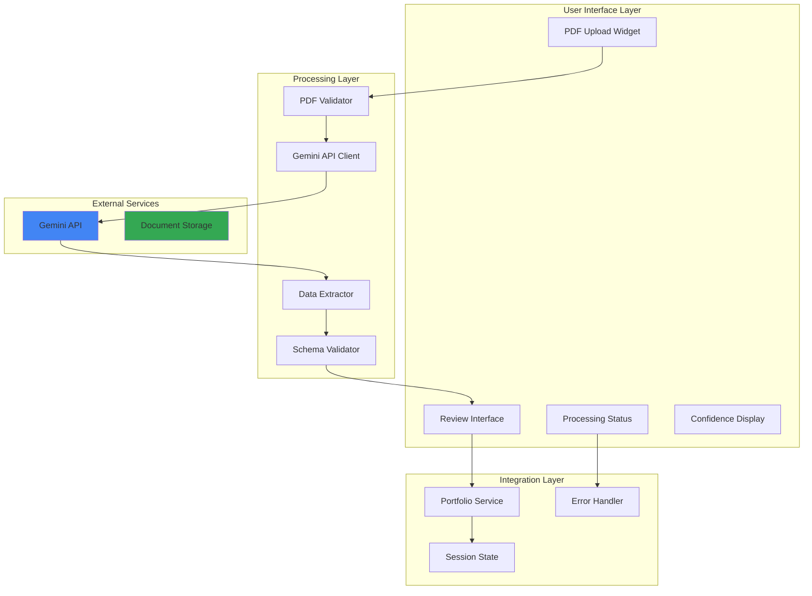
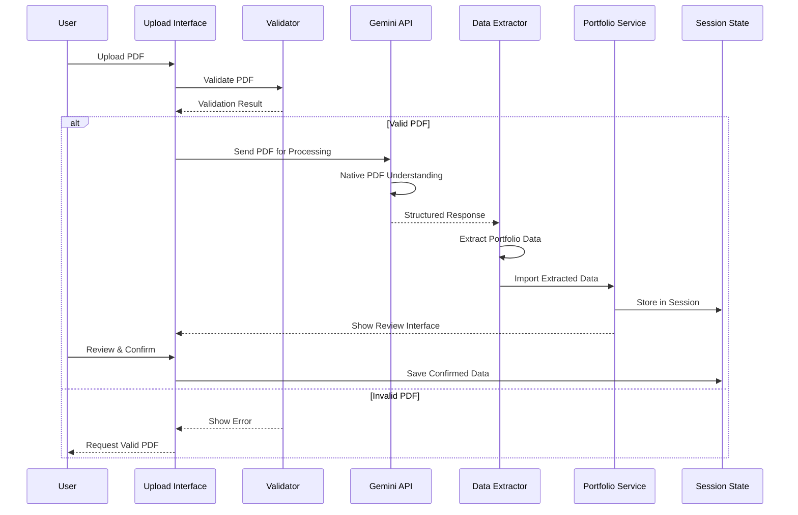
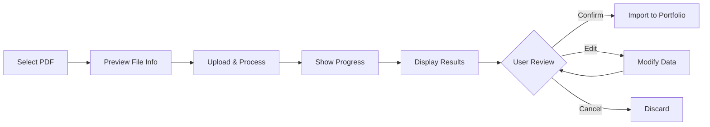

# PDF Upload with Gemini Integration - Solution Design

## Executive Summary

This document outlines the design and implementation strategy for integrating PDF document upload functionality into the Smart Instrument Finder application, leveraging Google Gemini's native document processing capabilities to automatically extract portfolio and share transfer data from client statements.

## Business Context

### Problem Statement

Clients currently need to manually enter portfolio and share transfer data, which is:
- **Time-consuming**: Manual data entry for multiple instruments
- **Error-prone**: Risk of transcription errors
- **Inefficient**: Duplicate effort when data exists in PDF statements
- **User-unfriendly**: Creates friction in the onboarding process

### Solution Overview

Implement an intelligent PDF upload facility that:
1. Accepts PDF documents through Streamlit's file upload interface
2. Processes documents using Gemini's native PDF understanding
3. Extracts structured portfolio data automatically
4. Validates and presents data for user review
5. Integrates seamlessly with existing portfolio management

## Technical Architecture

### System Architecture



### Data Flow



## Implementation Design

### 1. PDF Upload Interface

#### Component Structure
```python
# app/components/pdf_upload.py
class PDFUploadComponent:
    """
    Manages PDF upload and processing for portfolio data extraction.
    """
    
    def __init__(self):
        self.max_file_size = 20 * 1024 * 1024  # 20MB
        self.supported_types = ['application/pdf']
        self.gemini_client = None
        
    def render_upload_interface(self):
        """Render the PDF upload widget with instructions."""
        
    def process_uploaded_pdf(self, uploaded_file):
        """Process PDF through Gemini API."""
        
    def display_extraction_results(self, extracted_data):
        """Show extracted data with confidence scores."""
```

#### UI Implementation
```python
# Enhanced Portfolio Page Integration
def render_pdf_upload_section():
    st.markdown("### 📄 Import from PDF Statement")
    
    with st.expander("Upload Portfolio Statement", expanded=True):
        # Instructions
        st.info("""
        Upload your broker statement or portfolio document (PDF format).
        Our AI will automatically extract:
        - Account details and identifiers
        - Instrument holdings and quantities
        - Cost basis and prices
        - Transaction dates
        """)
        
        # File uploader
        uploaded_file = st.file_uploader(
            "Choose PDF file",
            type=['pdf'],
            accept_multiple_files=False,
            help="Maximum file size: 20MB",
            key="pdf_uploader"
        )
        
        if uploaded_file:
            # Show file info
            col1, col2 = st.columns([2, 1])
            with col1:
                st.write(f"📎 **{uploaded_file.name}**")
                st.write(f"Size: {uploaded_file.size / 1024:.1f} KB")
            with col2:
                if st.button("🔄 Process PDF", type="primary"):
                    process_pdf_document(uploaded_file)
```

### 2. Gemini API Integration

#### API Client Implementation
```python
# app/services/gemini_pdf_processor.py
import google.generativeai as genai
from typing import Dict, Any, List, Optional
import base64

class GeminiPDFProcessor:
    """
    Handles PDF processing using Google Gemini's native document understanding.
    """
    
    def __init__(self, api_key: str):
        genai.configure(api_key=api_key)
        self.model = genai.GenerativeModel('gemini-1.5-flash')
        self.extraction_prompt = self._create_extraction_prompt()
        
    def _create_extraction_prompt(self) -> str:
        """Create structured prompt for portfolio data extraction."""
        return """
        Analyze this PDF document and extract portfolio/investment data.
        
        Extract the following information in JSON format:
        {
            "document_metadata": {
                "document_type": "statement|confirmation|portfolio_summary",
                "broker_name": "string",
                "account_number": "string",
                "statement_date": "YYYY-MM-DD",
                "currency": "string"
            },
            "portfolio_entries": [
                {
                    "instrument_name": "string",
                    "ticker_symbol": "string",
                    "isin_code": "string (if available)",
                    "quantity": number,
                    "cost_basis": number,
                    "current_value": number,
                    "purchase_date": "YYYY-MM-DD",
                    "account_type": "string"
                }
            ],
            "confidence_scores": {
                "overall": 0.0-1.0,
                "document_quality": 0.0-1.0,
                "extraction_completeness": 0.0-1.0
            },
            "extraction_notes": ["any issues or ambiguities found"]
        }
        
        Rules:
        1. Extract ALL investment positions found
        2. Use exact values from the document
        3. Mark missing fields as null
        4. Include confidence scores for data quality
        5. Note any ambiguities in extraction_notes
        """
        
    def process_pdf(self, pdf_bytes: bytes) -> Dict[str, Any]:
        """
        Process PDF using Gemini's native document understanding.
        
        Args:
            pdf_bytes: PDF file content as bytes
            
        Returns:
            Extracted portfolio data with confidence scores
        """
        try:
            # Prepare the PDF for Gemini API
            response = self.model.generate_content([
                {
                    "inline_data": {
                        "mime_type": "application/pdf",
                        "data": base64.b64encode(pdf_bytes).decode()
                    }
                },
                self.extraction_prompt
            ])
            
            # Parse the JSON response
            import json
            extracted_data = json.loads(response.text)
            
            # Validate and enhance extracted data
            return self._validate_extraction(extracted_data)
            
        except Exception as e:
            return {
                "error": str(e),
                "success": False
            }
    
    def _validate_extraction(self, data: Dict) -> Dict:
        """Validate and enhance extracted data."""
        # Add validation logic
        data["success"] = True
        data["processing_timestamp"] = datetime.now().isoformat()
        return data
```

#### Advanced Extraction Strategies
```python
# app/services/advanced_pdf_extraction.py
class AdvancedPDFExtractor:
    """
    Advanced extraction strategies for complex PDF documents.
    """
    
    def extract_with_context(self, pdf_bytes: bytes, 
                            selected_instruments: List[Dict]) -> Dict:
        """
        Extract data with context from already selected instruments.
        """
        # Build context prompt
        instrument_context = self._build_instrument_context(selected_instruments)
        
        prompt = f"""
        Extract portfolio data from this PDF.
        Focus on these instruments if present:
        {instrument_context}
        
        Also extract any other instruments found.
        Match instruments by:
        1. Ticker symbol (exact match)
        2. ISIN code (if available)
        3. Instrument name (fuzzy match acceptable)
        
        Return structured JSON with matched instruments marked.
        """
        
        return self._process_with_prompt(pdf_bytes, prompt)
    
    def extract_share_transfers(self, pdf_bytes: bytes) -> Dict:
        """
        Specifically extract share transfer information.
        """
        prompt = """
        Extract share transfer details from this document:
        - From/To broker information
        - Transfer quantities (including negative for sells)
        - Settlement dates
        - Trust account numbers
        - Base cost information
        
        Structure as share transfer records.
        """
        
        return self._process_with_prompt(pdf_bytes, prompt)
```

### 3. Data Validation & Review Interface

#### Review Component
```python
# app/components/pdf_review_interface.py
class PDFReviewInterface:
    """
    Interface for reviewing and confirming extracted PDF data.
    """
    
    def render_review_interface(self, extracted_data: Dict):
        """Display extracted data for user review and confirmation."""
        
        st.markdown("### 📊 Review Extracted Data")
        
        # Show confidence scores
        self._display_confidence_metrics(extracted_data)
        
        # Display document metadata
        self._display_document_info(extracted_data)
        
        # Show extracted portfolio entries
        self._display_portfolio_entries(extracted_data)
        
        # Confirmation actions
        self._render_confirmation_actions(extracted_data)
    
    def _display_confidence_metrics(self, data: Dict):
        """Show extraction confidence scores."""
        confidence = data.get('confidence_scores', {})
        
        col1, col2, col3 = st.columns(3)
        with col1:
            score = confidence.get('overall', 0)
            color = "green" if score > 0.8 else "orange" if score > 0.6 else "red"
            st.metric("Overall Confidence", f"{score:.0%}", 
                     delta=None, delta_color="normal")
        
        with col2:
            score = confidence.get('document_quality', 0)
            st.metric("Document Quality", f"{score:.0%}")
        
        with col3:
            score = confidence.get('extraction_completeness', 0)
            st.metric("Completeness", f"{score:.0%}")
    
    def _display_portfolio_entries(self, data: Dict):
        """Display extracted portfolio entries in editable table."""
        entries = data.get('portfolio_entries', [])
        
        if entries:
            # Convert to DataFrame for display
            df = pd.DataFrame(entries)
            
            # Use st.data_editor for editable table
            edited_df = st.data_editor(
                df,
                num_rows="dynamic",
                use_container_width=True,
                hide_index=True,
                column_config={
                    "instrument_name": st.column_config.TextColumn(
                        "Instrument",
                        help="Name of the financial instrument"
                    ),
                    "ticker_symbol": st.column_config.TextColumn(
                        "Ticker",
                        help="Trading symbol"
                    ),
                    "quantity": st.column_config.NumberColumn(
                        "Quantity",
                        format="%d"
                    ),
                    "cost_basis": st.column_config.NumberColumn(
                        "Cost Basis",
                        format="%.2f"
                    )
                }
            )
            
            return edited_df
        else:
            st.warning("No portfolio entries extracted")
            return None
```

### 4. Integration with Portfolio Service

#### Enhanced Portfolio Service
```python
# app/services/portfolio_service.py (enhanced)
class PortfolioService:
    """Enhanced with PDF import capabilities."""
    
    @staticmethod
    def import_from_pdf_extraction(extracted_data: Dict, 
                                  user_confirmations: Dict) -> Dict:
        """
        Import PDF-extracted data into portfolio.
        
        Args:
            extracted_data: Data extracted from PDF by Gemini
            user_confirmations: User's review confirmations
            
        Returns:
            Import result with success/error information
        """
        try:
            validated_entries = []
            errors = []
            
            for entry in extracted_data.get('portfolio_entries', []):
                # Match with existing instruments
                matched_instrument = PortfolioService._match_instrument(entry)
                
                if matched_instrument:
                    # Create portfolio entry
                    portfolio_entry = {
                        'instrument_id': matched_instrument['instrument_id'],
                        'instrument_name': matched_instrument['name'],
                        'ticker': matched_instrument['ticker'],
                        'platform': entry.get('platform', 'EE'),
                        'trust_account_id': entry.get('account_number', ''),
                        'quantity': entry.get('quantity', 0),
                        'base_cost': entry.get('cost_basis', 0),
                        'settlement_date': entry.get('purchase_date', ''),
                        'last_price': entry.get('current_value', 0),
                        'data_source': 'pdf_extraction',
                        'extraction_confidence': extracted_data.get(
                            'confidence_scores', {}
                        ).get('overall', 0)
                    }
                    
                    validated_entries.append(portfolio_entry)
                else:
                    errors.append({
                        'entry': entry,
                        'error': 'Could not match instrument'
                    })
            
            # Store in session state
            if validated_entries:
                st.session_state['portfolio_entries'].update(
                    {e['instrument_id']: e for e in validated_entries}
                )
            
            return {
                'success': True,
                'imported_count': len(validated_entries),
                'error_count': len(errors),
                'entries': validated_entries,
                'errors': errors
            }
            
        except Exception as e:
            return {
                'success': False,
                'error': str(e)
            }
```

### 5. Chat Interface Integration

#### Enhanced AI Assistant with PDF Context
```python
# app/pages/1_AI_Assistance.py (enhanced)
def handle_pdf_in_chat():
    """Handle PDF uploads in the chat interface."""
    
    # Add file upload to chat
    uploaded_file = st.file_uploader(
        "Upload portfolio statement for analysis",
        type=['pdf'],
        key="chat_pdf_upload",
        help="I can help you understand and extract data from your PDF"
    )
    
    if uploaded_file:
        with st.spinner("Analyzing document..."):
            # Process with Gemini
            processor = GeminiPDFProcessor(st.secrets["llm_api"]["gemini_key"])
            pdf_bytes = uploaded_file.read()
            
            # Create context-aware prompt
            prompt = f"""
            User has uploaded: {uploaded_file.name}
            
            Please:
            1. Identify the document type
            2. Summarize key portfolio information
            3. Highlight any important details
            4. Suggest next steps for importing data
            
            Be conversational and helpful.
            """
            
            response = processor.model.generate_content([
                {
                    "inline_data": {
                        "mime_type": "application/pdf",
                        "data": base64.b64encode(pdf_bytes).decode()
                    }
                },
                prompt
            ])
            
            # Add to chat history
            st.session_state.messages.append({
                "role": "user",
                "content": f"Uploaded {uploaded_file.name}"
            })
            
            st.session_state.messages.append({
                "role": "assistant",
                "content": response.text
            })
            
            # Offer to extract data
            if st.button("Extract Portfolio Data"):
                extracted = processor.process_pdf(pdf_bytes)
                st.session_state['pdf_extraction'] = extracted
                st.switch_page("pages/2_Portfolio.py")
```

## Security & Compliance

### Data Security Measures

1. **File Validation**
   ```python
   def validate_pdf_security(file_bytes: bytes) -> bool:
       """Validate PDF for security concerns."""
       # Check file size
       if len(file_bytes) > MAX_FILE_SIZE:
           return False
       
       # Check PDF header
       if not file_bytes.startswith(b'%PDF'):
           return False
       
       # Scan for malicious patterns
       # Implementation details...
       
       return True
   ```

2. **Data Privacy**
   - PDFs processed in memory only
   - No permanent storage of uploaded documents
   - Session-based temporary storage
   - Automatic cleanup on session end

3. **API Security**
   - Secure API key management via secrets
   - Rate limiting implementation
   - Error handling without data exposure

### Compliance Considerations

1. **GDPR/POPIA Compliance**
   - User consent for data processing
   - Right to deletion
   - Data minimization principles

2. **Financial Data Protection**
   - Encryption in transit
   - No logging of sensitive data
   - Audit trail for data access

## User Experience Design

### Upload Flow


### UI Components

1. **Upload Widget**
   - Drag-and-drop support
   - File type validation
   - Size limit display
   - Progress indicator

2. **Processing Feedback**
   - Real-time status updates
   - Estimated time remaining
   - Cancel option

3. **Review Interface**
   - Confidence score visualization
   - Editable data table
   - Field-level validation
   - Bulk actions

4. **Error Handling**
   - Clear error messages
   - Retry options
   - Fallback to manual entry

## Implementation Roadmap

### Phase 1: Core Infrastructure (Week 1-2)
- [ ] Set up Gemini API client
- [ ] Implement basic PDF upload widget
- [ ] Create data extraction prompts
- [ ] Build validation framework

### Phase 2: Data Processing (Week 2-3)
- [ ] Implement extraction logic
- [ ] Create review interface
- [ ] Add confidence scoring
- [ ] Build instrument matching

### Phase 3: Integration (Week 3-4)
- [ ] Integrate with Portfolio Service
- [ ] Add to chat interface
- [ ] Implement session management
- [ ] Create error handling

### Phase 4: Enhancement (Week 4-5)
- [ ] Add advanced extraction features
- [ ] Implement batch processing
- [ ] Create extraction templates
- [ ] Add export capabilities

### Phase 5: Testing & Deployment (Week 5-6)
- [ ] Unit testing
- [ ] Integration testing
- [ ] User acceptance testing
- [ ] Production deployment

## Testing Strategy

### Test Scenarios

1. **PDF Types**
   - Broker statements
   - Portfolio summaries
   - Transaction confirmations
   - Multi-page documents

2. **Data Variations**
   - Different date formats
   - Multiple currencies
   - Various broker formats
   - Missing fields

3. **Error Cases**
   - Corrupted PDFs
   - Non-PDF files
   - Oversized files
   - Network failures

### Test Implementation
```python
def test_pdf_extraction():
    """Test PDF extraction pipeline."""
    # Load test PDF
    test_pdf = load_test_pdf("sample_statement.pdf")
    
    # Process with Gemini
    processor = GeminiPDFProcessor(test_api_key)
    result = processor.process_pdf(test_pdf)
    
    # Validate structure
    assert "portfolio_entries" in result
    assert "confidence_scores" in result
    
    # Check data quality
    assert result["confidence_scores"]["overall"] > 0.7
    
    # Validate extraction
    entries = result["portfolio_entries"]
    assert len(entries) > 0
    assert all(e.get("instrument_name") for e in entries)
```

## Performance Optimization

### Optimization Strategies

1. **Caching**
   ```python
   @st.cache_data(ttl=3600)
   def process_pdf_cached(pdf_hash: str, pdf_bytes: bytes):
       """Cache processed PDFs for 1 hour."""
       return processor.process_pdf(pdf_bytes)
   ```

2. **Async Processing**
   ```python
   async def process_pdf_async(pdf_bytes: bytes):
       """Process PDF asynchronously."""
       return await asyncio.create_task(
           processor.process_pdf(pdf_bytes)
       )
   ```

3. **Batch Processing**
   - Queue multiple PDFs
   - Process in parallel
   - Aggregate results

## Monitoring & Analytics

### Key Metrics

1. **Usage Metrics**
   - PDF upload count
   - Processing success rate
   - Average extraction confidence
   - User confirmation rate

2. **Performance Metrics**
   - Processing time per page
   - API response time
   - Error rate
   - Timeout frequency

3. **Quality Metrics**
   - Extraction accuracy
   - Field completeness
   - User corrections required
   - Confidence score distribution

### Monitoring Implementation
```python
def track_pdf_processing(event_type: str, metadata: Dict):
    """Track PDF processing events."""
    st.session_state.setdefault('pdf_analytics', []).append({
        'event': event_type,
        'timestamp': datetime.now().isoformat(),
        'metadata': metadata
    })
```

## Cost Considerations

### Gemini API Pricing
Based on [Google's pricing](https://ai.google.dev/gemini-api/docs/document-processing):
- Each document page = 258 tokens
- Maximum 1000 pages per document
- Pricing per 1M tokens varies by model

### Cost Optimization
1. **Page Limits**: Restrict to first 50 pages
2. **Caching**: Cache frequently used documents
3. **Batch Processing**: Optimize API calls
4. **Model Selection**: Use appropriate model tier

## Future Enhancements

### Advanced Features
1. **OCR Enhancement**: Handle scanned PDFs
2. **Multi-language Support**: Process documents in various languages
3. **Template Learning**: Learn from user corrections
4. **Intelligent Matching**: ML-based instrument matching
5. **Historical Analysis**: Track portfolio changes over time

### Integration Opportunities
1. **Email Integration**: Process emailed statements
2. **Cloud Storage**: Direct import from Google Drive/Dropbox
3. **API Webhooks**: Real-time statement processing
4. **Mobile Support**: Mobile app PDF capture

## Conclusion

This solution design provides a comprehensive framework for implementing PDF upload and processing capabilities using Google Gemini's native document understanding. The integration enhances user experience by automating data extraction while maintaining security and accuracy through confidence scoring and user review interfaces.

The phased implementation approach ensures rapid delivery of core functionality while allowing for iterative improvements based on user feedback and real-world usage patterns.

## Appendix

### A. Sample Code Structure
```
app/
├── components/
│   ├── pdf_upload.py
│   └── pdf_review_interface.py
├── services/
│   ├── gemini_pdf_processor.py
│   ├── advanced_pdf_extraction.py
│   └── portfolio_service.py (enhanced)
├── pages/
│   ├── 1_AI_Assistance.py (enhanced)
│   └── 2_Portfolio.py (enhanced)
└── utils/
    ├── pdf_validator.py
    └── extraction_utils.py
```

### B. Configuration Template
```toml
# .streamlit/secrets.toml
[pdf_processing]
max_file_size_mb = 20
max_pages = 50
supported_formats = ["pdf"]
extraction_timeout = 30

[gemini]
model = "gemini-1.5-flash"
temperature = 0.1
max_tokens = 4096
```

### C. References
- [Google Gemini Document Processing](https://ai.google.dev/gemini-api/docs/document-processing)
- [Streamlit File Upload Documentation](https://docs.streamlit.io/library/api-reference/widgets/st.file_uploader)
- [Portfolio Technical Documentation](./portfolio_technical_documentation.md)
- [Persisted Selection Solution Design](./persisted_selection_solution_design.md)
