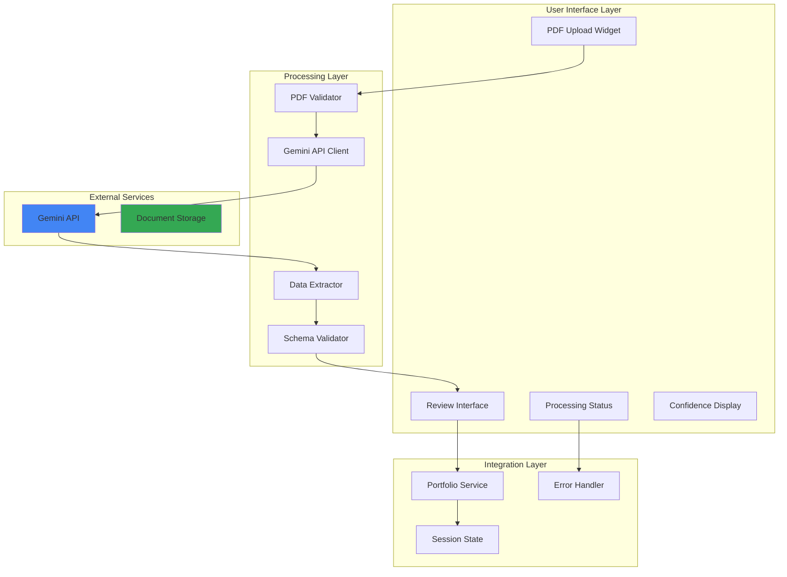
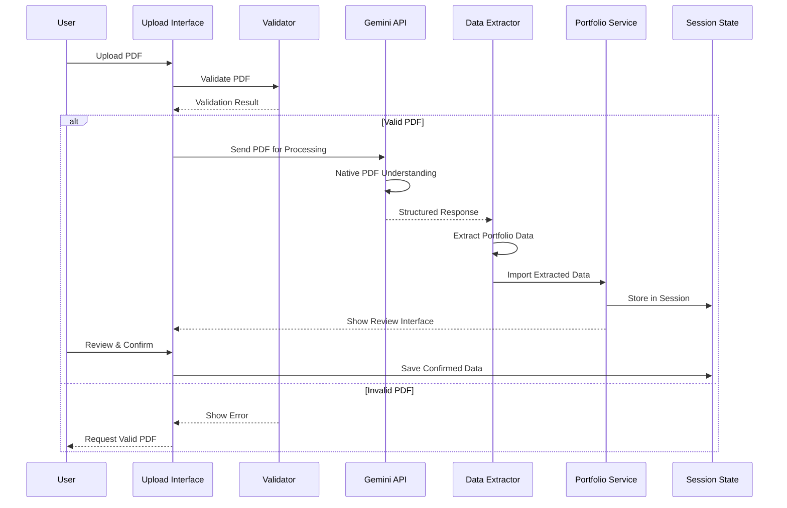
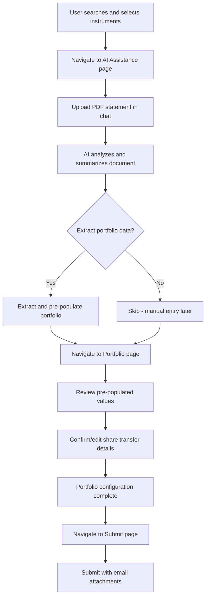
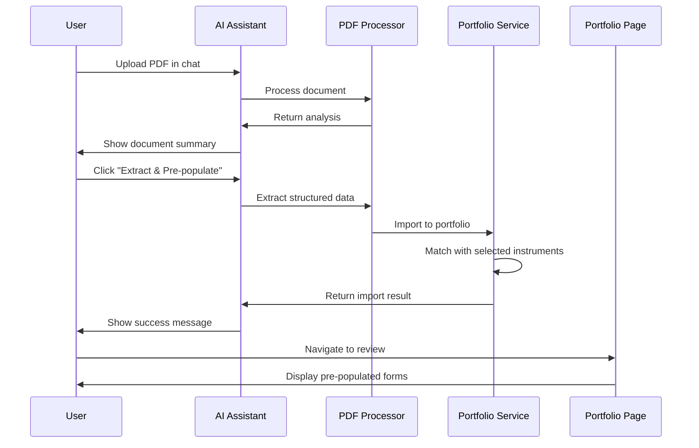

# PDF Upload with Gemini Integration - Solution Design

## Executive Summary

This document outlines the design and implementation strategy for integrating PDF document upload functionality into the Smart Instrument Finder application, leveraging Google Gemini's native document processing capabilities to automatically extract portfolio and share transfer data from client statements.

### Confirmed User Flow

The PDF upload feature follows this exact workflow:

1.  **Navigate to AI Assistance Page**: User goes to the AI Assistance page via sidebar
2.  **Upload Statement in Chat**: User uploads PDF directly in the existing chat facility
3.  **AI Analysis & Extraction**: The AI analyzes the document and offers to extract portfolio data
4.  **Pre-populate Portfolio Config**: Extracted data automatically pre-populates portfolio configuration
5.  **Navigate to Portfolio Page**: User goes to Portfolio page to review pre-populated values
6.  **Confirm/Edit Values**: User reviews, confirms, or corrects the extracted data
7.  **Continue with Existing Flow**: User proceeds with the standard submission workflow

This approach leverages the existing chat interface for a conversational PDF upload experience while maintaining the current application flow.

## Business Context

### Problem Statement

Clients currently need to manually enter portfolio and share transfer data, which is:
- **Time-consuming**: Manual data entry for multiple instruments
- **Error-prone**: Risk of transcription errors
- **Inefficient**: Duplicate effort when data exists in PDF statements
- **User-unfriendly**: Creates friction in the onboarding process

### Solution Overview

Implement an intelligent PDF upload facility that:
1. Accepts PDF documents through Streamlit's file upload interface
2. Processes documents using Gemini's native PDF understanding
3. Extracts structured portfolio data automatically
4. Validates and presents data for user review
5. Integrates seamlessly with existing portfolio management

## Technical Architecture

### System Architecture



### Data Flow



## Implementation Design

### 1. PDF Upload Interface

#### Component Structure
```python
# app/components/pdf_upload.py
class PDFUploadComponent:
    """
    Manages PDF upload and processing for portfolio data extraction.
    """
    
    def __init__(self):
        self.max_file_size = 20 * 1024 * 1024  # 20MB
        self.supported_types = ['application/pdf']
        self.gemini_client = None
        
    def render_upload_interface(self):
        """Render the PDF upload widget with instructions."""
        
    def process_uploaded_pdf(self, uploaded_file):
        """Process PDF through Gemini API."""
        
    def display_extraction_results(self, extracted_data):
        """Show extracted data with confidence scores."""
```

#### Portfolio Page - Handling Pre-populated Data
```python
# app/pages/2_Portfolio.py - Enhanced to handle PDF pre-population
def render_portfolio_page():
    """
    Portfolio page that displays pre-populated data from PDF extraction
    and allows user review/confirmation.
    """
    
    # Check if we have PDF extraction data
    if 'pdf_extraction' in st.session_state:
        st.info("""
        📄 **PDF Data Imported!** 
        Review the pre-populated values below and make any necessary corrections.
        Fields marked with 🟢 have high confidence, 🟡 medium, 🔴 low.
        """)
        
        # Show extraction summary
        extraction = st.session_state['pdf_extraction']
        if extraction.get('document_metadata'):
            with st.expander("📊 Document Summary", expanded=False):
                metadata = extraction['document_metadata']
                col1, col2, col3 = st.columns(3)
                with col1:
                    st.metric("Document Type", metadata.get('document_type', 'Unknown'))
                with col2:
                    st.metric("Broker", metadata.get('broker_name', 'Unknown'))
                with col3:
                    confidence = extraction.get('confidence_scores', {}).get('overall', 0)
                    st.metric("Confidence", f"{confidence:.0%}")
    
    # Display instruments with pre-populated share transfer forms
    for instrument in selected_instruments:
        instrument_id = str(instrument.get('instrument_id'))
        portfolio_entry = PortfolioService.get_portfolio_entry(instrument_id)
        
        with st.expander(
            f"{instrument.get('name')} ({instrument.get('ticker')})",
            expanded=(portfolio_entry is not None)  # Expand if has data
        ):
            # Show confidence indicator if from PDF
            if portfolio_entry and portfolio_entry.get('data_source') == 'pdf_extraction':
                confidence = portfolio_entry.get('extraction_confidence', 0)
                if confidence > 0.8:
                    st.success(f"🟢 High confidence extraction ({confidence:.0%})")
                elif confidence > 0.6:
                    st.warning(f"🟡 Medium confidence - please verify ({confidence:.0%})")
                else:
                    st.error(f"🔴 Low confidence - manual review required ({confidence:.0%})")
            
            # Render share transfer form with pre-populated values
            share_transfer_form.render_form(
                instrument=instrument,
                form_key=f"form_{instrument_id}",
                prefilled_data=portfolio_entry  # Pass pre-populated data
            )
```

### 2. Gemini API Integration

#### API Client Implementation
```python
# app/services/gemini_pdf_processor.py
import google.generativeai as genai
from typing import Dict, Any, List, Optional
import base64

class GeminiPDFProcessor:
    """
    Handles PDF processing using Google Gemini's native document understanding.
    """
    
    def __init__(self, api_key: str):
        genai.configure(api_key=api_key)
        self.model = genai.GenerativeModel('gemini-1.5-flash')
        self.extraction_prompt = self._create_extraction_prompt()
        
    def _create_extraction_prompt(self) -> str:
        """Create a robust, structured prompt for portfolio data extraction."""
        return """
        Analyze the provided PDF document, which is a financial statement. Your task is to extract all portfolio and investment data with high precision and structure it into a valid JSON object. Do not output any text other than the JSON object.

        **JSON Output Schema:**
        {
          "document_metadata": {
            "document_type": "string (e.g., 'Portfolio Statement', 'Transaction Confirmation')",
            "broker_name": "string (e.g., 'Charles Schwab', 'Fidelity')",
            "account_number": "string",
            "statement_date": "string (format as YYYY-MM-DD)",
            "currency": "string (e.g., 'USD', 'ZAR')"
          },
          "portfolio_entries": [
            {
              "instrument_name": "string",
              "ticker_symbol": "string (if available)",
              "isin_code": "string (if available)",
              "quantity": "number (can be negative)",
              "cost_basis": "number (per unit cost)",
              "current_value": "number (market value)",
              "purchase_date": "string (format as YYYY-MM-DD, if available)",
              "account_type": "string (e.g., 'Taxable', 'Retirement')"
            }
          ],
          "confidence_scores": {
            "overall": "number (0.0 to 1.0)",
            "document_quality": "number (0.0 to 1.0, based on clarity and readability)",
            "extraction_completeness": "number (0.0 to 1.0, based on how many fields were found)"
          },
          "extraction_notes": [
            "string (note any issues, ambiguities, or missing data)"
          ]
        }

        **Extraction Rules & Constraints:**
        1.  **Completeness**: Extract ALL investment positions and holdings found in the document.
        2.  **Accuracy**: Use the exact values, numbers, and text from the document. Do not infer or calculate values unless explicitly stated.
        3.  **Formatting**: Dates must be in YYYY-MM-DD format. Numerical values should be numbers, not strings.
        4.  **Handling Missing Data**: If a field is not present in the document for a specific entry, the value should be `null`. Do not omit the key.
        5.  **Confidence**: Provide a confidence score for the overall extraction, the document's quality, and the completeness of the extracted data.
        6.  **Notes**: Use the `extraction_notes` array to report any difficulties, such as unclear text, complex table structures, or ambiguous data.
        """
        
    def process_pdf(self, pdf_bytes: bytes) -> Dict[str, Any]:
        """
        Process PDF using Gemini's native document understanding.
        
        Args:
            pdf_bytes: PDF file content as bytes
            
        Returns:
            Extracted portfolio data with confidence scores
        """
        try:
            # Prepare the PDF for Gemini API
            response = self.model.generate_content([
                {
                    "inline_data": {
                        "mime_type": "application/pdf",
                        "data": base64.b64encode(pdf_bytes).decode()
                    }
                },
                self.extraction_prompt
            ])
            
            # Parse the JSON response
            import json
            extracted_data = json.loads(response.text)
            
            # Validate and enhance extracted data
            return self._validate_extraction(extracted_data)
            
        except Exception as e:
            return {
                "error": str(e),
                "success": False
            }
    
    def _validate_extraction(self, data: Dict) -> Dict:
        """Validate and enhance extracted data."""
        # Add validation logic
        data["success"] = True
        data["processing_timestamp"] = datetime.now().isoformat()
        return data
```

#### Advanced Extraction Strategies
```python
# app/services/advanced_pdf_extraction.py
class AdvancedPDFExtractor:
    """
    Advanced extraction strategies for complex PDF documents.
    """
    
    def extract_with_context(self, pdf_bytes: bytes, 
                            selected_instruments: List[Dict]) -> Dict:
        """
        Extract data with context from already selected instruments.
        """
        # Build context prompt
        instrument_context = self._build_instrument_context(selected_instruments)
        
        prompt = f"""
        Extract portfolio data from this PDF.
        Focus on these instruments if present:
        {instrument_context}
        
        Also extract any other instruments found.
        Match instruments by:
        1. Ticker symbol (exact match)
        2. ISIN code (if available)
        3. Instrument name (fuzzy match acceptable)
        
        Return structured JSON with matched instruments marked.
        """
        
        return self._process_with_prompt(pdf_bytes, prompt)
    
    def extract_share_transfers(self, pdf_bytes: bytes) -> Dict:
        """
        Specifically extract share transfer information.
        """
        prompt = """
        Extract share transfer details from this document:
        - From/To broker information
        - Transfer quantities (including negative for sells)
        - Settlement dates
        - Trust account numbers
        - Base cost information
        
        Structure as share transfer records.
        """
        
        return self._process_with_prompt(pdf_bytes, prompt)
```

### 3. Data Validation & Review Interface

#### Review Component
```python
# app/components/pdf_review_interface.py
class PDFReviewInterface:
    """
    Interface for reviewing and confirming extracted PDF data.
    """
    
    def render_review_interface(self, extracted_data: Dict):
        """Display extracted data for user review and confirmation."""
        
        st.markdown("### 📊 Review Extracted Data")
        
        # Show confidence scores
        self._display_confidence_metrics(extracted_data)
        
        # Display document metadata
        self._display_document_info(extracted_data)
        
        # Show extracted portfolio entries
        self._display_portfolio_entries(extracted_data)
        
        # Confirmation actions
        self._render_confirmation_actions(extracted_data)
    
    def _display_confidence_metrics(self, data: Dict):
        """Show extraction confidence scores."""
        confidence = data.get('confidence_scores', {})
        
        col1, col2, col3 = st.columns(3)
        with col1:
            score = confidence.get('overall', 0)
            color = "green" if score > 0.8 else "orange" if score > 0.6 else "red"
            st.metric("Overall Confidence", f"{score:.0%}", 
                     delta=None, delta_color="normal")
        
        with col2:
            score = confidence.get('document_quality', 0)
            st.metric("Document Quality", f"{score:.0%}")
        
        with col3:
            score = confidence.get('extraction_completeness', 0)
            st.metric("Completeness", f"{score:.0%}")
    
    def _display_portfolio_entries(self, data: Dict):
        """Display extracted portfolio entries in editable table."""
        entries = data.get('portfolio_entries', [])
        
        if entries:
            # Convert to DataFrame for display
            df = pd.DataFrame(entries)
            
            # Use st.data_editor for editable table
            edited_df = st.data_editor(
                df,
                num_rows="dynamic",
                use_container_width=True,
                hide_index=True,
                column_config={
                    "instrument_name": st.column_config.TextColumn(
                        "Instrument",
                        help="Name of the financial instrument"
                    ),
                    "ticker_symbol": st.column_config.TextColumn(
                        "Ticker",
                        help="Trading symbol"
                    ),
                    "quantity": st.column_config.NumberColumn(
                        "Quantity",
                        format="%d"
                    ),
                    "cost_basis": st.column_config.NumberColumn(
                        "Cost Basis",
                        format="%.2f"
                    )
                }
            )
            
            return edited_df
        else:
            st.warning("No portfolio entries extracted")
            return None
```

### 4. Integration with Portfolio Service

#### Enhanced Portfolio Service
```python
# app/services/portfolio_service.py (enhanced)
class PortfolioService:
    """Enhanced with PDF import capabilities."""
    
    @staticmethod
    def import_from_pdf_extraction(extracted_data: Dict, 
                                  user_confirmations: Dict,
                                  selected_instruments: List[Dict]) -> Dict:
        """
        Import PDF-extracted data into portfolio, matching against selected instruments.
        
        Args:
            extracted_data: Data extracted from PDF by Gemini
            user_confirmations: User's review confirmations
            selected_instruments: User's selected instruments from search
            
        Returns:
            Import result with success/error information
        """
        try:
            validated_entries = []
            errors = []
            
            for entry in extracted_data.get('portfolio_entries', []):
                # Match with selected instruments first, then broader search
                matched_instrument = PortfolioService._match_with_selected(
                    entry, selected_instruments
                ) or PortfolioService._match_instrument(entry)
                
                if matched_instrument:
                    # Create portfolio entry with complete instrument data
                    portfolio_entry = {
                        # Core identifiers from matched instrument
                        'instrument_id': matched_instrument['instrument_id'],
                        'instrument_name': matched_instrument['name'],
                        'ticker': matched_instrument['ticker'],
                        'isin': matched_instrument.get('isin', ''),
                        'contract_code': matched_instrument.get('contract_code', ''),
                        
                        # Asset classification
                        'asset_group': matched_instrument.get('asset_group', ''),
                        'asset_sub_group': matched_instrument.get('asset_sub_group', ''),
                        'exchange': matched_instrument.get('exchange', ''),
                        'currency': matched_instrument.get('currency', 'ZAR'),
                        
                        # Share transfer data from PDF
                        'platform': entry.get('platform', 'EE'),
                        'trust_account_id': entry.get('account_number', ''),
                        'quantity': entry.get('quantity', 0),
                        'base_cost': entry.get('cost_basis', 0),
                        'settlement_date': entry.get('purchase_date', ''),
                        'last_price': entry.get('current_value', 0),
                        'broker_from': entry.get('broker_from', '9'),
                        'broker_to': entry.get('broker_to', '26'),
                        
                        # Metadata
                        'data_source': 'pdf_extraction',
                        'extraction_confidence': extracted_data.get(
                            'confidence_scores', {}
                        ).get('overall', 0),
                        'source_document': extracted_data.get(
                            'document_metadata', {}
                        ).get('document_name', 'Unknown PDF')
                    }
                    
                    validated_entries.append(portfolio_entry)
                else:
                    errors.append({
                        'entry': entry,
                        'error': 'Could not match instrument'
                    })
            
            # Store in session state
            if validated_entries:
                st.session_state['portfolio_entries'].update(
                    {e['instrument_id']: e for e in validated_entries}
                )
            
            return {
                'success': True,
                'imported_count': len(validated_entries),
                'error_count': len(errors),
                'entries': validated_entries,
                'errors': errors
            }
            
        except Exception as e:
            return {
                'success': False,
                'error': str(e)
            }
```

### 5. Email Submission Integration

#### Enhanced Submission Flow with PDF Data
```python
# app/components/submission.py (enhanced)
def handle_portfolio_submission_with_pdf(
    selected_instruments: List[Dict],
    user_info: Dict,
    submission_notes: str,
    pdf_extraction_data: Optional[Dict] = None
) -> None:
    """
    Enhanced submission that includes PDF extraction data in email.
    """
    # Prepare comprehensive submission data
    submission_data = {
        "user_info": user_info,
        "search_context": {
            "wallet": st.session_state.get("selected_wallet", "Unknown"),
            "wallet_id": st.session_state.get("selected_wallet_id", ""),
            "search_history": st.session_state.get("search_history", [])
        },
        "selected_instruments": selected_instruments,
        "portfolio_entries": PortfolioService.get_all_portfolio_entries(),
        "share_transfer_data": PortfolioService.generate_share_transfer_data(),
        "submission_notes": submission_notes,
        "submission_timestamp": datetime.datetime.now().isoformat()
    }
    
    # Add PDF extraction metadata if available
    if pdf_extraction_data:
        submission_data["pdf_extraction"] = {
            "document_metadata": pdf_extraction_data.get("document_metadata"),
            "confidence_scores": pdf_extraction_data.get("confidence_scores"),
            "extraction_timestamp": pdf_extraction_data.get("processing_timestamp"),
            "extraction_notes": pdf_extraction_data.get("extraction_notes", [])
        }
    
    # Generate enhanced CSV with share transfer format
    csv_data = generate_share_transfer_csv(submission_data)
    
    # Generate comprehensive PDF report
    pdf_bytes = generate_enhanced_pdf_report(submission_data)
    
    # Send email with all attachments
    send_comprehensive_submission_email(
        submission_data=submission_data,
        pdf_bytes=pdf_bytes,
        csv_data=csv_data
    )
```

#### Share Transfer CSV Generation
```python
def generate_share_transfer_csv(submission_data: Dict) -> str:
    """
    Generate CSV in the exact format required for share transfers.
    Format: SX/EE,User ID,TrustAccountID,ShareCode,InstrumentID,Qty,Base Cost,
            Excel Date,SettlementDate,Last Price,BrokerID_From,BrokerID_To,Reference
    """
    import csv
    import io
    
    output = io.StringIO()
    
    # Define CSV headers matching required format
    headers = [
        'SX/EE', 'User ID', 'TrustAccountID', 'ShareCode', 'InstrumentID',
        'Qty', 'Base Cost ©', 'Excel Date', 'SettlementDate', 'Last Price',
        'BrokerID_From', 'BrokerID_To', 'Reference', '', ''
    ]
    
    writer = csv.writer(output)
    writer.writerow(headers)
    
    # Write share transfer data
    for entry in submission_data.get('share_transfer_data', []):
        row = [
            entry.get('platform', 'EE'),
            submission_data['user_info']['user_id'],
            entry.get('trust_account_id', ''),
            entry.get('ticker', ''),
            entry.get('instrument_id', ''),
            entry.get('quantity', 0),
            entry.get('base_cost', 0),
            entry.get('settlement_date', ''),
            entry.get('settlement_date', ''),
            entry.get('last_price', 0),
            entry.get('broker_from', '9'),
            entry.get('broker_to', '26'),
            f"NT -{entry.get('settlement_date', '')}",
            'NT -',
            entry.get('settlement_date', '')
        ]
        writer.writerow(row)
    
    return output.getvalue()
```

### 6. AI Assistance Page - Primary PDF Upload Interface

#### Enhanced Chat Interface with PDF Upload
```python
# app/pages/1_AI_Assistance.py (enhanced)
def render_pdf_upload_interface():
    """
    Render PDF upload interface integrated with the chat experience.
    Uses st.file_uploader for reliable file handling.
    """
    
    # PDF Upload Section - positioned prominently before chat
    st.markdown("### 📄 Upload Portfolio Statement")
    
    with st.container():
        uploaded_file = st.file_uploader(
            "Upload your broker statement or portfolio document (PDF)",
            type=['pdf'],
            key="ai_pdf_upload",
            help="Upload your PDF and I'll analyze it for you",
            accept_multiple_files=False
        )
        
        if uploaded_file:
            # Show file info
            col1, col2 = st.columns([3, 1])
            with col1:
                st.success(f"📎 **{uploaded_file.name}** ({uploaded_file.size / 1024:.1f} KB)")
            with col2:
                if st.button("🔍 Analyze Document", type="primary", use_container_width=True):
                    process_uploaded_pdf(uploaded_file)

def process_uploaded_pdf(uploaded_file):
    """
    Process the uploaded PDF and integrate results into chat conversation.
    """
    with st.spinner("🔍 Analyzing your document..."):
        # Initialize Gemini processor
        processor = GeminiPDFProcessor(st.secrets["llm_api"]["gemini_key"])
        pdf_bytes = uploaded_file.read()
        
        # Step 1: Add upload to chat history
        st.session_state.messages.append({
            "role": "user",
            "content": f"📎 Uploaded document: {uploaded_file.name}"
        })
        
        # Step 2: Analyze document with enhanced prompt
        analysis_prompt = f"""
        As the Smart Instrument Finder Assistant, I will analyze the uploaded document '{uploaded_file.name}'.

        I will:
        1. Identify the document type and provide a brief summary
        2. Highlight key portfolio holdings and important details
        3. Explain what data can be extracted for portfolio configuration
        4. Offer to pre-populate the user's portfolio with this data
        
        I will be conversational, helpful, and guide the user on next steps.
        """
        
        try:
            # Get AI analysis using Gemini's document processing
            analysis_response = processor.model.generate_content([
                {
                    "inline_data": {
                        "mime_type": "application/pdf",
                        "data": base64.b64encode(pdf_bytes).decode()
                    }
                },
                analysis_prompt
            ])
            
            # Add AI response to chat
            st.session_state.messages.append({
                "role": "assistant", 
                "content": analysis_response.text
            })
            
            # Store PDF data for potential extraction
            st.session_state['pending_pdf'] = {
                'file_name': uploaded_file.name,
                'pdf_bytes': pdf_bytes,
                'processor': processor
            }
            
            # Show extraction option
            st.markdown("---")
            col1, col2 = st.columns(2)
            
            with col1:
                if st.button("✅ Extract & Pre-populate Portfolio", 
                           type="primary", 
                           use_container_width=True,
                           key="extract_portfolio"):
                    extract_and_populate_portfolio()
            
            with col2:
                if st.button("💬 Continue Chatting", 
                           use_container_width=True,
                           key="continue_chat"):
                    st.info("You can ask me questions about the document or continue with manual portfolio setup.")
                    
        except Exception as e:
            st.error(f"Error analyzing document: {str(e)}")
            st.session_state.messages.append({
                "role": "assistant",
                "content": f"I encountered an error analyzing your document: {str(e)}. Please try uploading again or proceed with manual portfolio configuration."
            })

def extract_and_populate_portfolio():
    """
    Extract structured data from PDF and populate portfolio.
    """
    if 'pending_pdf' not in st.session_state:
        st.error("No PDF data available for extraction.")
        return
    
    pdf_data = st.session_state['pending_pdf']
    
    with st.spinner("📊 Extracting portfolio data..."):
        try:
            # Extract structured data
            extracted_data = pdf_data['processor'].process_pdf(pdf_data['pdf_bytes'])
            
            # Match with selected instruments
            selected_instruments = SelectionManager.get_selections()
            
            # Import to portfolio service
            import_result = PortfolioService.import_from_pdf_extraction(
                extracted_data=extracted_data,
                user_confirmations={},
                selected_instruments=selected_instruments
            )
            
            # Store results in session
            st.session_state['pdf_extraction'] = extracted_data
            st.session_state['pdf_import_result'] = import_result
            
            # Add success message to chat
            success_message = f"""
            ✅ **Portfolio Data Extracted Successfully!**
            
            I've extracted {import_result.get('imported_count', 0)} portfolio entries from your document.
            
            **Next Steps:**
            1. Navigate to the 'My Portfolio' page to review the pre-populated data
            2. Confirm or edit the extracted values as needed
            3. Complete your portfolio configuration
            4. Proceed to submit your results
            
            The extracted data includes confidence scores to help you identify which fields may need review.
            """
            
            st.session_state.messages.append({
                "role": "assistant",
                "content": success_message
            })
            
            # Show navigation button
            if st.button("📊 Go to My Portfolio", type="primary", use_container_width=True):
                st.switch_page("pages/2_Portfolio.py")
                
        except Exception as e:
            error_message = f"I encountered an error extracting data from your PDF: {str(e)}. You can still proceed with manual portfolio configuration."
            
            st.error(error_message)
            st.session_state.messages.append({
                "role": "assistant",
                "content": error_message
            })

# Enhanced chat input handling
def handle_chat_input():
    """Handle regular chat input alongside PDF functionality."""
    
    # Regular chat input
    if prompt := st.chat_input("Ask anything about the Smart Instrument Finder process..."):
        generate_agent_response(prompt)

# Main page rendering
def render_ai_assistance_page():
    """Main rendering function for AI Assistance page."""
    
    # Render PDF upload interface first
    render_pdf_upload_interface()
    
    st.markdown("---")
    
    # Render chat history
    for message in st.session_state.messages:
        if message["role"] == "assistant":
            with st.chat_message("assistant", avatar=get_favicon_path()):
                st.markdown(message["content"])
        else:
            with st.chat_message("user", avatar=get_user_avatar_path()):
                st.markdown(message["content"])
    
    # Handle chat input
    handle_chat_input()
    
    # Show quick actions if no messages
    if not st.session_state.messages:
        render_quick_actions()
```

#### Key Implementation Notes

**File Upload Strategy:**
- Uses proven `st.file_uploader` widget for reliable PDF handling
- Positioned prominently at the top of the AI Assistance page
- Integrates seamlessly with chat conversation flow

**User Experience Flow:**
1. User sees clear PDF upload option when entering AI Assistance page
2. Upon upload, file info is displayed with prominent "Analyze" button
3. Analysis results are added to chat conversation naturally
4. User can choose to extract data or continue chatting
5. Extraction results guide user to Portfolio page for review

**Technical Advantages:**
- Leverages stable, well-tested Streamlit components
- Maintains chat conversation context throughout process
- Provides clear error handling and user feedback
- Stores PDF data in session for potential re-processing

**Fallback Compatibility:**
- Works with all current Streamlit versions
- No dependency on experimental features
- Graceful degradation if PDF processing fails
- Users can always proceed with manual portfolio entry
```

## Security & Compliance

### Data Security Measures

1.  **File Validation**
    ```python
    def validate_pdf_security(file_bytes: bytes) -> bool:
        """Validate PDF for security concerns."""
        # Check file size
        if len(file_bytes) > MAX_FILE_SIZE:
            return False
        
        # Check PDF header
        if not file_bytes.startswith(b'%PDF'):
            return False
        
        # Scan for malicious patterns
        # Implementation details...
        
        return True
    ```

2.  **Data Privacy**
    -   PDFs processed in memory only
    -   No permanent storage of uploaded documents
    -   Session-based temporary storage
    -   Automatic cleanup on session end

3.  **API Security**
    -   Secure API key management via secrets
    -   Rate limiting implementation
    -   Error handling without data exposure

### Compliance Considerations

1.  **GDPR/POPIA Compliance**
    -   User consent for data processing
    -   Right to deletion
    -   Data minimization principles

2.  **Financial Data Protection**
    -   Encryption in transit
    -   No logging of sensitive data
    -   Audit trail for data access

## User Experience Design

### Complete User Journey with PDF Upload


### PDF Upload Flow in AI Chat


### UI Components

1.  **Upload Widget**
    -   Drag-and-drop support
    -   File type validation
    -   Size limit display
    -   Progress indicator

2.  **Processing Feedback**
    -   Real-time status updates
    -   Estimated time remaining
    -   Cancel option

3.  **Review Interface**
    -   Confidence score visualization
    -   Editable data table
    -   Field-level validation
    -   Bulk actions

4.  **Error Handling**
    -   Clear error messages
    -   Retry options
    -   Fallback to manual entry

## Implementation Roadmap

### Phase 1: Core Infrastructure (Sprint 1)
- [ ] Set up Gemini API client with existing secrets configuration
- [ ] Implement PDF upload widget following project's file upload patterns
- [ ] Create structured extraction prompts for portfolio data
- [ ] Build validation framework using existing JSON validators

### Phase 2: Data Processing (Sprint 2)
- [ ] Implement extraction logic with instrument matching against selected items
- [ ] Create review interface following existing UI patterns
- [ ] Add confidence scoring with visual indicators
- [ ] Build instrument matching using existing fuzzy matcher

### Phase 3: Integration (Sprint 3)
- [ ] Integrate with existing PortfolioService
- [ ] Add PDF context to AI Assistant (1_AI_Assistance.py)
- [ ] Implement session state management following project patterns
- [ ] Create error handling with user-friendly messages

### Phase 4: Email Submission Integration (Sprint 4)
- [ ] Enhance email submission to include PDF extraction metadata
- [ ] Generate comprehensive CSV with share transfer data
- [ ] Create enhanced PDF report with extraction confidence scores
- [ ] Add extraction audit trail to submission

### Phase 5: Testing & Deployment (Sprint 5)
- [ ] Unit testing with sample broker statements
- [ ] Integration testing with full submission workflow
- [ ] User acceptance testing with real portfolio data
- [ ] Production deployment with feature flag

## Testing Strategy

### Test Scenarios

1.  **PDF Types**
    -   Broker statements
    -   Portfolio summaries
    -   Transaction confirmations
    -   Multi-page documents

2.  **Data Variations**
    -   Different date formats
    -   Multiple currencies
    -   Various broker formats
    -   Missing fields

3.  **Error Cases**
    -   Corrupted PDFs
    -   Non-PDF files
    -   Oversized files
    -   Network failures

### Test Implementation
```python
def test_pdf_extraction():
    """Test PDF extraction pipeline."""
    # Load test PDF
    test_pdf = load_test_pdf("sample_statement.pdf")
    
    # Process with Gemini
    processor = GeminiPDFProcessor(test_api_key)
    result = processor.process_pdf(test_pdf)
    
    # Validate structure
    assert "portfolio_entries" in result
    assert "confidence_scores" in result
    
    # Check data quality
    assert result["confidence_scores"]["overall"] > 0.7
    
    # Validate extraction
    entries = result["portfolio_entries"]
    assert len(entries) > 0
    assert all(e.get("instrument_name") for e in entries)
```

## Performance Optimization

### Optimization Strategies

1.  **Caching**
    ```python
    @st.cache_data(ttl=3600)
    def process_pdf_cached(pdf_hash: str, pdf_bytes: bytes):
        """Cache processed PDFs for 1 hour."""
        return processor.process_pdf(pdf_bytes)
    ```

2.  **Async Processing**
    ```python
    async def process_pdf_async(pdf_bytes: bytes):
        """Process PDF asynchronously."""
        return await asyncio.create_task(
            processor.process_pdf(pdf_bytes)
        )
    ```

3.  **Batch Processing**
    -   Queue multiple PDFs
    -   Process in parallel
    -   Aggregate results

## Monitoring & Analytics

### Key Metrics

1.  **Usage Metrics**
    -   PDF upload count
    -   Processing success rate
    -   Average extraction confidence
    -   User confirmation rate

2.  **Performance Metrics**
    -   Processing time per page
    -   API response time
    -   Error rate
    -   Timeout frequency

3.  **Quality Metrics**
    -   Extraction accuracy
    -   Field completeness
    -   User corrections required
    -   Confidence score distribution

### Monitoring Implementation
```python
def track_pdf_processing(event_type: str, metadata: Dict):
    """Track PDF processing events."""
    st.session_state.setdefault('pdf_analytics', []).append({
        'event': event_type,
        'timestamp': datetime.now().isoformat(),
        'metadata': metadata
    })
```

## Cost Considerations

### Gemini API Pricing
Based on [Google's pricing](https://ai.google.dev/gemini-api/docs/document-processing):
- Each document page = 258 tokens
- Maximum 1000 pages per document
- Pricing per 1M tokens varies by model

### Cost Optimization
1.  **Page Limits**: Restrict to first 50 pages
2.  **Caching**: Cache frequently used documents
3.  **Batch Processing**: Optimize API calls
4.  **Model Selection**: Use appropriate model tier

## Future Enhancements

### Advanced Features
1.  **OCR Enhancement**: Handle scanned PDFs
2.  **Multi-language Support**: Process documents in various languages
3.  **Template Learning**: Learn from user corrections
4.  **Intelligent Matching**: ML-based instrument matching
5.  **Historical Analysis**: Track portfolio changes over time

### Integration Opportunities
1.  **Email Integration**: Process emailed statements
2.  **Cloud Storage**: Direct import from Google Drive/Dropbox
3.  **API Webhooks**: Real-time statement processing
4.  **Mobile Support**: Mobile app PDF capture

## Alignment with Agentic Rails

This solution design ensures the PDF processing feature strictly adheres to the established agentic principles outlined in `agent_summarizer_mandate.md`:

1.  **Conversational Interaction**: The primary entry point for PDF upload is the AI Assistant's chat interface. The agent first analyzes the document and provides a conversational summary, maintaining its persona as a helpful guide.
2.  **Context Awareness**: The agent is aware of the user's context (selected instruments) and can use this information to perform a more targeted data extraction if needed.
3.  **Action-Oriented Guidance**: After analyzing the document, the agent provides a clear, actionable next step: "Extract & Pre-populate Portfolio". This guides the user through the workflow.
4.  **Constraint Adherence**: The agent operates within its boundaries. It extracts and presents data but leaves the final confirmation and submission to the user, never making financial decisions on their behalf.
5.  **Seamless Workflow Integration**: The feature doesn't operate in isolation. It's designed to be a natural extension of the existing search -> select -> configure -> submit workflow.

## Gemini API Utilization

The solution is designed to fully leverage the native document processing capabilities of the Gemini API, as described in the official Google AI documentation.

-   **Native PDF Understanding**: We are using Gemini's multimodal capabilities to process the PDF file directly. This is not simple OCR; the model understands the document's structure, including text, tables, and layout, which is crucial for accurately extracting data from complex financial statements. ([Reference](https://ai.google.dev/gemini-api/docs/document-processing))
-   **Structured Output**: The prompts are engineered to request a specific JSON schema as output. This leverages Gemini's ability to generate structured data, which is essential for pre-populating the portfolio forms programmatically.
-   **Long Context**: The use of `gemini-1.5-flash` allows for processing long, multi-page documents (up to 1000 pages), ensuring that even comprehensive portfolio statements can be handled effectively.
-   **Inline Data Transfer**: The implementation passes the PDF data inline (base64 encoded) directly to the `generateContent` method, which is an efficient method for files under 20MB as recommended by the documentation.

This approach ensures we are using the most appropriate and powerful features of the Gemini API for this specific task.

## Alignment with Existing Project Conventions

### Code Organization
The implementation follows the existing project structure:
- **Components**: Modular UI components in `app/components/`
- **Services**: Business logic in `app/services/`
- **Pages**: Multi-page structure in `app/pages/`
- **Utilities**: Helper functions in `app/utils.py`

### UI/UX Consistency
- **Styling**: Uses existing CSS classes (`gradient-title`, `fade-in`, etc.)
- **Layout**: Follows wide layout with sidebar navigation
- **Components**: Reuses existing patterns (expanders, columns, metrics)
- **Session State**: Follows namespace isolation patterns

### Data Flow Integration

#### Primary Workflow with PDF Upload
1. **Search → Selection**: Users search and select instruments
2. **AI Assistance → PDF Upload**: Navigate to AI page and upload statement in chat
3. **PDF Analysis → Extraction**: AI analyzes document and offers to extract data
4. **Pre-population → Portfolio**: Extracted data pre-populates portfolio configuration
5. **Portfolio → Review**: User navigates to Portfolio page to review/confirm values
6. **Review → Submit**: Validate and submit complete portfolio
7. **Submit → Email**: Send comprehensive data package with all attachments

### Email Submission Enhancement
The PDF upload feature enhances the existing email workflow:
- **Attachments**: PDF report + Share Transfer CSV + Extraction metadata
- **Validation**: Confidence scores included in submission
- **Audit Trail**: Complete extraction history maintained
- **Backward Compatible**: Works with existing submission flow

## Conclusion

This solution design provides a comprehensive framework for implementing PDF upload and processing capabilities using Google Gemini's native document understanding. The integration is carefully aligned with existing project conventions, ensuring seamless integration with the current search → selection → portfolio → submission workflow.

The implementation enhances user experience by automating portfolio data extraction while maintaining the existing email submission engine's functionality. The phased implementation approach ensures rapid delivery of core functionality while preserving all current features and workflows.

## Appendix

### A. Sample Code Structure
```
app/
├── components/
│   ├── pdf_upload.py
│   └── pdf_review_interface.py
├── services/
│   ├── gemini_pdf_processor.py
│   ├── advanced_pdf_extraction.py
│   └── portfolio_service.py (enhanced)
├── pages/
│   ├── 1_AI_Assistance.py (enhanced)
│   └── 2_Portfolio.py (enhanced)
└── utils/
    ├── pdf_validator.py
    └── extraction_utils.py
```

### B. Configuration Template
```toml
# .streamlit/secrets.toml
[pdf_processing]
max_file_size_mb = 20
max_pages = 50
supported_formats = ["pdf"]
extraction_timeout = 30

[gemini]
model = "gemini-1.5-flash"
temperature = 0.1
max_tokens = 4096
```

### C. Key Implementation Notes

#### Integration Points
1. **Portfolio Page (2_Portfolio.py)**: Add PDF upload section after selection display
2. **Submission Page (3_Submit.py)**: Show PDF extraction confidence in submission summary
3. **AI Assistant (1_AI_Assistance.py)**: Enable PDF analysis in chat
4. **Email Sender**: Include extraction metadata in email body

#### Data Validation Requirements
- Instrument matching must prioritize selected instruments
- Trust Account IDs must be 6-10 digits
- Dates must be in YYYY-MM-DD format
- Quantities can be negative (for sells)
- All monetary values in instrument's currency

#### Quality Assurance Checklist
- [ ] PDF upload limited to 20MB
- [ ] Extraction confidence scores displayed
- [ ] User can edit extracted data before saving
- [ ] Share transfer CSV format matches exact specification
- [ ] Email includes all required attachments
- [ ] Session state properly managed
- [ ] Error messages are user-friendly
- [ ] Backward compatibility maintained

### D. References
- [Google Gemini Document Processing](https://ai.google.dev/gemini-api/docs/document-processing)
- [Streamlit File Upload Documentation](https://docs.streamlit.io/library/api-reference/widgets/st.file_uploader)
- [Portfolio Technical Documentation](./portfolio_technical_documentation.md)
- [Persisted Selection Solution Design](./persisted_selection_solution_design.md)
- [Project Blueprint](../project_blueprint.md)
