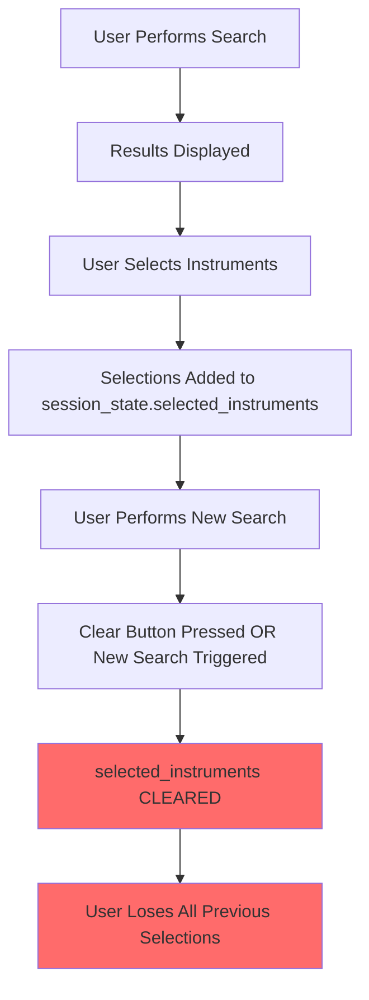
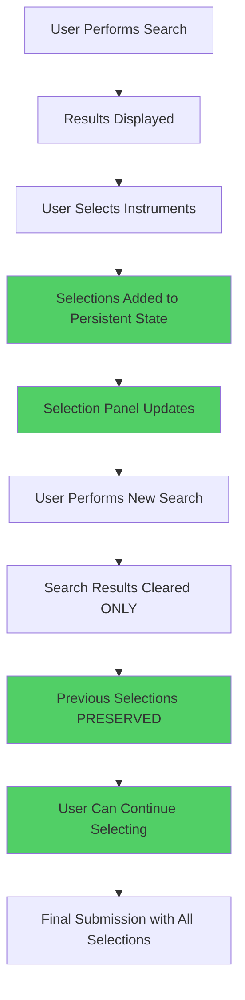

# Persisted Selection Solution Design

## Problem Statement

### Current Issue
Users experience frustration when their instrument selections are inadvertently cleared during the search workflow. Specifically:

1. **Selection Loss on New Search**: When users perform a new search after selecting instruments from previous results, their selections are lost
2. **Clear Button Overreach**: The "Clear" button removes both search results AND selected instruments, which is overly aggressive
3. **Inconsistent State Management**: Selection state is managed reactively rather than persistently, leading to unexpected behavior
4. **Poor UX Flow**: Users must remember to complete their selection process in one search session, limiting exploration

### Business Impact
- **Reduced User Satisfaction**: Users lose work and must restart selection process
- **Inefficient Workflow**: Prevents users from building comprehensive instrument portfolios across multiple searches
- **Abandonment Risk**: Frustrating UX may lead to users abandoning the application
- **Support Burden**: Increased user complaints and support requests

## Current Architecture Analysis

### Selection Management Flow


### Current Implementation Issues

#### 1. Aggressive Clearing in `search_interface.py`
```python
def _clear_results(self):
    """Clear search results from session state."""
    if 'current_results' in st.session_state:
        st.session_state.current_results = []
    if 'selected_instruments' in st.session_state:  # ❌ PROBLEM: Clears selections
        st.session_state.selected_instruments = []
```

#### 2. Selection Logic in `result_display.py`
```python
# Current selection management is reactive and fragile
if selected:
    if result not in st.session_state.get('selected_instruments', []):
        if 'selected_instruments' not in st.session_state:
            st.session_state.selected_instruments = []
        st.session_state.selected_instruments.append(result)
```

#### 3. Utility Function Overreach in `utils.py`
```python
def clear_search_results():
    """Clear current search results and related state."""
    st.session_state.current_results = []
    st.session_state.selected_instruments = []  # ❌ PROBLEM: Clears selections
```

## Solution Design

### Core Principles

1. **Separation of Concerns**: Distinguish between search results and user selections
2. **Persistent Selection State**: Maintain selections across multiple search sessions
3. **Explicit User Control**: Only clear selections when user explicitly requests it
4. **Defensive Programming**: Handle edge cases and state inconsistencies gracefully
5. **Enhanced UX**: Provide clear feedback about selection state and management options

### Proposed Architecture

#### 1. Enhanced Session State Structure
```python
# Enhanced session state organization
st.session_state = {
    # Search-related state (temporary)
    "current_results": [],           # Current search results (cleared on new search)
    "search_history": [],            # Search query history
    "last_search_query": "",         # Most recent search query
    
    # Selection-related state (persistent)
    "selected_instruments": [],      # User's instrument selections (PERSISTENT)
    "selection_metadata": {          # Enhanced selection tracking
        "total_selected": 0,
        "selection_timestamps": {},   # When each instrument was selected
        "selection_sources": {},      # Which search query led to each selection
        "last_modified": None
    },
    
    # User workflow state
    "selection_mode": "accumulate",  # "accumulate" | "replace" | "review"
    "show_selection_panel": True,    # Whether to show persistent selection panel
}
```

#### 2. Selection Management Service

Create a dedicated `SelectionManager` class to handle all selection-related operations:

```python
# app/services/selection_manager.py
class SelectionManager:
    """
    Centralized service for managing instrument selections with persistence,
    deduplication, and enhanced user control.
    """
    
    @staticmethod
    def add_instrument(instrument: Dict[str, Any], source_query: str = "") -> bool:
        """Add instrument to selections with metadata tracking."""
        
    @staticmethod
    def remove_instrument(instrument_key: str) -> bool:
        """Remove instrument from selections by unique key."""
        
    @staticmethod
    def clear_selections(confirm: bool = False) -> bool:
        """Clear all selections with confirmation requirement."""
        
    @staticmethod
    def get_selections() -> List[Dict[str, Any]]:
        """Get current selections with metadata."""
        
    @staticmethod
    def is_selected(instrument: Dict[str, Any]) -> bool:
        """Check if instrument is already selected."""
        
    @staticmethod
    def get_selection_summary() -> Dict[str, Any]:
        """Get summary statistics about current selections."""
```

#### 3. Improved UI Components

##### Enhanced Search Interface
```python
# Modified search_interface.py
class SearchInterface:
    def _clear_results(self):
        """Clear ONLY search results, preserve selections."""
        if 'current_results' in st.session_state:
            st.session_state.current_results = []
        # ✅ DO NOT clear selected_instruments
        
    def render_clear_options(self):
        """Provide granular clearing options."""
        col1, col2 = st.columns(2)
        with col1:
            if st.button("Clear Results", help="Clear current search results only"):
                self._clear_results()
        with col2:
            if st.button("Clear Selections", 
                        help="Clear your selected instruments", 
                        type="secondary"):
                self._show_clear_selections_dialog()
```

##### Persistent Selection Panel
```python
# New component: app/components/selection_panel.py
class SelectionPanel:
    """
    Persistent panel showing user's selected instruments across all searches.
    Always visible, provides selection management capabilities.
    """
    
    def render_persistent_panel(self):
        """Render always-visible selection panel in sidebar or main area."""
        
    def render_selection_item(self, instrument: Dict, index: int):
        """Render individual selected instrument with remove option."""
        
    def render_selection_actions(self):
        """Render bulk actions for selections (clear all, export, etc.)."""
```

##### Enhanced Result Display
```python
# Modified result_display.py
class ResultDisplayComponent:
    def _render_result_item(self, result: Dict, idx: int, allow_selection: bool = True):
        """Enhanced result item with better selection feedback."""
        
        # Check if already selected using unique key
        is_already_selected = SelectionManager.is_selected(result)
        
        if allow_selection:
            # Show different UI for already-selected items
            if is_already_selected:
                col1, col2 = st.columns([0.1, 0.9])
                with col1:
                    st.success("✓")  # Visual indicator
                with col2:
                    st.write(f"**{result['name']}** (Already Selected)")
                    if st.button(f"Remove from Selection", key=f"remove_{idx}"):
                        SelectionManager.remove_instrument(result)
                        st.rerun()
            else:
                # Standard selection checkbox
                selected = st.checkbox(
                    f"Select {result['name']}", 
                    key=f"select_{idx}",
                    help="Add to your instrument portfolio"
                )
                if selected:
                    SelectionManager.add_instrument(result, st.session_state.get('last_search_query', ''))
                    st.rerun()
```

### Implementation Plan

#### Phase 1: Core Infrastructure (Priority: High)
1. **Create SelectionManager Service** (`app/services/selection_manager.py`)
   - Implement centralized selection logic
   - Add deduplication using business keys (Exchange, Ticker, ContractCode)
   - Include metadata tracking (timestamps, source queries)

2. **Update Session State Initialization** (`app/utils.py`)
   - Add enhanced selection metadata structure
   - Preserve existing selection state during app restarts

3. **Fix Clear Button Behavior** (`app/components/search_interface.py`)
   - Separate "Clear Results" from "Clear Selections"
   - Add confirmation dialog for clearing selections

#### Phase 2: Enhanced UI Components (Priority: High)
1. **Create Persistent Selection Panel** (`app/components/selection_panel.py`)
   - Always-visible panel showing current selections
   - Individual remove buttons for each selected instrument
   - Bulk actions (clear all, export list)

2. **Update Result Display Logic** (`app/components/result_display.py`)
   - Show visual indicators for already-selected instruments
   - Prevent duplicate selections
   - Provide "remove from selection" option in results

3. **Enhance Main Page Layout** (`app/main.py`)
   - Integrate persistent selection panel
   - Update search flow to preserve selections

#### Phase 3: Advanced Features (Priority: Medium)
1. **Selection Modes**
   - **Accumulate Mode**: Add to existing selections (default)
   - **Replace Mode**: Clear previous selections on new search
   - **Review Mode**: Show only selected instruments

2. **Selection Analytics**
   - Track selection patterns and user behavior
   - Provide insights on most-selected instruments
   - Export selection history

3. **Enhanced Persistence**
   - Optional browser localStorage backup
   - Session recovery after browser refresh
   - Export/import selection lists

#### Phase 4: User Experience Enhancements (Priority: Low)
1. **Smart Suggestions**
   - Suggest similar instruments based on selections
   - Highlight instruments from same asset class/exchange

2. **Selection Validation**
   - Warn about conflicting instrument selections
   - Validate wallet compatibility across selections

3. **Batch Operations**
   - Select/deselect all results
   - Filter results by selection status
   - Bulk remove by criteria

### Technical Implementation Details

#### 1. Unique Instrument Identification
```python
def get_instrument_key(instrument: Dict[str, Any]) -> str:
    """Generate unique key for instrument deduplication."""
    # Use business key as recommended in CSV analysis
    exchange = (instrument.get('exchange') or '').upper()
    ticker = (instrument.get('ticker') or '').upper()
    contract_code = (instrument.get('contract_code') or '').upper()
    
    if exchange and ticker and contract_code:
        return f"{exchange}|{ticker}|{contract_code}"
    
    # Fallback to legacy key
    instrument_id = instrument.get('instrument_id', '')
    name = (instrument.get('name') or '').upper()
    return f"LEGACY|{instrument_id}|{name}"
```

#### 2. Selection Metadata Structure
```python
selection_metadata = {
    "instrument_key": "JSE|AAPL|EQU.US.AAPL",
    "selected_at": "2024-01-15T10:30:00Z",
    "source_query": "Apple stock",
    "selection_session": "session_20240115_103000_abc123",
    "wallet_context": "USD",
    "user_notes": ""  # Optional user notes per selection
}
```

#### 3. State Persistence Strategy
```python
def persist_selections_to_browser():
    """Optional: Backup selections to browser localStorage."""
    selections = st.session_state.get('selected_instruments', [])
    selection_data = {
        'selections': selections,
        'metadata': st.session_state.get('selection_metadata', {}),
        'timestamp': datetime.now().isoformat(),
        'user_id': st.session_state.get('user_id', ''),
        'session_id': st.session_state.get('session_id', '')
    }
    # Use streamlit-js-eval or similar to store in localStorage
    st_js_eval(f"localStorage.setItem('instrument_selections', '{json.dumps(selection_data)}')")

def restore_selections_from_browser():
    """Optional: Restore selections from browser localStorage."""
    # Retrieve and validate stored selections
    pass
```

### User Experience Flow

#### New Improved Flow


### Success Metrics

#### User Experience Metrics
- **Selection Retention Rate**: % of selections that persist across search sessions
- **User Satisfaction Score**: Feedback on selection management experience
- **Task Completion Rate**: % of users who successfully submit selections
- **Session Duration**: Time users spend building their instrument portfolio

#### Technical Metrics
- **State Consistency**: No unexpected selection losses
- **Performance**: Selection operations complete within 100ms
- **Error Rate**: < 1% of selection operations fail
- **Memory Usage**: Efficient storage of selection metadata

### Risk Mitigation

#### Potential Risks and Mitigations

1. **Memory Bloat from Large Selections**
   - **Risk**: Users select hundreds of instruments
   - **Mitigation**: Implement selection limits (e.g., 100 instruments max)
   - **Monitoring**: Track selection count distribution

2. **State Corruption**
   - **Risk**: Invalid data in selection state
   - **Mitigation**: Implement validation and sanitization
   - **Recovery**: Graceful degradation with error logging

3. **Performance Impact**
   - **Risk**: Large selection lists slow down UI
   - **Mitigation**: Virtualized rendering for large lists
   - **Optimization**: Lazy loading of selection metadata

4. **Browser Compatibility**
   - **Risk**: localStorage not available in all environments
   - **Mitigation**: Graceful fallback to session-only storage
   - **Testing**: Cross-browser compatibility validation

### Testing Strategy

#### Unit Tests
- SelectionManager methods (add, remove, clear, validate)
- Instrument key generation and deduplication
- State persistence and recovery functions

#### Integration Tests
- End-to-end selection workflow
- Cross-page navigation with selections
- Search and selection interaction

#### User Acceptance Tests
- Multi-search selection scenarios
- Clear button behavior validation
- Selection panel functionality
- Submission with persistent selections

### Migration Strategy

#### Backward Compatibility
1. **Existing Sessions**: Preserve current `selected_instruments` structure
2. **Gradual Enhancement**: Add metadata without breaking existing functionality
3. **Feature Flags**: Enable new features progressively

#### Deployment Plan
1. **Phase 1**: Deploy SelectionManager with existing UI
2. **Phase 2**: Update UI components incrementally
3. **Phase 3**: Enable advanced features based on user feedback

### Future Enhancements

#### Advanced Selection Features
- **Selection Templates**: Save and reuse common instrument combinations
- **Smart Portfolios**: AI-suggested instrument combinations
- **Collaborative Selections**: Share selection lists with other users
- **Historical Analysis**: Track selection performance over time

#### Integration Opportunities
- **External Portfolio Import**: Import existing portfolios for comparison
- **Real-time Pricing**: Show current prices for selected instruments
- **Risk Analysis**: Portfolio risk assessment for selections
- **Regulatory Compliance**: Validate selections against compliance rules

---

## Conclusion

This solution design addresses the core issue of selection persistence while laying the foundation for enhanced user experience and future feature development. The phased implementation approach ensures minimal disruption to existing functionality while providing immediate value to users.

The key innovation is the **separation of search state from selection state**, ensuring that users can explore multiple searches while building a persistent instrument portfolio. This fundamental architectural improvement will significantly enhance user satisfaction and application usability.

**Next Steps**: Begin implementation with Phase 1 (Core Infrastructure) to immediately resolve the selection loss issue, then proceed with UI enhancements to provide users with better selection management capabilities.
