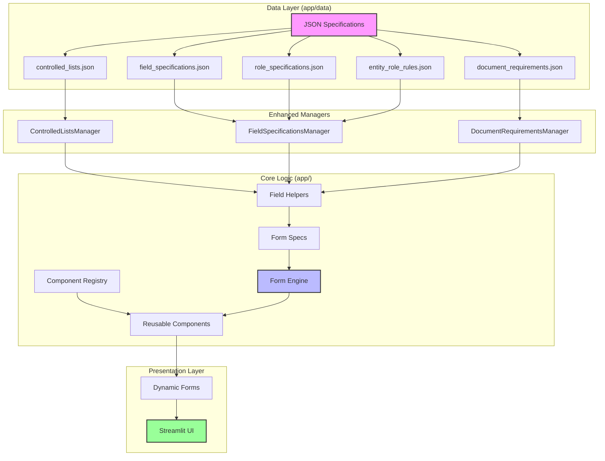

# Juristics ReFICA App - Technical Architecture Documentation

This document serves as the **comprehensive technical architecture documentation** for the Juristics ReFICA App. The system has been fully implemented using a **semantic specification-driven architecture** that provides maximum modularity, reusability, and maintainability.

## 📊 **Architectural Flow Diagram**

This diagram illustrates how the system's components interact to dynamically generate forms from a set of declarative specifications.



## 🚀 **Latest Architecture Enhancements (Semantic Specification Compliance)**

The system has been enhanced to align with semantic specification requirements:

- **📋 Structured Controlled Lists**: Code/label separation with JSON-based specifications
- **👥 Role-Based Architecture**: Proper role system for Natural Persons and Entity Fields  
- **🔧 Field Specifications**: Comprehensive validation rules with cross-field dependencies
- **📄 Document Requirements**: Structured document upload requirements by entity type and role
- **⚡ Enhanced Validation Engine**: Multi-layer validation with business rule enforcement
- **🎯 Dynamic Form Generation**: Forms built from declarative specifications
- **🧪 Development Mode Toggle**: Testing mode that bypasses all form validation for email engine testing
- **🔄 DRY Field Helpers**: Helper functions eliminate code duplication across 17+ entity specs
- **🏢 Juristic Entity Support**: Dedicated component for capturing corporate entities in various roles
- **📎 Enhanced Attachment Naming**: Intelligent email attachment naming system with descriptive, structured filenames

## 🏗️ **Architecture Overview**

The Juristics ReFICA App implements a **3-page application** with:

* **Dynamic form generation** based on entity type selection
* **Reusable, validated form components** with instance-scoped state management
* **Component interface + registry system** for consistent render → validate → serialize patterns
* **Multiple component instances** on the same page (e.g., "Directors", "Beneficial Owners") with **instance_id** scoping
* **Lightweight form engine** that orchestrates component interactions
* **Preserved session state persistence** using existing `persist_*` helpers

---

## 📁 **System Architecture**

```
Juristics ReFICA App/
├── app/
│   ├── common_form_sections/      # ✅ REUSABLE COMPONENTS
│   │   ├── __init__.py            # Component registry system
│   │   ├── address.py             # Address with country validation
│   │   ├── authorised_representative.py # 🆕 Single person component (form author)
│   │   ├── base.py                # SectionComponent interface
│   │   ├── juristic_entities.py   # 🆕 Juristic entity collection component
│   │   ├── natural_persons.py     # Natural person collection component
│   │   ├── phone.py               # Phone with dialing code validation
│   │   ├── CountryList.csv        # Country database
│   │   └── CountryListV2.csv      # Enhanced country database with dialing codes
│   ├── components/                # UI components
│   │   ├── sidebar.py             # 3-page navigation
│   │   └── submission.py          # Submission handling
│   ├── data/                      # ✅ STRUCTURED DATA & SPECIFICATIONS
│   │   ├── __init__.py
│   │   ├── controlled_lists.json      # Structured controlled lists with codes/labels
│   │   ├── document_requirements.json # Document upload requirements
│   │   ├── entity_role_rules.json     # Entity type to role requirements mapping
│   │   ├── field_specifications.json  # Field validation rules and UI metadata
│   │   └── role_specifications.json   # Role definitions and field mappings
│   ├── forms/                     # ✅ FORM ENGINE & SPECS
│   │   ├── __init__.py
│   │   ├── engine.py              # Core form renderer and orchestration
│   │   ├── field_helpers.py       # 🆕 DRY field generation utilities
│   │   └── specs/                 # Entity-specific form definitions (17+ types)
│   │       ├── __init__.py        # SPECS registry
│   │       ├── burial_society.py
│   │       ├── charity_organisation.py
│   │       ├── church.py
│   │       ├── closed_corporation.py
│   │       ├── company.py
│   │       ├── community_group.py
│   │       ├── cultural_association.py
│   │       ├── environmental_group.py
│   │       ├── investment_club.py
│   │       ├── other.py
│   │       ├── partnership.py
│   │       ├── savings_club.py
│   │       ├── school.py
│   │       ├── social_club.py
│   │       ├── sports_club.py
│   │       ├── stokvel.py
│   │       └── trust.py
│   ├── pages/                     # Application pages
│   │   ├── 1_AI_Assistance.py     # AI assistant with enhancements
│   │   ├── 3_Declaration_and_Submit.py # Final submission page
│   │   └── _archive/              # 📦 ARCHIVED: Original pages 2-7
│   ├── controlled_lists_enhanced.py   # Enhanced controlled lists manager
│   ├── controlled_lists.py            # Legacy controlled lists (compatibility)
│   ├── attachment_metadata.py          # 🆕 Enhanced email attachment naming system
│   ├── csv_generator.py               # CSV data export and flattening utilities
│   ├── document_requirements.py       # Document requirements manager
│   ├── email_sender.py                # Email submission with enhanced attachment names
│   ├── field_specifications.py        # Field specification and validation system
│   ├── main.py                        # Introduction: Dynamic entity forms
│   ├── pdf_generator.py               # PDF generation
│   ├── styling.py                     # UI styling
│   └── utils.py                       # State management, dev mode, persistence helpers
├── assets/                        # Static assets
│   └── logos/
│       ├── agent.png
│       ├── EasyETFsLogo.svg
│       ├── favicon.png
│       ├── favicon.svg
│       ├── lottie-jsons/          # Animation files
│       ├── Ownthemarket.png
│       ├── profile.svg
│       ├── Satrix_logo.png
│       └── stx_svg.svg
├── docs/                          # Documentation
│   └── architecture_diagram.md    # Mermaid diagrams and architecture overview
├── doc_requirements_spec.csv      # External documentation
├── knowledge_set.md               # AI knowledge base
├── project_details.md             # This file - technical architecture documentation
├── README.md                      # Project overview and setup
├── requirements.txt               # Python dependencies
└── summerizer_mandate.md          # Project requirements summary
```

### 🎯 **Key Architectural Principles**

1. **📋 Semantic Specification Compliance**: Follows structured data contracts for maintainability and governance
2. **🔧 Component Reusability**: Form sections (address, phone, natural persons) are implemented once and reused across all entity types
3. **🔒 Instance Isolation**: Multiple instances of the same component can exist on one page without state collisions using `instance_id` scoping
4. **📦 Namespace Separation**: Each entity type maintains isolated session state, allowing users to switch between entity types without data loss
5. **⚙️ Declarative Configuration**: Entity forms are defined declaratively in JSON specs, mixing simple fields with reusable components
6. **🎯 Consistent Interface**: All components implement the same interface (render/validate/serialize) ensuring predictable behavior
7. **🔄 Code/Label Separation**: UI displays human-readable labels while system stores structured codes for data integrity
8. **👥 Role-Based Architecture**: Natural persons and entity fields are organized by roles with proper validation rules
9. **📄 Document Governance**: Upload requirements defined by entity type and role with validation

---

## 🆕 **Enhanced Data Management Architecture**

### **🔧 Latest Architectural Improvements**

**✅ DRY Principle Compliance - Address Duplication Resolved**

The `AuthorisedRepresentativeComponent` has been refactored to eliminate code duplication and maintain architectural consistency:

- **❌ Before**: Address fields were duplicated in both `AuthorisedRepresentativeComponent` and `AddressComponent`
- **✅ After**: Address handling is exclusively managed by the dedicated `AddressComponent`
- **📋 Form Specs Updated**: All entity types now use separate address sections for authorised representatives
- **🎯 Single Responsibility**: `AuthorisedRepresentativeComponent` focuses solely on personal details, identification, and contact info
- **🔧 Maintainable**: Address validation rules and logic exist in only one place
- **🏗️ Consistent**: All address capture uses the same component with the same validation rules

**Implementation Pattern:**
```python
# Authorised Representative personal details
Section(title="Authorised Representative", component_id="authorised_representative", ...)

# Separate address section using dedicated component
Section(title="Authorised Representative Address", component_id="address", 
        component_args={"instance_id": "auth_rep_address"})

# Entity address (also separate)
Section(title="Entity Physical Address", component_id="address",
        component_args={"instance_id": "physical_address"})
```

**✅ CSV Data Export Enhancement**

The submission system now includes machine-readable CSV data export alongside the existing PDF summary:

- **📊 Dual Format Output**: Both human-readable PDF and machine-readable CSV formats
- **🏗️ Structured Data**: CSV uses "long format" with Section/Record#/Field/Value columns
- **🔧 Isolated Logic**: New `csv_generator.py` module with dedicated data flattening
- **📧 Email Integration**: CSV automatically attached to submission emails
- **⚡ Low Risk**: Minimal changes to existing stable codebase
- **🎯 Flexible Format**: Handles nested data, collections, and varying record counts

**CSV Output Format:**
```csv
Section,Record #,Field,Value
Entity Details,1,Entity Name,Acme Corp Ltd
Directors,1,Full Name,John Smith
Directors,1,SA ID,1234567890123
Directors,2,Full Name,Jane Doe
Directors,2,Foreign ID,ABC123456
```

**✅ Enhanced Email Attachment Naming**

The submission system now includes an intelligent attachment naming system that transforms cryptic user-uploaded filenames into descriptive, structured names that clearly identify their source and purpose:

- **📎 Structured Naming Convention**: Standardized format: `{Entity_Name}_{Entity_Type}_{Section_Title}_{Person_Identifier}_{Document_Type}.{extension}`
- **🧠 Context-Aware Metadata**: Each attachment includes section title, document type, person identifier, and entity context
- **🔧 Backward Compatibility**: Seamless integration with existing email system using enhanced serialization
- **⚡ Zero Breaking Changes**: Legacy functionality preserved with automatic detection and fallback
- **🎯 Smart Document Classification**: Automatic mapping of ID types to specific document categories

**Enhanced Attachment Examples:**
```
Before: IMG_1234.jpg, scan001.pdf, document.pdf
After:  Acme_Corp_Company_Company_Directors_John_Smith_Director_1_SA_ID_Document.jpg
        Acme_Corp_Company_Company_Directors_John_Smith_Director_1_Proof_of_Address.pdf
        Acme_Corp_Company_Entity_Documents_Recent_Bank_Statement_3_months.pdf
        XYZ_Trust_Trust_Entity_Documents_Certificate_Notice_of_incorporation_CM1_COR_14_1_14_3_or_Certificate_of_change_of_name_CM9_or_CIPC_R.pdf
```

### **Structured Data Sources**

The system now uses JSON-based structured data following semantic specification requirements and has been **fully integrated** into all form journeys:

#### **1. Controlled Lists (`app/data/controlled_lists.json`)**
```json
{
  "source_of_funds": [
    {"code": "BUSINESS_OPERATING_INCOME", "label": "Business Operating Income", "is_active": true, "sort_order": 1},
    {"code": "COMMISSION", "label": "Commission", "is_active": true, "sort_order": 2}
  ],
  "entity_types": [
    {"code": "COMPANY", "label": "Company", "is_active": true, "sort_order": 5}
  ]
}
```

#### **2. Field Specifications (`app/data/field_specifications.json`)**
```json
{
  "standard_field_formatting_rules": {
    "entity_name": {
      "data_type": "string",
      "required_rule": "always", 
      "ui_control": "input",
      "min_length": 1,
      "max_length": 200
    },
    "sa_id_number": {
      "data_type": "id_sa",
      "required_rule": "if_id_type_sa_id",
      "validation": "luhn_check",
      "dependencies": {"id_type": "SA ID Number"}
    }
  }
}
```

#### **3. Role Specifications (`app/data/role_specifications.json`)**
```json
{
  "natural_person_roles": {
    "AUTHORISED_REPRESENTATIVE": {
      "role_id": "AUTHORISED_REPRESENTATIVE",
      "name": "Authorised Representative",
      "fields": [
        {"field_name": "title", "required_rule": "always"},
        {"field_name": "first_name", "required_rule": "always"}
      ]
    }
  }
}
```

#### **4. Entity Role Rules (`app/data/entity_role_rules.json`)**
```json
{
  "entity_role_rules": [
    {
      "entity_type": "COMPANY",
      "required_roles": [
        {"role_id": "AUTHORISED_REPRESENTATIVE", "requirement": "REQUIRED", "min_count": 1, "max_count": 1},
        {"role_id": "DIRECTOR", "requirement": "REQUIRED", "min_count": 1, "max_count": null}
      ]
    }
  ]
}
```

#### **5. Document Requirements (`app/data/document_requirements.json`)**
```json
{
  "document_requirements": [
    {
      "entity_type": "COMPANY",
      "document_code": "CERTIFICATE_OF_INCORPORATION",
      "description": "Certificate of Incorporation",
      "required_rule": "REQUIRED",
      "accepted_formats": ["pdf", "jpg", "jpeg", "png"],
      "max_size_mb": 10
    }
  ]
}
```

### **Enhanced Managers**

#### **Controlled List Manager** ✅ **FULLY INTEGRATED**
- **Code/Label Resolution**: Maps between codes (stored) and labels (displayed)
- **Active Item Filtering**: Enables/disables options dynamically
- **Sort Ordering**: Custom ordering with configurable priority (e.g., South Africa first)
- **Form Integration**: Now powering all dropdown fields across entity forms

#### **Field Specification Manager** 
- **Multi-layer Validation**: Data type, format, length, range, special validation
- **Dependency Resolution**: Cross-field validation rules
- **Business Rule Enforcement**: Entity-specific conditional logic

#### **Document Requirements Manager**
- **Role-based Requirements**: Documents required per entity type and role
- **Upload Validation**: File format, size, and completeness checking
- **Schema Generation**: Dynamic UI generation from requirements

### **🎯 Controlled Lists Integration Status**

The enhanced controlled lists system has been **fully integrated** across all form components:

**Form Components:**
- ✅ **Entity Type Selection** (`app/main.py`): Uses `get_entity_types()` for dynamic entity selection
- ✅ **Field Helpers** (`app/forms/field_helpers.py`): Integrated Source of Funds, Industry, and Country dropdowns
- ✅ **Natural Persons Component** (`app/common_form_sections/natural_persons.py`): Member roles and countries (uses `get_countries()`)
- ✅ **Authorised Representative Component** (`app/common_form_sections/authorised_representative.py`): Titles, genders, marital status, countries
- ✅ **Address Component** (`app/common_form_sections/address.py`): Country selection with 220+ countries (uses enhanced controlled lists)
- ✅ **Juristic Entities Component** (`app/common_form_sections/juristic_entities.py`): Entity types and countries
- ✅ **Session State Management** (`app/utils.py`): Backwards compatibility maintained

**Data Flow:**
```
JSON Data Sources → Enhanced Managers → Form Components → Dynamic UI → User Experience
```

All form dropdowns now use standardized controlled lists with consistent code/label separation, ensuring data integrity while providing user-friendly interfaces.

---

## 🚀 **Application Flow**

### **3-Page Navigation Structure**

The application implements a streamlined **3-page workflow**:

1. **📋 Introduction (main.py)**: Entity type selection and dynamic form rendering
2. **🤖 AI Assistance**: Context-aware help system
3. **📝 Declaration & Submit**: Final validation and submission

#### **Page Configuration** (`.streamlit/pages.toml`)
```toml
[[pages]]
path = "app/main.py"
name = "Introduction"
icon = "🏠"

[[pages]]
path = "app/pages/1_AI_Assistance.py"
name = "AI Assistance"
icon = "🤖"

[[pages]]
path = "app/pages/3_Declaration_and_Submit.py"
name = "Declaration & Submit"
icon = "📝"
```

#### **Navigation Implementation** (`app/components/sidebar.py`)
```python
st.page_link('main.py', label='Introduction', icon='🏠')
st.page_link('pages/1_AI_Assistance.py', label='AI Assistance', icon='🤖')
st.page_link('pages/3_Declaration_and_Submit.py', label='Declaration & Submit', icon='📝')
```

#### **Legacy Page Archive**
Original pages 2-7 have been preserved in `app/pages/_archive/` for reference and potential future use.

---

## 🔧 **Core Utilities & State Management**

### **Namespace & Instance Key System**

The system implements a sophisticated state management approach with two levels of scoping:

#### **Implementation** (`app/utils.py`)

```python
# Entity Types Configuration (17+ supported types)
ENTITY_TYPES = [
    "Burial Society", "Charity Organisation", "Church", "Closed Corporation", 
    "Company", "Community Group", "Cultural Association", "Environmental Group",
    "Investment Club", "Partnership", "Savings Club", "School", "Social Club",
    "Sports Club", "Stokvel", "Trust", "Other"
]

# Namespace Management
def sanitize_ns(label: str) -> str:
    """Convert entity type to valid namespace identifier"""
    return re.sub(r'[^a-z0-9_]', '', label.strip().lower().replace(' ', '_'))

def current_namespace() -> str:
    """Get current entity type namespace from session state"""
    return sanitize_ns(st.session_state.get("entity_type", ENTITY_TYPES[0]))

# Key Generation Functions
def ns_key(ns: str, key: str) -> str:
    """Create entity-namespaced session key: 'company__field_name'"""
    return f"{ns}__{key}"

def inst_key(ns: str, instance_id: str, key: str) -> str:
    """Create instance-scoped session key: 'company__directors__count'"""
    return ns_key(ns, f"{instance_id}__{key}")

# Session State Initialization
def initialize_state():
    """Initialize all required session state variables"""
    if 'state_initialized' not in st.session_state:
        defaults = {
            # Entity Onboarding Core
            "messages": [],
            "accept": False,
            "entity_type": ENTITY_TYPES[0],
            "entity_user_id": "",
            "entity_display_name": "",
            "s1_name": "", "s1_desig": "",
            "s2_name": "", "s2_desig": "",
            # System Configuration
            "favicon_path": str(favicon_path),
            # Legacy DDQ fields (preserved for compatibility)
            # ... additional fields ...
        }
        for key, value in defaults.items():
            st.session_state.setdefault(key, value)
        st.session_state.state_initialized = True
```

#### **State Management Hierarchy**

1. **Global Keys**: `"entity_type"`, `"entity_user_id"`, `"accept"`
2. **Namespace Keys**: `ns_key("company", "legal_name")` → `"company__legal_name"`
3. **Instance Keys**: `inst_key("company", "directors", "count")` → `"company__directors__count"`

#### **Benefits**

- **Entity Isolation**: Users can switch between Company/Trust/etc. without losing data
- **Component Reuse**: Same component (e.g., natural_persons) used multiple times on one page
- **State Persistence**: Session state preserved across page navigation
- **No Collisions**: Unique keys prevent data overwrites

---

## 🧩 **Component System Architecture**

### **Component Interface** (`app/common_form_sections/base.py`)

```python
from abc import ABC, abstractmethod
from typing import Any, Dict, List, Tuple

class SectionComponent(ABC):
    """Abstract base class for reusable form sections."""

    @abstractmethod
    def render(self, *, ns: str, instance_id: str, **config) -> None:
        """
        Render the component UI using Streamlit widgets.
        
        Args:
            ns: Entity namespace (e.g., 'company', 'trust')
            instance_id: Component instance identifier (e.g., 'directors', 'ubos')
            **config: Component-specific configuration options
        """
        raise NotImplementedError

    @abstractmethod
    def validate(self, *, ns: str, instance_id: str, **config) -> List[str]:
        """
        Validate component data and return error messages.
        
        Returns:
            List of human-readable error strings (empty if valid)
        """
        raise NotImplementedError

    @abstractmethod
    def serialize(self, *, ns: str, instance_id: str, **config) -> Tuple[Dict[str, Any], List[Any]]:
        """
        Serialize component data for submission.
        
        Returns:
            Tuple of (payload_dict, uploads_list)
            - payload_dict: JSON-serializable data summary
            - uploads_list: List of UploadedFile objects for email attachment
        """
        raise NotImplementedError
```

### **Component Registry** (`app/common_form_sections/__init__.py`)

```python
from typing import Dict
from app.common_form_sections.base import SectionComponent

# Global component registry
_REGISTRY: Dict[str, SectionComponent] = {}

def register_component(name: str, component: SectionComponent):
    """Register a reusable section under a stable name."""
    _REGISTRY[name] = component

def get_component(name: str) -> SectionComponent | None:
    """Retrieve a registered component by name."""
    return _REGISTRY.get(name)

# Auto-register components on import
from . import natural_persons  # Auto-registers "natural_persons"
from . import address          # Auto-registers "address"  
from . import phone           # Auto-registers "phone"
```

### **Component Registration Pattern**

Each component self-registers during import:

```python
# At end of component file (e.g., natural_persons.py)
register_component("natural_persons", NaturalPersonsComponent())
```

---

## 📎 **Enhanced Email Attachment Naming System**

The Juristics ReFICA App features a sophisticated attachment naming system that automatically generates descriptive, structured filenames for email submissions, replacing cryptic user-uploaded names with meaningful, context-aware identifiers.

### **🎯 Problem Solved**

**Before Enhancement:**
- Users upload files with unhelpful names: `IMG_1234.jpg`, `scan001.pdf`, `document.pdf`
- Recipients cannot identify which document belongs to which person or section
- Manual correlation required between attachments and form data
- Confusion and processing delays for document reviewers

**After Enhancement:**
- Automatic generation of descriptive filenames with full context
- Clear identification of document source, type, and associated person
- Structured naming convention for consistent processing
- Enhanced email body with attachment summary

### **🏗️ System Architecture**

#### **Core Components**

**AttachmentMetadata Class** (`app/attachment_metadata.py`)
```python
@dataclass
class AttachmentMetadata:
    file: st.runtime.uploaded_file_manager.UploadedFile
    section_title: str          # "Company Directors", "Entity Documents", etc.
    document_type: str          # "SA_ID_Document", "Proof_of_Address", etc.
    person_identifier: str      # "John_Smith_Director_1", "Auth_Rep", etc.
    entity_context: str         # "Acme_Corp_Company", etc.
    
    def generate_filename(self) -> str:
        """Generate standardized filename for email attachment."""
        # Returns: Entity_Name_Entity_Type_Section_Title_Person_ID_Document_Type.ext
```

**AttachmentCollector Class**
```python
class AttachmentCollector:
    """Manages collection of AttachmentMetadata objects from form components."""
    
    def add_attachment(self, file, section_title, document_type, person_identifier=""):
        """Add attachment with enhanced metadata."""
    
    def get_attachments_for_email(self) -> List[AttachmentMetadata]:
        """Get all attachments ready for email sending with enhanced names."""
    
    def get_legacy_upload_list(self) -> List[UploadedFile]:
        """Backward compatibility - get traditional upload list."""
```

#### **Enhanced Serialization Pipeline**

**1. Component-Level Enhancement**
- **Base Interface**: `SectionComponent.serialize_with_metadata()` method added
- **Natural Persons**: Creates person identifiers and maps document types
- **Authorised Representative**: Handles single-person attachment context
- **Form Fields**: File upload fields generate appropriate metadata

**2. Form Engine Integration**
- **Enhanced Serialization**: `serialize_answers_with_metadata()` function
- **Attachment Collection**: Centralized gathering of attachment metadata
- **Backward Compatibility**: Legacy `serialize_answers()` maintained

**3. Email System Enhancement**
- **Metadata-Aware Sending**: `send_submission_email_with_metadata()`
- **Enhanced Filenames**: Uses `AttachmentMetadata.generate_filename()`
- **Improved Email Body**: Includes attachment summary with new names

### **🎯 Naming Convention**

**Standard Format:**
```
{Entity_Name}_{Entity_Type}_{Section_Title}_{Person_Identifier}_{Document_Type}.{extension}
```

**Component Breakdown:**
- **Entity_Name**: Sanitized legal/registered name (e.g., "Acme_Corp")
- **Entity_Type**: Entity type classification (e.g., "Company", "Trust")
- **Section_Title**: Form section where uploaded (e.g., "Company_Directors", "Entity_Documents")
- **Person_Identifier**: Individual identifier (e.g., "John_Smith_Director_1", "Auth_Rep")
- **Document_Type**: Form field label converted to filename-safe format (e.g., "Recent_Bank_Statement_3_months", "Certificate_Notice_of_incorporation_CM1_COR_14_1_14_3")
- **Extension**: Original file extension preserved

**Real Examples:**
```
Acme_Corp_Company_Company_Directors_John_Smith_Director_1_SA_ID_Document.jpg
Acme_Corp_Company_Company_Directors_Jane_Doe_Director_2_Passport_Document.pdf
Acme_Corp_Company_Authorised_Representative_Mike_Wilson_Auth_Rep_Proof_of_Address.pdf
Acme_Corp_Company_Entity_Documents_Recent_Bank_Statement_3_months.pdf
Acme_Corp_Company_Entity_Documents_Certificate_Notice_of_incorporation_CM1_COR_14_1_14_3_or_Certificate_of_change_of_name_CM9_or_CIPC_R.pdf
XYZ_Trust_Trust_Trustees_Sarah_Johnson_Trustee_1_Foreign_ID_Document.jpg
XYZ_Trust_Trust_Entity_Documents_Trust_Deed_or_Letter_of_Authority_issued_and_signed_by_Master_of_High_Court.pdf
```

### **🧠 Smart Document Classification**

#### **Field-Label-Based Document Naming**

The system uses the **exact form field labels** as document types, ensuring that attachment names directly reflect the specific document requirements displayed to users:

**Entity Document Examples:**
```
Form Field Label → Attachment Document Type
"Recent Bank Statement (3 months)" → "Recent_Bank_Statement_3_months"
"Certificate/ Notice of incorporation (CM1/ COR 14.1/ 14.3)" → "Certificate_Notice_of_incorporation_CM1_COR_14_1_14_3"
"Trust Deed or Letter of Authority" → "Trust_Deed_or_Letter_of_Authority"
"Resolution signed by Directors" → "Resolution_signed_by_Directors"
```

**ID Type Mapping (for Natural Persons):**
```python
"SA ID Number" → "SA_ID_Document"
"Foreign ID Number" → "Foreign_ID_Document"
"Foreign Passport Number" → "Passport_Document"
"Proof of Address" → "Proof_of_Address"
```

**Person Identifier Generation:**
```python
def create_person_identifier(first_name, surname, role_label, index):
    """Creates: John_Smith_Director_1 or fallback to Director_1"""
    name_parts = [part for part in [first_name, surname] if part.strip()]
    person_name = "_".join(name_parts) if name_parts else f"{role_label}_{index}"
    return f"{person_name}_{role_label}_{index}"
```

**Filename Sanitization:**
- **Preserves Meaningful Content**: Keeps important details like "(3 months)", "(CM1/ COR 14.1/ 14.3)", etc.
- **Field Label Mapping**: Uses exact form field labels as document types for consistent identification
- **Safe Character Conversion**: Converts `/` to `_`, `()` to `_content_`, spaces to `_`
- **Smart Truncation**: Limits very long names to 100 characters while preserving readability
- **Extension Preservation**: Maintains original file extensions (.pdf, .jpg, .png, etc.)

### **🔄 Backward Compatibility & Migration**

**Zero Breaking Changes:**
- **Automatic Detection**: System detects enhanced vs legacy serialization
- **Graceful Fallback**: Falls back to original naming if enhanced system unavailable
- **Legacy Support**: Original `send_submission_email()` function unchanged
- **Phased Rollout**: Enhanced naming used when available, legacy otherwise

**Migration Strategy:**
```python
# Automatic detection in submission handler
if hasattr(answers, '_attachment_collector'):
    # Use enhanced email sending with descriptive names
    send_submission_email_with_metadata(answers, answers._attachment_collector)
else:
    # Fall back to legacy email sending with original names
    send_submission_email(answers, uploaded_files)
```

### **📊 Development Mode Integration**

**Enhanced Debug Information:**
- **Attachment Count**: Shows number of attachments with metadata
- **Filename Preview**: Displays enhanced attachment names before submission
- **Real-time Feedback**: Updates as users add/modify attachments

**Debug Output Example:**
```
🔧 Enhanced Serialization Active - 4 attachments with metadata
📎 Enhanced Attachment Names Preview:
  • Acme_Corp_Company_Company_Directors_John_Smith_Director_1_SA_ID_Document.jpg
  • Acme_Corp_Company_Company_Directors_John_Smith_Director_1_Proof_of_Address.pdf
  • Acme_Corp_Company_Entity_Documents_Recent_Bank_Statement_3_months.pdf
  • Acme_Corp_Company_Entity_Documents_Certificate_Notice_of_incorporation_CM1_COR_14_1_14_3_or_Certificate_of_change_of_name_CM9_or_CIPC_R.pdf
```

### **🚀 Benefits & Impact**

**For Recipients:**
- **Clear Identification**: Immediately understand document source and purpose
- **Efficient Processing**: No manual correlation between attachments and form data
- **Consistent Naming**: Same document types use identical names across all entity journeys
- **Audit Trail**: Enhanced filenames provide clear document lineage
- **Reduced Errors**: Less confusion about which document belongs where

**For System:**
- **Field-Label Consistency**: Document names directly match form field labels for intuitive mapping
- **Cross-Journey Uniformity**: "Recent Bank Statement (3 months)" produces the same filename across all entity types
- **Maintainable**: Changes to field labels automatically update attachment naming
- **Extensible**: New document types inherit the same naming pattern automatically
- **Testable**: Comprehensive test coverage ensures reliability
- **Performance**: Minimal overhead - only filename generation at submission time

### **🔧 Technical Implementation Details**

**Enhanced Component Interface:**
```python
def serialize_with_metadata(self, *, ns: str, instance_id: str, 
                           attachment_collector: AttachmentCollector, 
                           section_title: str, **config) -> Dict[str, Any]:
    """Enhanced serialization with proper attachment metadata collection."""
```

**Form Engine Enhancement:**
```python
def serialize_answers_with_metadata(spec: FormSpec, ns: str):
    """Enhanced serialization that returns AttachmentCollector with metadata."""
    attachment_collector = AttachmentCollector(entity_name, entity_type)
    # Process all sections and components, collecting attachment metadata
    return answers, attachment_collector
```

**Email System Enhancement:**
```python
def send_submission_email_with_metadata(answers, attachment_collector):
    """Enhanced email sending with properly named attachments."""
    attachments = attachment_collector.get_attachments_for_email()
    for attachment_metadata in attachments:
        enhanced_filename = attachment_metadata.generate_filename()
        # Attach with enhanced filename that reflects exact field label
        # E.g., "Recent_Bank_Statement_3_months.pdf" instead of "scan.pdf"
```

**Field Label Sanitization:**
```python
def sanitize_document_label(label: str) -> str:
    """Preserve meaningful content while making filename-safe."""
    # Converts: "Recent Bank Statement (3 months)" 
    # To:       "Recent_Bank_Statement_3_months"
    # Keeps:    Important details like timeframes and document codes
    # Removes:  Only characters unsafe for filenames (/, <, >, :, ", |, *, ?, \)
```

This comprehensive enhancement ensures that every attachment in email submissions has a meaningful, descriptive name that clearly identifies its purpose, source, and context, dramatically improving the document processing experience for recipients.

---

## 👥 **Implemented Components**

### **Natural Persons Component** (`app/common_form_sections/natural_persons.py`)

The most complex component, handling collections of people with various identification types and validation rules.

### **Authorised Representative Component** (`app/common_form_sections/authorised_representative.py`)

Handles the detailed capture of a **single individual**, typically the person completing the form on behalf of the entity. Unlike `NaturalPersonsComponent` which handles a *collection* of people, this is for a single, mandatory role.

#### **Features**
- **Comprehensive Personal Details**: Collects title, first/last name, date of birth, gender, and marital status
- **Multiple ID Types**: SA ID (with Luhn validation), Foreign ID, and Foreign Passport with expiry validation  
- **Integrated Contact Info**: Email validation, citizenship, country of residence, and phone number with auto-dialing code
- **DRY Compliance**: Uses dedicated `AddressComponent` and `PhoneComponent` for their respective functions
- **Smart Auto-Fill**: Automatically suggests phone dialing codes based on citizenship or residence country
- **Age Validation**: Ensures minimum 18 years old based on date of birth

#### **Validation Rules**
- **Required Personal**: Title, first name, last name, gender, date of birth, marital status
- **Required ID**: Valid identification type with appropriate validation (SA ID Luhn check, future passport expiry)
- **Required Contact**: Valid email format, citizenship, residence country, phone with dialing code
- **Age Verification**: Must be at least 18 years old
- **Phone Format**: SA numbers (+27) must be 9 digits without leading zero; international 6-15 digits

### **Juristic Entities Component** (`app/common_form_sections/juristic_entities.py`)

Acts as the corporate equivalent of the `NaturalPersonsComponent`. Designed to capture a **collection of related legal entities** (e.g., companies that are shareholders in another company).

#### **Features**
- **Entity Type Selection**: Uses controlled lists for consistent entity type classification
- **Core Entity Details**: Entity name, registration number, and country of registration
- **Role-Specific Fields**: Additional fields based on context (percentage shareholding for shareholders, executive control for directors)
- **Conditional Validation**: Country of registration required only when registration number is provided
- **Configurable UI**: Adapts labels and requirements based on role context

#### **Role-Specific Logic**
- **Shareholders/Partners**: Captures percentage ownership (0-100%) with validation
- **Directors/Partners**: Captures executive control (Yes/No) selection
- **All Roles**: Standard entity identification and registration details

#### **Configuration Options**

| Parameter | Type | Description |
|-----------|------|-------------|
| `title` | str | Section heading (e.g., "Juristic Entity Shareholders") |
| `role_label` | str | Individual item labels (e.g., "Shareholder", "Trustee") |
| `min_count` | int | Minimum required entities |
| `help_text` | str | Additional guidance for users |

```python
from __future__ import annotations
import datetime, re
from typing import Any, Dict, List, Tuple
import streamlit as st

from app.common_form_sections.base import SectionComponent
from app.common_form_sections import register_component
from app.utils import inst_key
from app.utils import (
    persist_number_input, persist_text_input, persist_selectbox,
    persist_date_input, persist_file_uploader
)

COUNTRIES = get_countries(include_empty=True, return_codes=False)  # Uses enhanced controlled lists

def _digits_only(s: str) -> str:
    return re.sub(r"\D", "", s or "")

def _luhn_ok(n: str) -> bool:
    n = _digits_only(n)
    total, alt = 0, False
    for d in n[::-1]:
        d = int(d)
        if alt:
            d *= 2
            if d > 9: d -= 9
        total += d
        alt = not alt
    return total % 10 == 0

def _valid_sa_id(n: str) -> bool:
    n = _digits_only(n)
    return len(n) == 13 and _luhn_ok(n)

def _is_future_date(d: datetime.date | None) -> bool:
    return bool(d and d > datetime.date.today())

class NaturalPersonsComponent(SectionComponent):
    """
    Reusable section for capturing a list of natural persons.
    Config (kwargs):
      - title: str = "Related Natural Persons"
      - role_label: str = "Person"    (used in UI headings)
      - min_count: int = 0            (enforce minimum count)
      - show_uploads: bool = True     (toggle ID/PoA uploads)
      - allowed_id_types: list[str] = ["SA ID Number", "Foreign ID Number", "Foreign Passport Number"]
    """

    def render(self, *, ns: str, instance_id: str, **config) -> None:
        title = config.get("title", "Related Natural Persons")
        role_label = config.get("role_label", "Person")
        allowed_id_types = config.get("allowed_id_types",
            ["SA ID Number", "Foreign ID Number", "Foreign Passport Number"])

        st.subheader(title)
        count_key = inst_key(ns, instance_id, "count")
        n = persist_number_input(f"Number of {role_label.lower()}s", count_key, min_value=0, step=1)

        for i in range(st.session_state.get(count_key, 0)):
            with st.expander(f"{role_label} #{i+1}", expanded=False):
                persist_text_input("Full Name & Surname", inst_key(ns, instance_id, f"full_{i}"))

                id_type = persist_selectbox("Identification Type",
                    inst_key(ns, instance_id, f"id_type_{i}"),
                    options=[""] + allowed_id_types)

                if id_type == "SA ID Number":
                    persist_text_input("SA ID Number", inst_key(ns, instance_id, f"sa_id_{i}"),
                                       help="13 digits; Luhn check applies.")
                elif id_type == "Foreign ID Number":
                    persist_text_input("Foreign ID Number", inst_key(ns, instance_id, f"foreign_id_{i}"))
                elif id_type == "Foreign Passport Number":
                    persist_text_input("Passport Number", inst_key(ns, instance_id, f"passport_no_{i}"))
                    persist_selectbox("Passport Issue Country",
                        inst_key(ns, instance_id, f"passport_country_{i}"),
                        options=COUNTRIES)
                    persist_date_input("Passport Expiry (YYYY/MM/DD)",
                        inst_key(ns, instance_id, f"passport_expiry_{i}"),
                        min_value=datetime.date.today() + datetime.timedelta(days=1))

                persist_text_input("Email", inst_key(ns, instance_id, f"email_{i}"))
                persist_text_input("Telephone", inst_key(ns, instance_id, f"tel_{i}"))

                if config.get("show_uploads", True):
                    persist_file_uploader("ID / Passport Document",
                        inst_key(ns, instance_id, f"id_doc_{i}"))
                    persist_file_uploader("Proof of Address",
                        inst_key(ns, instance_id, f"poa_doc_{i}"))

    def validate(self, *, ns: str, instance_id: str, **config) -> List[str]:
        errs: List[str] = []
        role_label = config.get("role_label", "Person")
        min_count = int(config.get("min_count", 0))
        allowed_id_types = config.get("allowed_id_types",
            ["SA ID Number", "Foreign ID Number", "Foreign Passport Number"])

        n = st.session_state.get(inst_key(ns, instance_id, "count"), 0)
        if n < min_count:
            errs.append(f"[{role_label}s] At least {min_count} entr{'y' if min_count==1 else 'ies'} required.")

        for i in range(n):
            prefix = f"[{role_label} #{i+1}]"
            full = (st.session_state.get(inst_key(ns, instance_id, f"full_{i}")) or "").strip()
            if not full:
                errs.append(f"{prefix} Full Name is required.")

            idt = st.session_state.get(inst_key(ns, instance_id, f"id_type_{i}"), "")
            if idt not in [""] + allowed_id_types:
                errs.append(f"{prefix} Invalid ID Type.")
            if not idt:
                errs.append(f"{prefix} Identification Type is required.")
            if idt == "SA ID Number":
                val = st.session_state.get(inst_key(ns, instance_id, f"sa_id_{i}"), "")
                if not _valid_sa_id(val):
                    errs.append(f"{prefix} SA ID Number is invalid.")
            elif idt == "Foreign ID Number":
                if not (st.session_state.get(inst_key(ns, instance_id, f"foreign_id_{i}")) or "").strip():
                    errs.append(f"{prefix} Foreign ID Number is required.")
            elif idt == "Foreign Passport Number":
                if not (st.session_state.get(inst_key(ns, instance_id, f"passport_no_{i}")) or "").strip():
                    errs.append(f"{prefix} Passport Number is required.")
                if not (st.session_state.get(inst_key(ns, instance_id, f"passport_country_{i}")) or "").strip():
                    errs.append(f"{prefix} Passport Issue Country is required.")
                exp = st.session_state.get(inst_key(ns, instance_id, f"passport_expiry_{i}"))
                if not (exp and _is_future_date(exp)):
                    errs.append(f"{prefix} Passport Expiry must be a future date.")

        return errs

    def serialize(self, *, ns: str, instance_id: str, **config) -> Tuple[Dict[str, Any], List[Any]]:
        people: List[Dict[str, Any]] = []
        uploads: List[Any] = []
        n = st.session_state.get(inst_key(ns, instance_id, "count"), 0)

        for i in range(n):
            exp = st.session_state.get(inst_key(ns, instance_id, f"passport_expiry_{i}"))
            people.append({
                "Full Name": st.session_state.get(inst_key(ns, instance_id, f"full_{i}"), ""),
                "ID Type": st.session_state.get(inst_key(ns, instance_id, f"id_type_{i}"), ""),
                "SA ID": st.session_state.get(inst_key(ns, instance_id, f"sa_id_{i}"), ""),
                "Foreign ID": st.session_state.get(inst_key(ns, instance_id, f"foreign_id_{i}"), ""),
                "Passport No": st.session_state.get(inst_key(ns, instance_id, f"passport_no_{i}"), ""),
                "Passport Country": st.session_state.get(inst_key(ns, instance_id, f"passport_country_{i}"), ""),
                "Passport Expiry": exp.strftime("%Y/%m/%d") if exp else "",
                "Email": st.session_state.get(inst_key(ns, instance_id, f"email_{i}"), ""),
                "Telephone": st.session_state.get(inst_key(ns, instance_id, f"tel_{i}"), ""),
                "ID Doc Uploaded": bool(st.session_state.get(inst_key(ns, instance_id, f"id_doc_{i}"))),
                "PoA Uploaded": bool(st.session_state.get(inst_key(ns, instance_id, f"poa_doc_{i}"))),
            })
            if config.get("show_uploads", True):
                uploads.extend([
                    st.session_state.get(inst_key(ns, instance_id, f"id_doc_{i}")),
                    st.session_state.get(inst_key(ns, instance_id, f"poa_doc_{i}")),
                ])

        payload = {"Count": n, "Records": people}
        return payload, uploads

# Register
register_component("natural_persons", NaturalPersonsComponent())
```

#### **Features**

- **Configurable UI**: `title`, `role_label`, `min_count` parameters customize display
- **Multiple ID Types**: SA ID (with Luhn validation), Foreign ID, Foreign Passport
- **Country-Specific Validation**: Different rules for SA vs international identification
- **Document Uploads**: Optional ID/PoA document collection
- **Instance Isolation**: Multiple instances (Directors, UBOs, etc.) on same page
- **Real-time Validation**: Immediate feedback + submission-time validation

#### **Configuration Options**

| Parameter | Type | Default | Description |
|-----------|------|---------|-------------|
| `title` | str | "Related Natural Persons" | Section heading |
| `role_label` | str | "Person" | Individual item labels |
| `min_count` | int | 0 | Minimum required entries |
| `show_uploads` | bool | True | Enable document uploads |
| `allowed_id_types` | List[str] | All types | Restrict ID type options |

---

### **Address Component** (`app/common_form_sections/address.py`)

Handles physical address collection with country-specific validation rules.

#### **Features**
- **Two-column layout**: Unit/Street Number + Complex/Street Name inputs
- **Country-specific validation**: SA requires 4-digit postal codes and province selection
- **Dynamic province field**: Shows SA provinces or "Other" based on country
- **Comprehensive fields**: Unit, Complex, Street Number/Name, Suburb, City, Province, Country, Postal Code

#### **Validation Rules**
- **Required**: Street Number, Street Name, Suburb, City
- **Conditional**: Province required for South Africa
- **Postal Code**: 4 digits for SA, ≤10 characters for other countries

### **Phone Component** (`app/common_form_sections/phone.py`)

Handles phone number collection with international dialing code support.

#### **Features**
- **Split layout**: Dialing code (1/3 width) + phone number (2/3 width)
- **Dynamic validation**: Different rules based on dialing code
- **International support**: Supports various country formats

#### **Validation Rules**
- **Required**: Both dialing code and phone number
- **SA Numbers (+27)**: Must be 9 digits, no leading zero
- **International**: 6-15 digits allowed

---

## ⚙️ **Form Spec Helpers** (`app/forms/field_helpers.py`)

To further adhere to the **DRY (Don't Repeat Yourself)** principle, the architecture includes a helper module that generates common sets of fields for entity specifications. This eliminates code duplication across 17+ spec files and ensures consistency.

### **Key Helper Functions**

#### **`create_entity_details_fields()`**
Generates the standard entity details fields common across all entity types:
- Entity Name (customizable label)
- Trading Name (optional)
- Registration Number
- Country of Registration (with controlled list)
- Date of Registration/Establishment
- Source of Funds (with controlled list)
- Industry (with controlled list)

**Special Features:**
- **Trust Support**: Optional `include_trust_fields=True` adds "Masters Office where the Trust was registered"
- **Dynamic Labels**: Customizable entity name labels (e.g., "Trust Name", "Company Name")
- **Controlled Lists**: Automatic integration with enhanced controlled list managers

#### **`create_entity_document_upload_fields()`**
Dynamically generates file upload fields based on requirements defined in `app/data/document_requirements.json`:
- **Entity-Type Specific**: Different documents required per entity type (COMPANY, TRUST, etc.)
- **Validation Rules**: Required/optional flags from specifications
- **User Guidance**: Includes helpful attachment size warnings
- **Error Handling**: Graceful fallback if document schema unavailable

#### **`create_trust_specific_fields()`**
Generates Trust-specific regulatory fields:
- Masters Office registration location

### **Usage Pattern in Entity Specs**

This pattern makes spec files incredibly clean and maintainable:

```python
# app/forms/specs/trust.py
from app.forms.engine import FormSpec, Section
from app.forms.field_helpers import create_entity_details_fields, create_entity_document_upload_fields

SPEC = FormSpec(
    name="trust",
    title="Trust", 
    sections=[
        # Uses helper to generate all standard entity fields
        Section(
            title="Entity Details",
            fields=create_entity_details_fields(
                entity_name_label="Entity Name (Trust Name)", 
                include_trust_fields=True
            )
        ),
        # Uses helper to generate required document uploads
        Section(
            title="Entity Documents",
            fields=create_entity_document_upload_fields("TRUST")
        ),
        # ... component sections for people and addresses
    ]
)
```

### **Benefits**

| Benefit | Implementation | Impact |
|---------|----------------|---------|
| **Code Reuse** | Single function generates fields for 17+ entity types | 90% reduction in field definition code |
| **Consistency** | All entities use identical field structure and validation | Uniform user experience across entity types |
| **Maintainability** | Changes to standard fields update all entity types automatically | Single point of maintenance |
| **Controlled Lists** | Automatic integration with enhanced controlled list system | Consistent dropdowns with code/label separation |
| **Document Compliance** | Dynamic generation from JSON specifications | Always in sync with regulatory requirements |

---

## ⚙️ **Form Engine** (`app/forms/engine.py`)

The form engine orchestrates the interaction between entity specifications and reusable components.

### **Core Data Structures**

```python
from dataclasses import dataclass, field
from typing import List, Optional, Dict, Any, Tuple
import streamlit as st
from app.utils import ns_key
from app.utils import (
    persist_text_input, persist_number_input, persist_text_area,
    persist_selectbox, persist_date_input, persist_checkbox, persist_file_uploader
)
from app.common_form_sections import get_component

@dataclass
class Field:
    key: str
    label: str
    kind: str
    required: bool = False
    options: Optional[List[str]] = None
    accept_multiple: bool = False

@dataclass
class Section:
    title: str
    fields: List[Field] = field(default_factory=list)
    # NEW: reference to a shared component
    component_id: Optional[str] = None
    component_args: Dict[str, Any] = field(default_factory=dict)

@dataclass
class FormSpec:
    name: str
    title: str
    sections: List[Section]

def _render_field(ns: str, f: Field):
    k = ns_key(ns, f.key)
    if f.kind == "text":     return persist_text_input(f.label, k)
    if f.kind == "number":   return persist_number_input(f.label, k, min_value=0, step=1)
    if f.kind == "textarea": return persist_text_area(f.label, k)
    if f.kind == "select":   return persist_selectbox(f.label, k, options=f.options or [])
    if f.kind == "date":     return persist_date_input(f.label, k)
    if f.kind == "checkbox": return persist_checkbox(f.label, k)
    if f.kind == "file":     return persist_file_uploader(f.label, k, accept_multiple_files=f.accept_multiple)
    st.info(f"Unsupported field kind '{f.kind}' for {f.label}")

def render_form(spec: FormSpec, ns: str):
    st.subheader(spec.title)
    for sec in spec.sections:
        with st.expander(sec.title, expanded=True):
            for f in sec.fields:
                _render_field(ns, f)
            if sec.component_id:
                comp = get_component(sec.component_id)
                if comp is None:
                    st.warning(f"Component '{sec.component_id}' not found.")
                else:
                    # Require instance_id; if not provided, fallback to section title slug
                    instance_id = sec.component_args.get("instance_id") or sec.title.lower().replace(" ", "_")
                    comp.render(ns=ns, instance_id=instance_id, **sec.component_args)

def serialize_answers(spec: FormSpec, ns: str) -> Tuple[Dict[str, Any], List[Any]]:
    answers: Dict[str, Any] = {"Entity Type": spec.title}
    uploads: List[Any] = []
    for sec in spec.sections:
        sec_dict: Dict[str, Any] = {}
        # Simple fields
        for f in sec.fields:
            val = st.session_state.get(ns_key(ns, f.key))
            if f.kind == "file":
                has_files = bool(val) if not f.accept_multiple else bool(val and len(val) > 0)
                sec_dict[f.label] = has_files
                if f.accept_multiple and isinstance(val, list):
                    uploads.extend([u for u in val if u is not None])
                elif val is not None:
                    uploads.append(val)
            else:
                sec_dict[f.label] = val

        # Component payload
        if sec.component_id:
            comp = get_component(sec.component_id)
            if comp:
                instance_id = sec.component_args.get("instance_id") or sec.title.lower().replace(" ", "_")
                payload, comp_uploads = comp.serialize(ns=ns, instance_id=instance_id, **sec.component_args)
                # If fields + component should both appear, merge; otherwise replace:
                sec_dict.update(payload if isinstance(payload, dict) else {})
                uploads.extend(comp_uploads or [])

        answers[sec.title] = sec_dict
    return answers, uploads

def validate(spec: FormSpec, ns: str) -> List[str]:
    errs: List[str] = []
    # Field-level required checks
    for sec in spec.sections:
        for f in sec.fields:
            v = st.session_state.get(ns_key(ns, f.key))
            if f.required:
                if f.kind == "file":
                    if f.accept_multiple:
                        if not v or len([u for u in v if u is not None]) == 0:
                            errs.append(f"[{sec.title}] {f.label} is required.")
                    else:
                        if v is None:
                            errs.append(f"[{sec.title}] {f.label} is required.")
                else:
                    if v in (None, "", []):
                        errs.append(f"[{sec.title}] {f.label} is required.")
        # Component validation
        if sec.component_id:
            comp = get_component(sec.component_id)
            if comp:
                instance_id = sec.component_args.get("instance_id") or sec.title.lower().replace(" ", "_")
                errs.extend(comp.validate(ns=ns, instance_id=instance_id, **sec.component_args))
    return errs
```

---

## 7) Specs call the common section with an `instance_id`

Update **`app/forms/specs/company.py`**:

```python
from app.forms.engine import FormSpec, Section, Field

SPEC = FormSpec(
    name="company",
    title="Company",
    sections=[
        Section(
            title="Entity Details",
            fields=[Field("legal_name", "Legal / Registered Name", "text", required=True)]
        ),
        Section(
            title="Physical Address",
            component_id="address",
            component_args={
                "instance_id": "physical_address",
                "title": "Physical Address"
            }
        ),
        Section(
            title="Contact Information",
            component_id="phone",
            component_args={
                "instance_id": "contact_phone",
                "title": "Contact Number"
            }
        ),
        Section(
            title="Directors",
            component_id="natural_persons",
            component_args={
                "instance_id": "directors",
                "title": "Directors",
                "role_label": "Director",
                "min_count": 1,           # require at least one
                "show_uploads": True,
                # "allowed_id_types": ["SA ID Number", "Foreign Passport Number"]  # optional override
            }
        ),
        # You can mount it again for UBOs, with different rules:
        Section(
            title="Beneficial Owners (>5%)",
            component_id="natural_persons",
            component_args={
                "instance_id": "ubos",
                "title": "Beneficial Owners (>5%)",
                "role_label": "Owner",
                "min_count": 0,
                "show_uploads": True
            }
        ),
    ]
)
```

> The **same module** (`natural_persons`) now powers **both** Directors and UBOs, with different headings and rules—no duplication.

Repeat analogous patterns in `trust.py`, `partnership.py`, etc. Just pass a different `instance_id` and labels like "Trustees", "Partners", etc.

**`trust.py`**

```python
from app.forms.engine import FormSpec, Section, Field
SPEC = FormSpec(
    name="trust",
    title="Trust",
    sections=[
        Section(title="Entity Details", fields=[Field("legal_name","Trust Name","text", required=True)]),
        Section(title="Physical Address", component_id="address", component_args={"instance_id": "trust_address"}),
        Section(title="Contact", component_id="phone", component_args={"instance_id": "trust_phone"}),
        Section(title="Trustees", component_id="natural_persons", component_args={
            "instance_id": "trustees", "role_label": "Trustee", "min_count": 1
        }),
        Section(title="Beneficiaries", component_id="natural_persons", component_args={
            "instance_id": "beneficiaries", "role_label": "Beneficiary", "min_count": 0
        }),
    ]
)
```

**`partnership.py`**

```python
from app.forms.engine import FormSpec, Section, Field
SPEC = FormSpec(
    name="partnership",
    title="Partnership",
    sections=[
        Section(title="Entity Details", fields=[Field("legal_name","Partnership Name","text", required=True)]),
        Section(title="Physical Address", component_id="address", component_args={"instance_id": "partnership_address"}),
        Section(title="Contact", component_id="phone", component_args={"instance_id": "partnership_phone"}),
        Section(title="Partners", component_id="natural_persons", component_args={
            "instance_id": "partners", "role_label": "Partner", "min_count": 2
        }),
    ]
)
```

**`closed_corporation.py`**

```python
from app.forms.engine import FormSpec, Section, Field
SPEC = FormSpec(
    name="closed_corporation",
    title="Closed Corporation",
    sections=[
        Section(title="Entity Details", fields=[Field("legal_name","CC Registered Name","text", required=True)]),
        Section(title="Physical Address", component_id="address", component_args={"instance_id": "cc_address"}),
        Section(title="Contact", component_id="phone", component_args={"instance_id": "cc_phone"}),
        Section(title="Members", component_id="natural_persons", component_args={
            "instance_id": "members", "role_label": "Member", "min_count": 1
        }),
    ]
)
```

**`other.py`**

```python
from app.forms.engine import FormSpec, Section, Field
SPEC = FormSpec(
    name="other",
    title="Other",
    sections=[
        Section(title="Entity Details", fields=[Field("legal_name","Entity Name","text", required=True)]),
        Section(title="Physical Address", component_id="address", component_args={"instance_id": "other_address"}),
        Section(title="Contact", component_id="phone", component_args={"instance_id": "other_phone"}),
        Section(title="Associated People", component_id="natural_persons", component_args={
            "instance_id": "associated", "role_label": "Person", "min_count": 0
        }),
    ]
)
```

**`__init__.py`**

```python
from . import company, trust, partnership, closed_corporation, other

SPECS = {
    "company": company.SPEC,
    "trust": trust.SPEC,
    "partnership": partnership.SPEC,
    "closed_corporation": closed_corporation.SPEC,
    "other": other.SPEC,
}
```

---

## 8) No changes to your 3‑page flow

* **Introduction** (`app/main.py`) already renders the form by reading the spec and calling `render_form()`.
* **Declaration & Submit** still calls `validate(spec, ns)` → blocks invalid → `serialize_answers()` → email + PDF.
* **AI Assistance**: unchanged.

---

## 9) Migration note (if you used `form_parts.py` earlier)

If you already created `app/components/form_parts.py`, you can either:

* **Replace it** completely with this new `common_form_sections` package; or
* Keep it temporarily as a **shim** that forwards calls to registered components (to avoid touching older code paths). The new approach is more modular.

---

## 10) How to add more shared sections (pattern)

1. Create `app/common_form_sections/<name>.py`.
2. Implement a `SectionComponent` with `render`, `validate`, `serialize`.
3. At the bottom, `register_component("<name>", <YourComponent>())`.
4. In any spec, add:

   ```python
   Section(
       title="My Reused Block",
       component_id="<name>",
       component_args={"instance_id": "my_block", ...your config...}
   )
   ```

---

## 11) Replace **Introduction** page with the dynamic form

**`app/main.py`**:

```python
from __future__ import annotations
import streamlit as st
import sys
from pathlib import Path

sys.path.insert(0, str(Path(__file__).resolve().parent.parent))

from app.styling import GOOGLE_FONTS_CSS, GRADIENT_TITLE_CSS, FADE_IN_CSS
from app.components.sidebar import render_sidebar
from app.utils import initialize_state, persist_selectbox, persist_text_input, current_namespace, ns_key, ENTITY_TYPES
from app.forms.engine import render_form
from app.forms.specs import SPECS

def main():
    favicon_path = Path(__file__).resolve().parent.parent / "assets" / "logos" / "favicon.png"
    st.set_page_config("Entity Onboarding", str(favicon_path), layout="wide", initial_sidebar_state="expanded")

    st.markdown(GOOGLE_FONTS_CSS, unsafe_allow_html=True)
    st.markdown(GRADIENT_TITLE_CSS, unsafe_allow_html=True)
    st.markdown(FADE_IN_CSS, unsafe_allow_html=True)

    initialize_state()
    render_sidebar()

    st.markdown('<h1 class="gradient-title">Entity Onboarding</h1>', unsafe_allow_html=True)
    st.caption("Select an entity type. All information is captured on this page with built-in validation.")

    # Entity selector
    persist_selectbox("Entity Type", "entity_type", options=ENTITY_TYPES)
    ns = current_namespace()

    # EntityUserID immediately after entity type
    persist_text_input("Entity User ID", "entity_user_id")

    # Render the form according to the current spec
    spec = SPECS.get(ns)
    if not spec:
        st.warning("This entity type is not yet configured.")
        return

    render_form(spec, ns)

    # Capture a display name for downstream artifacts (email/PDF)
    legal_name = st.session_state.get(ns_key(ns, "legal_name"), "")
    if legal_name:
        st.session_state["entity_display_name"] = legal_name

    st.markdown("---")
    st.page_link('pages/3_Declaration_and_Submit.py', label='Proceed to Declaration & Submit', icon='📝')

if __name__ == "__main__":
    main()
```

---

## 12) Developer checklist

* [ ] Add `inst_key()` to `utils.py`.
* [ ] Add `common_form_sections` package (base + registry + `natural_persons.py` + `address.py` + `phone.py`).
* [ ] Update `engine.py` to support `component_id` + `component_args`.
* [ ] Refactor specs to use common sections with distinct `instance_id` values.
* [ ] Verify: you can mount **multiple natural\_persons blocks** on one page without collisions.
* [ ] Submit flow validates and serializes the combined payload.

---

## 13) Final page: validate → serialize → submit

Rename old file to **`app/pages/3_Declaration_and_Submit.py`** and replace content:

```python
import streamlit as st
import sys
from pathlib import Path

sys.path.insert(0, str(Path(__file__).resolve().parent.parent))
from app.components.sidebar import render_sidebar
from app.components.submission import handle_submission
from app.styling import GOOGLE_FONTS_CSS, GRADIENT_TITLE_CSS, FADE_IN_CSS
from app.utils import initialize_state, persist_checkbox, persist_text_input, current_namespace
from app.forms.specs import SPECS
from app.forms.engine import serialize_answers, validate

initialize_state()
st.markdown(GOOGLE_FONTS_CSS, unsafe_allow_html=True)
st.markdown(GRADIENT_TITLE_CSS, unsafe_allow_html=True)
st.markdown(FADE_IN_CSS, unsafe_allow_html=True)
render_sidebar()

st.header("Declaration & Submit")

persist_checkbox("I/we declare the information provided is true, accurate, complete, and up-to-date.", "accept")
cols = st.columns(2)
with cols[0]:
    persist_text_input("Signatory #1 – Full Name", "s1_name")
with cols[1]:
    persist_text_input("Signatory #1 – Designation", "s1_desig")
cols = st.columns(2)
with cols[0]:
    persist_text_input("Signatory #2 – Full Name (optional)", "s2_name")
with cols[1]:
    persist_text_input("Signatory #2 – Designation (optional)", "s2_desig")

st.markdown("---")
st.subheader("Final Submission")

def reconstruct_payload():
    ns = current_namespace()
    spec = SPECS.get(ns)
    if not spec:
        st.error("The selected entity type is not configured.")
        st.stop()

    # Formal validation pass (component + required fields)
    errors = validate(spec, ns)
    if errors:
        st.error("Please resolve the following issues before submitting:")
        for e in errors:
            st.markdown(f"- {e}")
        st.stop()

    answers, uploads = serialize_answers(spec, ns)
    # Attach global submission metadata
    answers["Entity User ID"] = st.session_state.get("entity_user_id", "")
    answers["Declaration"] = {
        "Declaration Accepted": st.session_state.get("accept", False),
        "Signatory 1 Name": st.session_state.get("s1_name", ""),
        "Signatory 1 Designation": st.session_state.get("s1_desig", ""),
        "Signatory 2 Name": st.session_state.get("s2_name", ""),
        "Signatory 2 Designation": st.session_state.get("s2_desig", ""),
    }
    return answers, uploads

if st.button("Confirm & Submit", use_container_width=True, type="primary"):
    answers_data, uploaded_files_data = reconstruct_payload()
    handle_submission(answers_data, uploaded_files_data)
```

---

## 14) Genericize submission, email, and PDF

**`app/components/submission.py`** (change success naming + PDF filename only):

```python
# inside handle_submission(...)
entity_name = st.session_state.get("entity_display_name", "UnknownEntity")
dt = datetime.datetime.now().strftime("%Y%m%d_%H%M")
pdf_name = f"Entity_Onboarding_{entity_name.replace(' ', '')}_{dt}.pdf"
st.success(f"✅ Onboarding submission for **{entity_name}** captured successfully. Please download your files below.")
```

**`app/email_sender.py`** (recipient via secrets; generic subject/body):

```python
recipient_email = st.secrets.get("email_credentials", {}).get("recipient_address", sender_email)
entity_name = st.session_state.get("entity_display_name", "Unknown Entity")
subject = f"New Onboarding Submission: {entity_name}"

body = "A new onboarding submission has been received.\n\n"
body += "Please find the PDF summary and all supporting documents attached.\n\n"
body += "Regards,\nEntity Onboarding App"
```

**`app/pdf_generator.py`** (title line):

```python
c.setFont("Helvetica-Bold", 16)
c.drawString(margin, y, "Entity Onboarding – Response Summary")
```

> `secrets.toml` example:
>
> ```toml
> [email_credentials]
> email_address = "no-reply@your-domain.com"
> app_password = "your_app_pw"
> recipient_address = "ops@your-domain.com"
> ```

---

## 15) (Optional) Make AI page generic

If you want a neutral assistant now (you can swap the knowledge file later), tweak the `SYSTEM_PROMPT` header in **`app/pages/1_AI_Assistance.py`** to describe a generic onboarding assistant. No code logic changes are needed.

---

## 16) Built-in validation rules (current)

* **Address**

  * Required: Street No, Street Name, Suburb, City
  * If Country = **South Africa**, **Province** required and **Postal Code = 4 digits**
  * Non‑SA postal code: free‑form (≤ 10 chars)

* **Phone**

  * Required: Dialing Code, Number
  * If Dialing Code = **+27**, Number must be **9 digits** and **not start with 0**
  * Otherwise: **6–15 digits**

* **Natural Persons**

  * Required: Full Name, Identification Type
  * If **SA ID**: must be **13 digits** and pass a **Luhn check**
  * If **Foreign ID**: number required
  * If **Passport**: number, issue country, and **future** expiry date required

* **Fields marked `required=True`** in specs (e.g., Legal / Registered Name) are enforced engine‑wide.

> All checks run **in the UI** and again on **submit** to prevent malformed payloads.

---

## 17) Developer extension points

* Add new components to `common_form_sections/<name>.py`: implement a `SectionComponent` with `render`, `validate`, `serialize`, then register.
* Add per‑entity sections in `app/forms/specs/*` (mix of simple `Field`s and `component_id`s).
* For advanced phone checks, optionally add `phonenumbers` to `requirements.txt` and upgrade `_phone_ok` accordingly.
* For SA ID, you can extend `_valid_sa_id` to verify YYMMDD birthdate parts.

---

## 18) Quick smoke test

1. App loads with **3 pages** in the sidebar.
2. Introduction → choose **Entity Type**, enter **Entity User ID**, complete sections.
3. Switch entity types and back—data should persist (thanks to namespacing).
4. Go to **Declaration & Submit**. If anything is invalid, you’ll see a list and submit will be blocked.
5. When valid: you receive the **email**, and a **PDF** is offered for download.

---

## 19) Why this meets your goal

* **Single source of truth**: Edit **one** `natural_persons.py` to change labels, validations, or data policy for *all* journeys.
* **Composable**: Mount the same component multiple times with different **instance\_id** and **rules**.
* **Low coupling**: Specs stay declarative; engine guarantees consistent render/validate/serialize.
* **Future‑proof**: Add new common sections (address, contact, bank details) by following the same interface.

---

---

## 🧪 **Development Mode Toggle**

The system includes a **Development Mode Toggle** that allows developers and testers to bypass all form validation rules for testing purposes, particularly useful for testing the email engine without populating every form field.

### **🔧 Features**

- **Toggle Control**: Simple button to enable/disable development mode
- **Validation Bypass**: All form validation rules are disabled when dev mode is active
- **Email Configuration**: Configurable recipient email address for testing (only in dev mode)
- **Visual Indicators**: Multiple clear warnings and status displays throughout the application
- **Session Persistence**: Development mode setting persists across page navigation
- **Safe Fallback**: Graceful handling if development mode functions are unavailable

### **📍 Implementation Locations**

#### **Main Page** (`app/main.py`)
- **Collapsible Section**: "🔧 Development Mode" expandable section above entity type selector
- **Toggle Button**: "Toggle Dev Mode" button with clear status display
- **Email Configuration**: Text input field to configure recipient email address (dev mode only)
- **Form Indicator**: Info box above the form when dev mode is active
- **Status Display**: Green/red indicators showing current mode status

#### **Declaration Page** (`app/pages/3_Declaration_and_Submit.py`)
- **Warning Banner**: Prominent warning when dev mode is active
- **Clear Messaging**: Explicit indication that validation is disabled

#### **Validation System** (All Components)
- **Form Engine**: Main validation function respects dev mode
- **Component Level**: All reusable components check dev mode before validation
- **Consistent Behavior**: Uniform validation bypass across all form sections

### **🔒 Safety Features**

- **Warning Messages**: Clear warnings that dev mode is for testing only
- **Multiple Indicators**: Visual cues in multiple locations when dev mode is active
- **Import Safety**: Graceful fallback if utility functions are unavailable
- **Session Isolation**: Dev mode setting doesn't affect other users

### **📋 Usage Instructions**

1. **Enable Development Mode**: Click "Toggle Dev Mode" button in the expandable section
2. **Fill Minimal Data**: Enter just enough data to test (e.g., entity type, entity user ID)
3. **Test Submission**: Navigate to Declaration & Submit page and submit
4. **Test Email Engine**: Your email system will receive submissions with minimal data
5. **Disable Dev Mode**: Toggle back to normal mode when testing is complete

### **🧪 Testing Verification**

The development mode has been thoroughly tested and confirmed to work correctly:
- ✅ **Dev Mode OFF**: Normal validation behavior (33+ validation errors for empty forms)
- ✅ **Dev Mode ON**: All validation bypassed (0 validation errors)
- ✅ **Component Level**: Individual components respect dev mode setting
- ✅ **Form Level**: Main form validation respects dev mode setting
- ✅ **Cross-Page**: Dev mode setting persists across all application pages

### **💡 Use Cases**

- **Email Engine Testing**: Test submission workflows without filling all required fields
- **Custom Email Testing**: Configure different recipient emails for testing various scenarios
- **Development Workflow**: Rapid iteration during development phases
- **QA Testing**: Test edge cases and error handling scenarios
- **Demo Purposes**: Demonstrate system functionality with minimal data entry

### **📧 Email Configuration in Dev Mode**

When development mode is enabled, users can configure the recipient email address for testing purposes:

- **Default Email**: Production default from `secrets.toml`
- **Configurable Field**: Text input that appears only in dev mode
- **Session Persistence**: Email setting persists across page navigation
- **Production Safety**: Always reverts to default email when dev mode is disabled
- **Real-time Updates**: Email changes are immediately reflected in the UI

**Implementation Details:**
- **Email Sender** (`app/email_sender.py`): Checks dev mode and uses configured email
- **Session State** (`app/utils.py`): Initializes and manages `dev_recipient_email`
- **UI Integration** (`app/main.py`): Provides email configuration interface in dev mode

---

## 📊 **Technical Summary**

### **Architecture Benefits**

| **Aspect** | **Implementation** | **Benefit** |
|------------|-------------------|-------------|
| **Reusability** | Components implement standard interface | Single codebase for all entity types |
| **Modularity** | Component registry + declarative specs | Easy to add new entity types |
| **State Management** | Namespace + instance scoping | No data collisions, entity switching |
| **Validation** | Real-time + submission validation | Immediate feedback + robust submission |
| **Maintainability** | Centralized component logic | Changes update all usages automatically |
| **Attachment Naming** | Intelligent metadata-driven filename generation | Clear document identification for recipients |

### **Data Flow**

```
User Interaction → Session State (namespaced) → Component Validation → Enhanced Serialization → Email Submission
     ↓                    ↓                          ↓                         ↓                      ↓
UI Widgets         ns_key/inst_key            Error Messages         AttachmentCollector      Enhanced Names
                                                                              ↓                      ↓
                                                                    Metadata + Context     PDF + Email + Uploads
```

**Enhanced Attachment Processing Flow:**
```
File Upload → AttachmentMetadata → AttachmentCollector → Enhanced Serialization → Email with Descriptive Names
     ↓               ↓                      ↓                      ↓                          ↓
Original Name   Context Capture      Collection Phase      Filename Generation      Recipient Processing
IMG_1234.jpg → Section + Person → Centralized Store → Entity_Type_Section_Person_Document.jpg → Clear Identification
```

### **Key Files & Responsibilities**

| **File/Package** | **Responsibility** | **Key Features** |
|------------------|-------------------|------------------|
| `utils.py` | State management, key generation | Namespace isolation, instance scoping |
| `common_form_sections/` | Reusable UI components | render/validate/serialize interface |
| `forms/engine.py` | Form orchestration | Component integration, enhanced serialization |  
| `forms/specs/` | Entity definitions | Declarative form configuration |
| `attachment_metadata.py` | Enhanced attachment naming | Metadata collection, filename generation |
| `email_sender.py` | Email submission system | Enhanced attachment names, dual compatibility |
| `main.py` | Dynamic form rendering | Entity type selection, form generation |
| `3_Declaration_and_Submit.py` | Final validation & submission | Error checking, enhanced payload assembly |

### **Validation Rules Summary**

| **Component** | **Required Fields** | **Special Validation** |
|---------------|-------------------|----------------------|
| **Natural Persons** | Full Name, ID Type | SA ID Luhn check, future passport expiry |
| **Address** | Street No/Name, Suburb, City | SA postal code (4 digits), province |
| **Phone** | Dialing Code, Number | SA format (9 digits, no leading 0) |
| **Entity Fields** | Legal Name | Per-spec requirements |

### **Instance Usage Examples**

```python
# Company form using same component multiple times
Section(title="Directors", component_id="natural_persons", 
        component_args={"instance_id": "directors", "min_count": 1})
        
Section(title="UBOs", component_id="natural_persons",
        component_args={"instance_id": "ubos", "min_count": 0})
```

### **Session State Structure**

```python
# Global keys
"entity_type" → "Company"
"entity_user_id" → "COMP001"

# Namespaced keys  
"company__legal_name" → "Acme Corp Ltd"

# Instance keys
"company__directors__count" → 2
"company__directors__full_0" → "John Smith"
"company__ubos__count" → 1
"company__ubos__full_0" → "Jane Doe"
```

## 🏢 **Supported Entity Types**

The Juristics ReFICA App supports 17 distinct entity types, each with tailored form specifications:

### **Primary Entity Types**
- **Company**: Corporate entities with directors, shareholders (natural/juristic)
- **Trust**: Trust structures with founder/settlor, trustees, beneficiaries
- **Partnership**: Business partnerships with partners and profit-sharing arrangements
- **Closed Corporation**: South African CCs with members

### **Community Organizations**
- **Burial Society**: Community burial assistance organizations
- **Charity Organisation**: Registered charitable entities
- **Church**: Religious organizations and congregations
- **Community Group**: Local community associations
- **Cultural Association**: Cultural and heritage organizations
- **Environmental Group**: Environmental advocacy organizations
- **Social Club**: Social and recreational clubs
- **Sports Club**: Athletic and sports organizations

### **Financial & Investment**
- **Investment Club**: Investment and savings collectives
- **Savings Club**: Formal savings groups
- **Stokvel**: Traditional South African savings circles

### **Educational**
- **School**: Educational institutions and schools

### **Flexible Category**
- **Other**: Catch-all for entities not fitting other categories

Each entity type has:
- **Dedicated Form Specification**: Tailored fields and validation rules
- **Role Requirements**: Specific people and entity roles per regulatory requirements
- **Document Requirements**: Entity-type specific document upload requirements
- **Validation Rules**: Custom business logic for each entity category

This architecture provides a robust, scalable foundation for entity onboarding with maximum code reuse and maintainability across all supported entity types.
